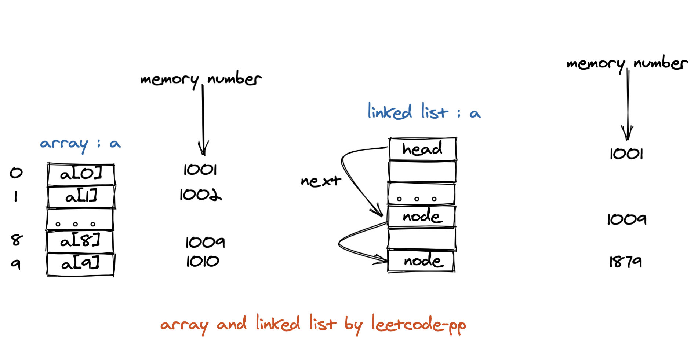
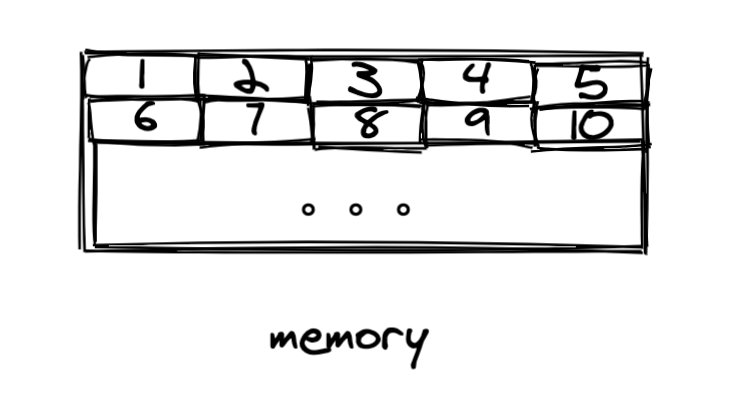
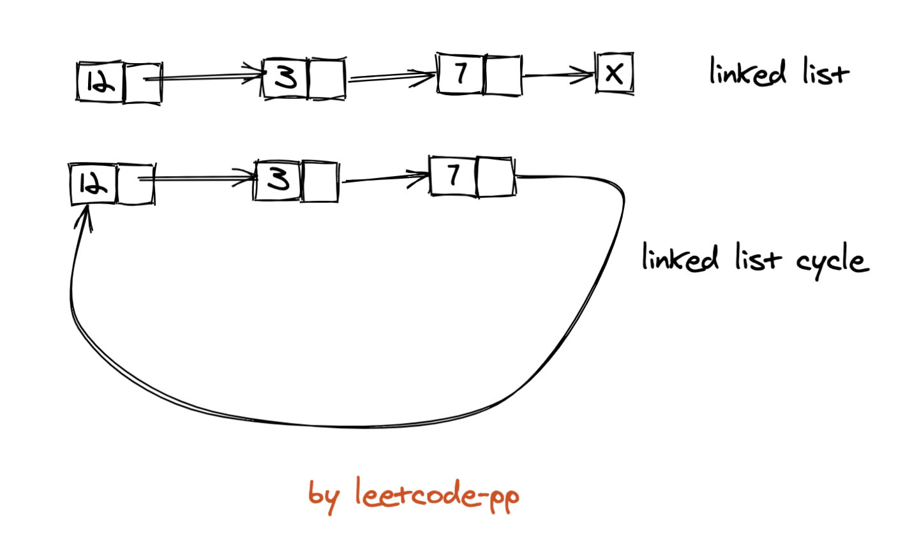
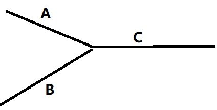

# 链表

关于链表的使用技巧，我在[几乎刷完了力扣所有的链表题，我发现了这些东西。。。 ](https://mp.weixin.qq.com/s?__biz=MzI4MzUxNjI3OA==&mid=2247485582&idx=1&sn=eff845460e91be97026c937b229c2989&chksm=eb88c497dcff4d81e08ac30951b160f0083bc9fe5a2b64b8e1ea9e0988e14a9df2b56515f508&token=450700782&lang=zh_CN#rd) 中进行了细致的讲解，建议大家看完本节内容后，再去看下这篇文章。

## 简介

本节给大家介绍的是和数组同一个级别的重量级数据结构 - 链表，很多的数据结构都是基于其产生的，比如前文讲的队列。

各种数据结构，不管是队列，栈等线性数据结构还是树，图等非线性数据结构，从根本上底层都是数组和链表。数组和链表两者在物理上存储是非常不一样的，如图：



（图 1. 数组和链表的物理存储图）

物理内存是一个个大小相同的内存单元构成的，如图：



（图 2. 物理内存）

不难看出，数组和链表只是使用物理内存的两种方式。

数组是连续的内存空间，通常每一个单位的大小也是固定的，因此可以按下标随机访问。

而链表则不一定连续，因此其查找只能依靠别的方式，一般我们是通过一个叫 **next 指针**来遍历查找，next 指针指向的就是当前节点的后继。

> 数组的当前节点的后继可以看作为 i + 1，其中 i 为当前节点的索引。也就是说给定数组位置，其后继位置是确定的，而链表则不然。

链表是一种物理存储单元上非连续、非顺序的存储结构，数据元素的逻辑顺序是通过链表中的指针链接次序实现的。链表由一系列结点（链表中每一个元素称为结点）组成，结点可以在运行时动态生成。


（图 3. 一个典型的链表逻辑表示图）

> 后面所有的图都是基于逻辑结构，而不是物理结构

链表只有一个后驱节点 next，如果是双向链表还会有一个前驱节点 pre。

由于只有一个前驱和后继，因此链表是一种线性的数组结构。 而如果增加一个前驱或者后继， 那么链表就变成了二叉树。

> 这仅仅是逻辑上的二叉树，而不是物理上的。因为树可以使用数组来实现，也可以使用链表来实现。这是因为树本身是不需要支持随机访问的

## 基本概念

### 虚拟节点

定义：数据结构中，在链表的第一个结点之前附设一个结点，它没有直接前驱，称之为虚拟结点。虚拟结点的数据域可以不存储任何信息，虚拟结点的指针域存储指向第一个结点的指针。

作用：对链表进行增删时统一算法逻辑，减少边界处理（避免了判断是否是空表或者是增删的节点是否为第一个节点）

### 尾节点

定义：数据结构中，尾结点是指链表中最后一个节点，即存储最后一个元素的节点。

作用：由于移动到链表末尾需要线性的时间，因此在链表末尾插入元素会很耗时， 增加尾节点便于在链表末尾以 $O(1)$ 的时间插入元素。

### 静态链表

定义：用数组描述的链表，它的内存空间是连续的，称为静态链表。相对地，动态链表因为是动态申请内存的，所以每个节点的物理地址可以不连续，要通过指针来顺序访问。

作用：既可以像数组一样在 $O(1$ 的时间对访问任意元素，又可以像链表一样在 O(1)的时间对节点进行增删

> 静态链表和动态链表这个知识点对刷题帮助不大， 作为了解即可。

## 链表分类

以下分类是两种分类标准，也就是一个链表可以既属于循环链表，也属于单链表，这是毋庸置疑的。

### 按照是否循环分为：循环链表和非循环链表



当我们需要在遍历到尾部之后重新开始遍历的时候，可以考虑使用循环链表。 需要注意的是，如果链表长度始终不变，那么使用循环链表很容易造成死循环，因此循环链表经常会伴随着节点的删除操作，比如[约瑟夫环问题](https://leetcode-cn.com/problems/yuan-quan-zhong-zui-hou-sheng-xia-de-shu-zi-lcof/solution/tong-su-yi-dong-mo-yun-suan-mo-ni-python3-by-azl39/)。

### 按照指针个数分为：单链表和双链表


- 单链表。 每个节点包括两部分：一个是存储数据的数据域，另一个是存储下一个节点指针的指针域。

- 双向链表。 每个节点包括三部分：一个是存储数据的数据域，一个是存储下一个节点指针的指针域，一个是存储上一个节点指针的指针域。

Java 中的 LinkedHashMap 以及 Python 中的 OrderedDict 底层都是双向链表。 其好处在于删除和插入的时候，可以更快地找到前驱指针。如果用单链表的话， 那么时间复杂度最坏的情况是 $O(n)$。双向链表的本质就是**空间换时间**，因此如果题目对时间有要求，可以考虑使用双向链表，比如力扣的双向链表的本质就是**空间换时间**，因此如果题目对时间有要求，可以考虑使用双向链表，比如力扣的 [146. LRU 缓存机制](https://github.com/azl397985856/leetcode/blob/master/problems/146.lru-cache.md) 。

## 链表的基本操作

### 插入

插入只需要考虑要插入位置前驱节点和后继节点（双向链表的情况下需要更新后继节点）即可，其他节点不受影响，因此在给定指针的情况下插入的操作时间复杂度为$O(1)$。这里给定指针中的指针指的是插入位置的前驱节点。

伪代码：

```

temp = 待插入位置的前驱节点.next
待插入位置的前驱节点.next = 待插入指针
待插入指针.next = temp

```

如果没有给定指针，我们需要先遍历找到节点，因此最坏情况下时间复杂度为 $O(N)$。

> 提示 1: 考虑头尾指针的情况。

> 提示 2: 新手推荐先画图，再写代码。等熟练之后，自然就不需要画图了。

### 删除

只需要将需要删除的节点的前驱指针的 next 指针修正为其下下个节点即可，因此链表适合**在数据需要有一定顺序，但是又需要进行频繁增删除的场景**。

删除的时候注意考虑**边界条件**。

伪代码：

```
待删除位置的前驱节点.next = 待删除位置的前驱节点.next.next
```

> 提示 1: 考虑头尾指针的情况。

> 提示 2: 新手推荐先画图，再写代码。等熟练之后，自然就不需要画图了。

### 遍历

遍历比较简单，直接上伪代码。

伪代码：

```
当前指针 =  头指针
while 当前指针不为空 {
   print(当前节点)
   当前指针 = 当前指针.next
}

```

## 常见题型

### 题型一：反转链表

1. 将某个链表进行反转。题目描述参考：[206. 反转链表](https://leetcode-cn.com/problems/reverse-linked-list/)
2. 将某个链表按 K 个一组进行反转。题目描述参考： [25. K 个一组翻转链表](https://leetcode-cn.com/problems/reverse-nodes-in-k-group/)

 （图 1）

### 题型二：合并链表

1. 将两条有序或无序的链表合并成一条有序链表。题目描述参考： [21. 合并两个有序链表](https://leetcode-cn.com/problems/merge-two-sorted-lists/)
2. 将 k 条有序链表合并成一条有序链表。题目描述参考：[23. 合并 K 个升序链表](https://leetcode-cn.com/problems/merge-k-sorted-lists/)

 （图 2）

### 题型三：相交或环形链表

1. 判断某条链表是否存在环。题目描述参考：[141. 环形链表](https://leetcode-cn.com/problems/linked-list-cycle/)
2. 获取某条链表环的大小。
3. 获取某条环形链表的入环点。题目描述参考：[142. 环形链表 II](https://leetcode-cn.com/problems/linked-list-cycle-ii/)
4. 获取某两条链表的相交节点。题目描述参考：[160. 相交链表](https://leetcode-cn.com/problems/intersection-of-two-linked-lists/)

 （图 3）

### 题型四：设计题

要求设计一种数据结构，可以在指定的时间或空间复杂度下完成 XX 操作，这种题目的套路就是**牢记所有基本数据结构的基本操作以及其复杂度**。分析算法的瓶颈，并辅以恰当的数据结构进行优化。

## 常见套路

针对上面的四种题型， 我们分别介绍如何用套路进行应对。

### 套路一：反转链表

核心点：反转链表只需记录前一个节点，并使用 `当前指针.next = 前一个节点` 即可。

但是反转链表也很容易出错，这里面有哪些细节？如何避免？可以参考我写过的[链表专题](https://lucifer.ren/blog/2020/11/08/linked-list/)

 以下内容假设你已经看过上面文章。

伪代码:

```
当前指针 =  头指针
前一个节点 = null;
while 当前指针不为空 {
	下一个节点 = 当前指针.next;
    当前指针.next = 前一个节点
    前一个节点 = 当前指针
    当前指针 = 下一个节点
}
return 前一个节点;
```

JS 代码参考:

```js
let cur = head;
let pre = null;
while (cur) {
  const next = cur.next;
  cur.next = pre;
  pre = cur;
  cur = next;
}
return pre;
```

**复杂度分析**

令 n 为链表总的节点数。

- 时间复杂度：$O(n)$
- 空间复杂度：$O(1)

### 套路二：合并链表

 建议大家先做**合并两个有序数组**，完事之后再做这道题。

和**合并两个有序数组**一样，我们只需要用两个读指针指向两个有序链表的头，一个写指针用于更新合并后的链表即可。

具体地，我们比较两个链表 l1 和 l2 的大小，然后将值较小的节点更新到合并后的链表 ans。不断重复此过程即可。

伪代码:

```jsx

ans = new Node(-1) // ans 为需要返回的头节点
cur = ans
// l1和l2分别为需要合并的两个链表的头节点
while l1 和 l2 都不为空
    cur.next = min(l1.val, l2.val)
    更新较小的指针，往后移动一位
if l1 == null
   cur.next = l2
if l2 == null
   cur.next = l1
return ans.next

```

JS 代码参考:

```js
let ans = (now = new ListNode(0));
while (l1 !== null && l2 !== null) {
  if (l1.val < l2.val) {
    now.next = l1;
    l1 = l1.next;
  } else {
    now.next = l2;
    l2 = l2.next;
  }
  now = now.next;
}

if (l1 === null) {
  now.next = l2;
} else {
  now.next = l1;
}
return ans.next;
```

**复杂度分析**

令 n 为链表总的节点数。

- 时间复杂度：$O(n)$
- 空间复杂度：$O(1)

### 套路三：相交或环形链表

##### 链表相交求交点

典型的算法有哈希法和双指针。

其中哈希法容易想到，但空间效率不佳。双指针空间效率好，但是补容易想到，需要大家消化一下。

###### 解法一：哈希法

- 有 A, B 这两条链表, 先遍历其中一个，比如 A 链表, 并将 A 中的所有节点存入哈希表。
- 遍历 B 链表,检查节点是否在哈希表中, 第一个存在的就是相交节点

伪代码:

```jsx
data = new Set() // 存放A链表的所有节点的地址

while A不为空{
  哈希表中添加A链表当前节点
  A指针向后移动
}

while B不为空{
  if 如果哈希表中含有B链表当前节点
    return B
  B指针向后移动
}

return null // 两条链表没有相交点
```

JS 代码参考:

```js
let data = new Set();
while (A !== null) {
  data.add(A);
  A = A.next;
}
while (B !== null) {
  if (data.has(B)) return B;
  B = B.next;
}
return null;
```

**复杂度分析**

令 n 为链表总的节点数。

- 时间复杂度：$O(n)$
- 空间复杂度：$O(n)

###### 解法二：双指针

例如使用 a, b 两个指针分别指向 A, B 这两条链表的头, 两个指针相同的速度向后移动。

- 当 a 到达链表的尾部时,重定位到链表 B 的头结点
- 当 b 到达链表的尾部时,重定位到链表 A 的头结点。
- a, b 指针相遇的点为相交的起始节点，否则没有相交点

 （图 5）

为什么 a, b 指针相遇的点一定是相交的起始节点? 我们证明一下：

如果我们将两条链表按相交的起始节点截断。a 距离交点的长度为 s1，b 距离交点的长度为 s2，交点到链表尾部的距离是 s3。

那么 A 链表长度为: s1 + s3，B 链表为: s2 + s3。当 a 指针将 A 链表遍历完后，重定位到链表 B 的头结点，然后继续遍历至相交点。

此时 a 指针遍历的距离为 s1 + s3 + s2，同理 b 指针遍历的距离为 s2 + s3 + s1。

显然两者走的距离是相等的，因此该点就是相遇点。

伪代码:

```jsx
a = headA
b = headB
while a,b指针不相等时 {
    a, b指针都向后移动
    if a, b指针都为空
      return null //没有相交点
    if a指针为空时
      a指针重定位到链表 B的头结点
    if b指针为空时
      b指针重定位到链表 A的头结点
}
return a
```

JS 代码参考:

```jsx
let a = headA,
  b = headB;
while (a != b) {
  a = a ? a.next : null;
  b = b ? b.next : null;
  if (a == null && b == null) return null;
  if (a == null) a = headB;
  if (b == null) b = headA;
}
return a;
```

Python 代码参考：

```py
class Solution:
    def getIntersectionNode(self, headA: ListNode, headB: ListNode) -> ListNode:
        a, b = headA, headB
        while a != b:
            a = a.next if a else headB
            b = b.next if b else headA
        return a
```

**复杂度分析**

令 n 为链表总的节点数。

- 时间复杂度：$O(2(s1 + s2 + s3))$
- 空间复杂度：$O(1)

扩展：如果题目仅仅要求一个 bool 值，表示两个链表是否相交。那么理论上时间复杂度可以进一步降低到 $O(s1+s2+2s3)$，即省去了 s1 + s2 次遍历。具体怎么做呢？其实我们只需要比较两个链表的尾节点是否一致即可，如果引用一致则说明是相交链表，否则不是相交链表。

##### 环形链表求环的起点

类似地，我们也有哈希法和双指针两个解法。

我们仍然从容易理解的哈希法入手。

###### 解法一：哈希法

- 遍历整个链表,同时将每个节点都插入哈希表,
- 如果当前节点在哈希表中不存在,继续遍历,
- 如果存在,那么当前节点就是环的入口节点

伪代码:

```jsx
data = new Set() // 声明哈希表
while head不为空{
  if 当前节点在哈希表中存在{
    return head // 当前节点就是环的入口节点
  } else {
    将当前节点插入哈希表
  }
  head指针后移
}
return null // 环不存在
```

JS 代码参考:

```jsx
let data = new Set();
while (head) {
  if (data.has(head)) {
    return head;
  } else {
    data.add(head);
  }
  head = head.next;
}
return null;
```

**复杂度分析**

令 n 为链表总的节点数。

- 时间复杂度：$O(n)$
- 空间复杂度：$O(n)

###### 解法二：快慢指针法

具体算法：

1. 定义一个 fast 指针,每次**前进两步**,一个 slow 指针,每次**前进一步**
2. 当两个指针相遇时

   1. 将 fast 指针**重定位**到链表头部,同时 fast 指针每次只**前进一步**
   2. slow 指针继续前进,每次**前进一步**

3. 当两个指针再次相遇时,当前节点就是环的入口

下面我们对此方法的正确性进行简单证明：

- x 表示第一次相遇点

- L 是起点到环的入口点的距离

- C 是环的入口点到第一次相遇点的距离

- D 是环的周长减去 C



L + C 是慢指针走的陆离，而快指针走的距离是慢指针的两倍，也就是 2(L + C) , 而快指针走的距离也可以用 L + 2C + D 表示，二者结合可以得出 L 和 D 相等

因此我们可以在两者第一次相遇后将快指针放回开头，这样二者再次相遇的点一点是环的入口点，这是因为 L 和 D 是相等的。

That's all!

参考：[【每日一题】- 2020-01-14 - 142. 环形链表 II](https://github.com/azl397985856/leetcode/issues/274#issuecomment-573985706)

伪代码：

```jsx
fast = head
slow = head //快慢指针都指向头部
do {
  快指针向后两步
  慢指针向后一步
} while 快慢指针不相等时
if 指针都为空时{
  return null // 没有环
}
while 快慢指针不相等时{
  快指针向后一步
  慢指针向后一步
}
return fast
```

JS 代码参考：

```js
if (head == null || head.next == null) return null;
let fast = (slow = head);
do {
  if (fast != null && fast.next != null) {
    fast = fast.next.next;
  } else {
    fast = null;
  }
  slow = slow.next;
} while (fast != slow);
if (fast == null) return null;
fast = head;
while (fast != slow) {
  fast = fast.next;
  slow = slow.next;
}
return fast;
```

**复杂度分析**

令 n 为链表总的节点数。

- 时间复杂度：$O(n)$
- 空间复杂度：$O(1)

### 套路四：求链表倒数第 k 个节点

我们假设 k 是一个不大于链表长度的正整数。

算法：

使用两个指针。第一个指针先走 k 步，接下来第二个指针再走。这样当第一个指针最到链表末尾（指向空）的时候，第二个指针刚好位于倒数第 k 个。

### 套路五：设计题

这个直接直接结合一个例子来给大家讲解一下。

题目描述：

```
设计一个算法支持以下操作:

获取数据 get 和 写入数据 put 。

获取数据 get(key) - 如果关键字 (key) 存在于缓存中，则获取关键字的值（总是正数），否则返回 -1。

写入数据 put(key, value) - 如果关键字已经存在，则变更其数据值；如果关键字不存在，则插入该组「关键字/值」。当缓存容量达到上限时，它应该在写入新数据之前删除最久未使用的数据值，从而为新的数据值留出空间。

在 O(1) 时间复杂度内完成这两种操作
```

思路:

1. 确定需要使用的数据结构

   1. 根据题目要求,存储的数据需要保证顺序关系(逻辑层面) ===> 使用数组,链表等保证循序关系

   2. 同时需要对数据进行频繁的增删, 时间复杂度 O(1) ==> 使用链表等

   3. 对数据进行读取时, 时间复杂度 O(1) ===> 使用哈希表

      最终采取双向链表 + 哈希表

      > 1. 双向链表按最后一次访问的时间的顺序进行排列, 链表头部为最近访问的节点
      > 2. 哈希表,以关键字为键,以链表节点的地址为值

2. put 操作

   通过哈希表, 查看传入的关键字对应的链表节点, 是否存在

   1. 如果存在,
      1. 将该链表节点的值更新
      2. 将该该链表节点调整至链表头部
   2. 如果不存在
      1. 如果链表容量未满,
         1. 新生成节点,
         2. 将该节点位置调整至链表头部
      2. 如果链表容量已满
         1. 删除尾部节点
         2. 新生成节点
         3. 将该节点位置调整至链表头部
      3. 将新生成的节点，按关键字为键，节点地址为值插入哈希表

3. get 操作

   通过哈希表, 查看传入的关键字对应的链表节点, 是否存在

   1. 节点存在
      1. 将该节点位置调整至链表头部
      2. 返回该节点的值
   2. 节点不存在, 返回 null

伪代码:

```js
var LRUCache = function(capacity) {
	保存一个该数据结构的最大容量
	生成一个双向链表,同时保存该链表的头结点与尾节点
	生成一个哈希表
};

function get (key) {
	if 哈希表中存在该关键字 {
		根据哈希表获取该链表节点
		将该节点放置于链表头部
		return 链表节点的值
	} else {
		  return -1
	}
};

function put (key, value) {
    if 哈希表中存在该关键字 {
		根据哈希表获取该链表节点
		将该链表节点的值更新
		将该节点放置于链表头部
	} else {
		if 容量已满 {
			删除链表尾部的节点
			新生成一个节点
			将该节点放置于链表头部
		} else {
			新生成一个节点
			将该节点放置于链表头部
		}
	}
};
```

JS 代码参考:

```js
function ListNode(key, val) {
  this.key = key;
  this.val = val;
  this.pre = this.next = null;
}

var LRUCache = function (capacity) {
  this.capacity = capacity;
  this.size = 0;
  this.data = {};
  this.head = new ListNode();
  this.tail = new ListNode();
  this.head.next = this.tail;
  this.tail.pre = this.head;
};

function get(key) {
  if (this.data[key] !== undefined) {
    let node = this.data[key];
    this.removeNode(node);
    this.appendHead(node);
    return node.val;
  } else {
    return -1;
  }
}

function put(key, value) {
  let node;
  if (this.data[key] !== undefined) {
    node = this.data[key];
    this.removeNode(node);
    node.val = value;
  } else {
    node = new ListNode(key, value);
    this.data[key] = node;
    if (this.size < this.capacity) {
      this.size++;
    } else {
      key = this.removeTail();
      delete this.data[key];
    }
  }
  this.appendHead(node);
}

function removeNode(node) {
  let preNode = node.pre,
    nextNode = node.next;
  preNode.next = nextNode;
  nextNode.pre = preNode;
}

function appendHead(node) {
  let firstNode = this.head.next;
  this.head.next = node;
  node.pre = this.head;
  node.next = firstNode;
  firstNode.pre = node;
}

function removeTail() {
  let key = this.tail.pre.key;
  this.removeNode(this.tail.pre);
  return key;
}
```

## 常见技巧

### 哨兵

链表题目中，只要是头节点可能会被修改的，一定记得用哨兵，这样可以大大减少判断。

关于哨兵技巧，不仅仅是链表，数组用的也很多，比如在数组前后分别添加一个元素。典型的有单调栈，再比如这道题 [6017. 向数组中追加 K 个整数](https://leetcode-cn.com/problems/append-k-integers-with-minimal-sum/)

2022-05-15 的周赛有一道题 [6064. 不含特殊楼层的最大连续楼层数](https://leetcode.cn/problems/maximum-consecutive-floors-without-special-floors/) 。如果这道题 bottom 和 top 不可能是特殊楼层，那么这道题就是简单。那么由于 bottom 和 top 也可能是特殊楼层，看起来麻烦了。但是注意题目条件， 特殊楼层都是大于等于 bottom 且小于等于 top。也就是说 special 有一个固定范围，那么我们就可以在特殊楼层中增加两个哨兵（虚拟楼层）bottom - 1 和 top + 1 即可大大减少判断。

### 数组模拟链表

为了方便理解，讲义中的链表都是用结构体来表示的。比如一个单链表的定义我们是类似这样去做的。力扣也是类似的表示方式。

```js
function ListNode(key, val) {
  this.key = key;
  this.val = val;
  this.next = null;
}
```

不过我们可以使用数组来直接完成，而不必使用结构体，并且有的时候使用数组会更加快。 这在后面的的《树》等专题也是一样的，我们也可以用数组来模拟树，比如完全二叉树使用数组模拟就特别合适。

比如我们可以用数组 nexts 表示链表，每个节点的 nexts[i] 表示第 i 个节点的下一个节点。类似的， 如果我们需要记录 vals 表示链表的值，那么我们可以用数组 vals 表示。如果还需要记录链表的前驱节点，那么我们可以用数组 pre 表示，其中每个节点的 pre[i] 表示第 i 个节点的前一个节点。

推荐加练题目:

- [2289. 使数组按非递减顺序排列](https://leetcode.cn/problems/steps-to-make-array-non-decreasing/solution/-by-fe-lucifer-olix/)

## 小技巧

### OrderedDict

Python 封装好的 OrderedDict 可以用来书写需要用到双向链表的题目， 显著减少样板代码量。具体见我们的每日一题链表部分的压轴题。

## 题目推荐

如果你将本文的内容全部看完了，则可以尝试以下题目。当解题过程遇到困难，不妨回头看一下讲义。

- [21. 合并两个有序链表](https://leetcode-cn.com/problems/merge-two-sorted-lists/)
- [82. 删除排序链表中的重复元素 II](https://leetcode-cn.com/problems/remove-duplicates-from-sorted-list-ii/)
- [83. 删除排序链表中的重复元素](https://leetcode-cn.com/problems/remove-duplicates-from-sorted-list/)
- [86. 分隔链表](https://leetcode-cn.com/problems/partition-list/)
- [92. 反转链表 II](https://leetcode-cn.com/problems/reverse-linked-list-ii/)
- [138. 复制带随机指针的链表](https://leetcode-cn.com/problems/copy-list-with-random-pointer/)
- [141. 环形链表](https://leetcode-cn.com/problems/linked-list-cycle/)
- [142. 环形链表 II](https://leetcode-cn.com/problems/linked-list-cycle-ii/)
- [143. 重排链表](https://leetcode-cn.com/problems/reorder-list/)
- [148. 排序链表](https://leetcode-cn.com/problems/sort-list/)
- [206. 反转链表](https://leetcode-cn.com/problems/reverse-linked-list/)
- [234. 回文链表](https://leetcode-cn.com/problems/palindrome-linked-list/)

还有一种循环移位问题也很常见，一起推荐给大家。[文科生都能看懂的循环移位算法](https://lucifer.ren/blog/2020/02/20/rotate-list/)

## 总结

链表是比较简单也非常基础的数据结构，所以大家一定要熟练掌握。

链表的常规题目基本都是考察指针操作，只要你做到**心中有链**，切记出现环，就离成功不远了。再利用一些诸如哨兵节点的技巧简化代码，相信你写出 bug free 代码也不是难事。

在碰到设计题这种对数据结构的设计能力要求较高时，一般会需要使用到 2-3 种数据结构，这时要根据具体的使用场景去分析，如何将各种数据结构的优势结合到一起，慢慢大家写的多了，碰到设计题就有了固定的思维模式，ac 也就水到渠成。

最后推荐大家**一定要掌握这道题 [25. K 个一组翻转链表](https://leetcode-cn.com/problems/reverse-nodes-in-k-group/)。会了它，基本上所有的链表题都通了。**

最后的最后附赠大家一个小技巧。如果你在打比赛，比如力扣周赛，那么先将链表转化为数组然后再处理也是可以的，并且会大大降低书写难度。比如上面这道题 [25. K 个一组翻转链表](https://leetcode-cn.com/problems/reverse-nodes-in-k-group/)，我就可以直接先将其存到数组，然后分多次调用数组的 reverse 方法，最后把数组转为链表并返回，写起来简直不要太简单。由于这仅仅是多了常数次的遍历以及 n 的空间，因此基本不至于不 AC（卡常的情况除外）。当然，如果题目描述明确说明不能转数组，还是不要用这种方法了。
