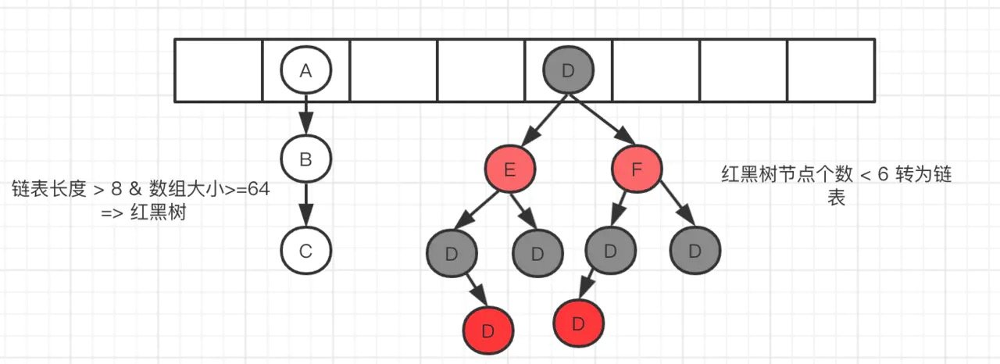
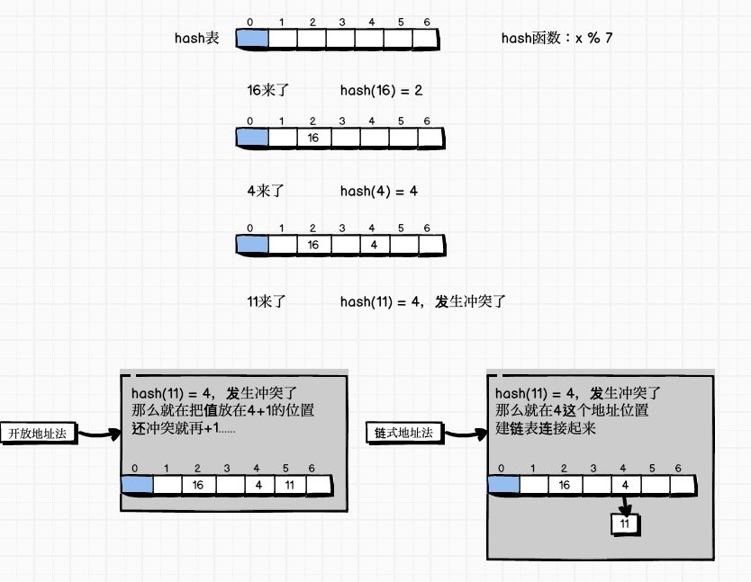

# 哈希表

哈希表是一种在**平均时间复杂度** O(1) 内可实现**任何操作**的数据结构，这里的操作包括查询，插入，删除以及修改。需要注意的是这里描述的是平均时间复杂度，最坏的情况仍然有可能是线性的。

> **平均时间复杂度** 是否能达到 O(1) 和哈希算法以及冲突处理算法都有关， 也就是说需要你的哈希函数设计地足够好才能达到平均时间复杂度 O(1)

听起来很神奇？没错！那么问题来了。

- 既然哈希表这么好，那数组和链表还有存在的价值么？
- 哈希表是如何实现**平均时间复杂度** O(1)的呢？

带着这两个疑问，大家继续看下看。

## 介绍

哈希的基本思想其实就是**建立恰当大小值域的数组进行某种映射**。比如：

```py
size = 10
hash_number = 0

for(c in s):
	hash_numer += ord(c)
	hash_number %= size
print(hash_number)

```

如上建立了一个大小为 10 的值域，值域的值分别是 0，1，2，3，4，5，6，7，8，9。接下来，我们对字符串逐个字符取 ascii 码并相加模 10，模 10 可以确保值不会越界。**这就是一个最简单的 hash 思想**。

不要小看这个思想，后面我们要讲的进阶篇 RK 算法的核心也是如此。

虽然要想实现一个工业级别的哈希表需要考虑的东西要远远大于这些，不过哈希表的实现的核心也是如此。

散列表（Hash table，也叫哈希表），是根据关键码值(Key)而直接进行访问的数据结构。散列表可以使用**数组 + 链表**的方式来实现，也可以用别的方式，比如**数组 + 红黑树**。 JDK1.8 的 HashMap 就同时使用了这两种方式。



### 两个精髓

哈希表查询的精髓就在于数组，哈希表查找的平均时间复杂度 $O(1)$ 就是因为这个。用数组存数据，查询时间复杂度 $O(1)$ 很容易，但是数据删除和新增操作，使用数组的平均时间复杂度会变成 $O(N)$，这个我们在之前的章节中讲述过。

如何解决数组在动态性下的弱势呢?答案是链表或者树，链表和树对动态数据很友好，而哈希表删除和新增的精髓就在于链表或者树。哈希表新增和删除的精髓就在于链表或树，哈希表修改和删除的平均时间复杂度 $O(1)$ 就是因为这个。

这两个精髓大家要牢牢记住，具体内容我们后面再详细讲述。

### 冲突

我前面说了哈希查询的精髓在于数组，而这里数组的索引就是哈希表的 key，我们知道哈希表可以存任意 string，而数组索引只能是数字，且数组的索引范围是 [0, n)，其中 n 为数组长度。这怎么办呢？ 我们使用哈希函数来解决这个问题。你可以把哈希函数当成一个神奇的函数，它的输入是 key，返回值是索引，并且相同的 key 计算出的索引是确定不变的，也就是说哈希函数需要是数学中的函数。

而理论上两个不同的 key 是可以算出同样的 hashcode 的。这个就叫做哈希冲突。那什么是哈希冲突呢？

哈希函数不是万能的，根据**抽屉原理**，除非你给一个容器足够大的抽屉（工程中不现实），否则不可避免的可能会造成两个不同的 Key 算出来的 hash 值相同，比如 hash 函数是 x % 3，这样 key=2 和 key=5 算出的 hash 值都为 2，这是要怎么办呢？一般我们有两种方法来处理，开放地址法和拉链法，具体大家可以查阅相关资料。这里简单的画了个图给大家直观看一下大概意思：



上面中两种方法都是遇到冲突的解决方式。其实我们也可以防患于未然，编写冲突小的哈希函数。比如 JDK1.8 的哈希函数就是先拿到通过 key 的 hashcode，是 32 位的 int 值，然后让 hashcode 的高 16 位和低 16 位进行异或操作。之所以这么做是因为这样做的哈希冲突的概率会小，

构造一个冲突小，稳定性高的 hash 函数是很重要的，我们在刷题的时候大部分时间都不会去考虑这个问题，但是实际工程中有时不可避免需要我们自己构造 hash 函数，这时就要根据实际情况进行分析测试啦。

> 最后偷偷说一下，用 Java 的同学有兴趣可以看看 HashSet 的源码，底层也是用的 HashMap😄

以上是一些理论知识，大家可以通过力扣的 [705. 设计哈希集合](https://leetcode-cn.com/problems/design-hashset/solution/li-kou-jia-jia-zhe-jian-dan-ti-ting-fei-760d2/) 和 [706. 设计哈希映射](https://leetcode-cn.com/problems/design-hashmap/solution/li-kou-jia-jia-zhe-ti-ye-ting-fei-mo-shu-s54w/) 检验下自己的学习成果哦~

## 常用操作的时间复杂度

- 插入：O(1)
- 删除：O(1)
- 查找：O(1)

常用的操作在非极其特殊情况下，平均的时间复杂度都为**O(1)**

## 常见题目类型

### **统计 xx 出现次数/频率/** （见下方多人运动）

该种题比较直观，若已知数据范围较小且比较连续，可以考虑用数组来实现。

题目推荐：

- [811.子域名访问计数](https://leetcode-cn.com/problems/subdomain-visit-count/description/)

再给大家介绍一个高阶一定的知识， 大家按需掌握。这个知识点是**频率的频率**。顾名思义， 就是统计频率的频率。 比如我们需要对字符串“aaabc” 进行字母计数。我们知道有 3 个 a ，1 个 b 和 1 个 c， 这就是频率。那什么是频率的频率呢？

还是以上面的例子来说，我们知道频率为 3 的有 1 个， 频率为 1 的有两个。那么将这个信息也存起来就是频率的频率了。

这有什么用呢？

我举个例子，给你一个字符串 s ， 让你求出所有子字符串的最小频率和。我们可以 O(n^2) 求出所有的子串，然后再用 O(n) 计算所有频率， 最后再用 O(1) 找出频率最小的。

我们能否利用后面要讲的滑动数组技巧进行优化呢？即充分利用已经计算好的信息？简单思考一下不太容易做到。比如给你一个字符串 “aaabc”，假设 a 是第一个子字符串，aa 是第二个子字符串。 我们很难利用上次的结论， 来知道最小频率是 2， 而不是 1。

语言可能讲起来比较抽象， 大家结合下面的题目来理解一下。

题目推荐：

- [1781. 所有子字符串美丽值之和](https://leetcode.cn/problems/sum-of-beauty-of-all-substrings/)

### **需要查找/增加/删除操作为 O(1)时间复杂度** （一些设计题）

见到这种要求的题可以考虑一下是否需要 hash 表来做，比如 LRU，LFU 之类的题，题目中要求了时间复杂度，就是用 hash 表+双向链表解决的。

### **题目类型为图数据结构相关** （比如并查集）

这样可能需要构建有向图/无向图，这时可以用 hash 表来表示图并进行后续操作。

### **需要存储之前的状态以减少计算开销**（比如经典的两数和）

相信大家做过 dp 的一些题目就知道，记忆化搜索，该方法就利用 hash 表来存储历史状态，这样可以大大减少重复计算。

### 状态压缩（本质就是 bit 上的哈希结构）

参考 [状压 DP 是什么？这篇题解带你入门](https://mp.weixin.qq.com/s/ecxTTrRvUJbdWwSFbKgDiw) 推荐一个题目，难度为 Hard。[1601. 最多可达成的换楼请求数目](https://leetcode-cn.com/problems/maximum-number-of-achievable-transfer-requests/)

### 记录第一次出现的位置，以便求最远或者最近。

比如题目

- [697. 数组的度](https://leetcode-cn.com/problems/degree-of-an-array/solution/li-kou-jia-jia-ha-xi-biao-chang-jian-yin-7jez/)，我们使用哈希表记录每个数组**第一次**出现的索引
- [1477. 找两个和为目标值且不重叠的子数组](https://leetcode.cn/problems/find-two-non-overlapping-sub-arrays-each-with-target-sum/) 我们需要记录**最后一次**前缀和为 cur - target 的索引，其中 cur 为当前的前缀和。

- **等等，大家多做类似的题目，相信可以总结出一套自己的思路。**

## 模板（伪代码）

1. 判断目标值是否出现过（例题如：两数之和、是否存在重复元素、合法数独等等）

```python
for num in nums:
    if num(该处为目标值target) in hashtable:
	return true
return false
```

2. 统计频率

数据比较离散

```python
for num in nums:
    if num in hashtable:
	hashtable[num] += 1
    else
	hashtable[num] = 1
# 后续操作
-------------------
```

数据范围较小且连续则可以用数组代替

```java
// 假设数据范围是0-n且n较小
int[] hashtable = new int[n + 1];

for num in nums:
    hashtable[num] += 1;

// 后续操作
------------------
```

## 题目推荐 - 👥 多人运动 🔥🔥🔥 强烈推荐

### 题目描述

已知小猪每晚都要约好几个女生到酒店房间。每个女生 i 与小猪约好的时间由 [si , ei］表示，其中 si 表示女生进入房间的时间， ei 表示女生离开房间的时间。由于小猪心胸开阔，思想开明，不同女生可以同时存在于小猪的房间。请计算出小猪最多同时在做几人的「多人运动」。

例子：

Input ： [[ 0 , 30] ,[ 5 , 10 ] ， [15 , 20 ] ]

OutPut ：最多同时有两个女生的「三人运动」

### 思路

这个题 解法不止一种，但是我们这里因为在讲 hash 表，统计频率。下面我只写一下大致思路的伪代码，具体细节大家不妨可以尝试自己实现一下。

```java
// 上面刚刚说了关于频率统计的方法，这里读完题，是不是就立刻想到了：
// 用hash表来统计每个时刻房间内的人数并维护一个最大值就是我们所求的结果啦

res = -1

for everyGirl in girls:
    for curTime in [everyGirl.start, everyGirl.end]:
	// 套上面板子
	if curTime in hashtable:
	    hashtable[curTime] += 1
	else
	    hashtable[curTime] = 1

	// 维护最大值
	res = max(res, hashtable[curTime])

----------------------------
```

线下验证通过可以贴到这里哦，[【每日一题】- 2020-04-27 - 多人运动](https://github.com/azl397985856/leetcode/issues/347)

这里还有各种解题方法，大家都可以学习下思路并试着自己做一做！

其他题目推荐：

- [128. 最长连续序列](https://github.com/azl397985856/leetcode/blob/master/problems/128.longest-consecutive-sequence.md) 🔥🔥🔥 强烈推荐
- [218.天际线](https://leetcode-cn.com/problems/the-skyline-problem/) （使用哈希统计可能会 OOM，但是思路上可行）
- [面试题 01.04. 回文排列](https://leetcode-cn.com/problems/palindrome-permutation-lcci/)
- [500. 键盘行](https://leetcode-cn.com/problems/keyboard-row/description/)
- [2025. 分割数组的最多方案数](https://github.com/azl397985856/leetcode/blob/master/problems/2025.maximum-number-of-ways-to-partition-an-array.md) 枚举+前缀和+哈希+滚动

## 回答开头的两个问题

我们来看下开头提出的两个问题：

- 既然哈希表这么好，那数组和链表还有存在的价值么？

这其实是一个伪问题。实际上哈希表是数组和链表（或者树）实现的。没有数组和链表这些基础数据结构，哈希表没办法实现。

那我是不是可以在任何用数组的地方都用哈希表呢？

对于数组来说，当然可以。无非就是把数字的索引变成对应的字符串即可，但是这会造成空间和时间上的浪费。

其实很多时候，我们会用数组来实现哈希表的计数功能。比如给你一个字符串 s，s 只包括小写英文字母，要你对字符串 s 中的所有字符进行统计其出现的次数。使用哈希表当然可以，但是这种知道容量的情况，我们通常使用数组来做。在这里，容量就是固定的 26。

代码：

```py
def count(s):
	counts = [0] * 26
	for i in range(len(s)):
		counts[ord(s[i]) - ord('a')] += 1

```

这种使用固定大小数组的方法非常常见。其实如果你仔细观察， 这就是一个不需要处理冲突的迷你哈希表。哈希函数就是 `ord(s[i]) - ord('a')`。

而对于链表来说，哈希表是没有办法替代的。因此哈希表的一些基础底层操作被哈希表封装了，无法使用到了。

- 哈希表是如何实现**平均时间复杂度** O(1)的呢？

上面讲的两个精髓可以很好地回答这个问题。

- 哈希表查询的精髓就在于数组，哈希表查找的平均时间复杂度 $O(1)$ 就是因为这个。
- 哈希表新增和删除的精髓就在于链表或树，哈希表修改和删除的平均时间复杂度 $O(1)$ 就是因为这个。

## 技巧

### 预处理

另外哈希表习惯被称为空间换时间的典范，尽管我们也可以使用数组等其他数据结构达到空间换时间的效果。而数据预处理就是一种空间换时间的技巧。

我的《算法通关之路》第 20 章对预处理技巧进行了描述，大家可以参考一下。

推荐题目：

- 未排序数组两数和问题。使用哈希表预处理出每个数的出现情况，进而遍历的时候就可以 O(1) 时间回答是否存在问题。
- [6011. 完成比赛的最少时间](https://leetcode-cn.com/problems/minimum-time-to-finish-the-race/) 我们可以预处理出使用同一轮胎连续跑 x 圈的耗时，进而再后面使用动态规划的时候**转移时间更短**。

## 总结

哈希表是一种“比较全能”的数据结构，常用的操作在非极其特殊情况下，平均的时间复杂度都为**O(1)**。

做题的时候，不会太关注哈希表的原理以及冲突，我们对此有一定的了解即可。大家应该把重点放在应用常见上。

这里我列举了几种常见的哈希表的应用场景，分别是：

- **统计 xx 出现次数/频率/**

- **需要查找/增加/删除操作为 O(1)时间复杂度** （一些设计题）

- **题目类型为图数据结构相关** （比如并查集）

- **需要存储之前的状态以减少计算开销**（比如经典的两数和）

- 状态压缩（本质就是 bit 上的哈希结构）

最后给大家了几个模板，大家可以使用这几个模板和文章给的做题思路去完成文章中推荐的题目。
