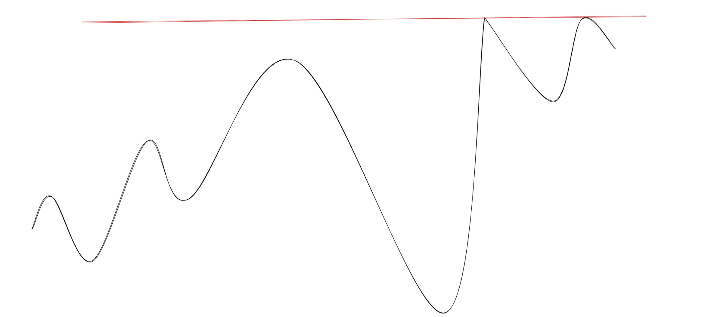
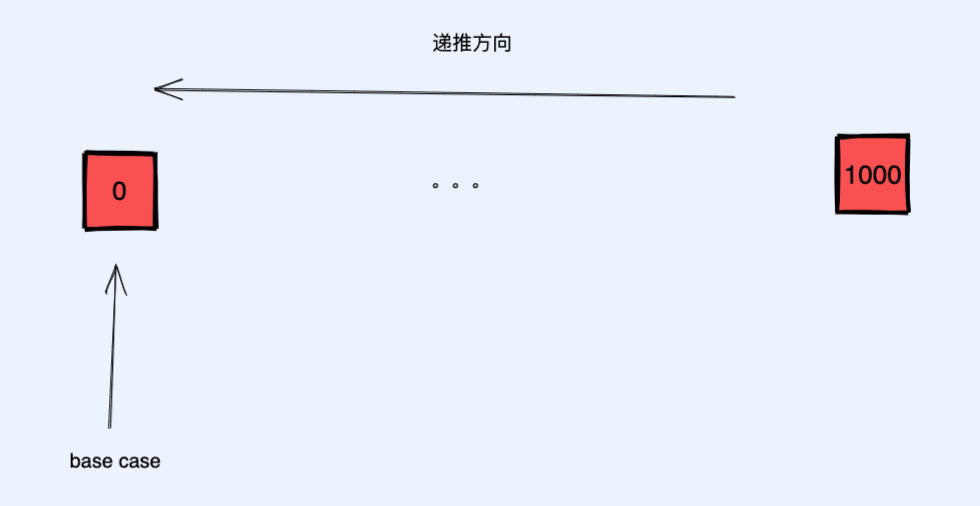
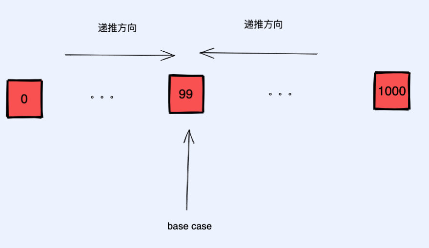

# 模拟，枚举与递推

这里我们讲三种基础思想和方法，这几种方法将贯穿整个算法系列的始终，它们分别是模拟，枚举与递推。

基础不意味着简单，有时候一道困难的题目也背后的算法也可能是基础算法。 因此我们需要做的是**熟悉各种基础数据结构和算法**，做到融会贯通，举一反三，这样面对复杂问题才能迎刄有余。

- 模拟并不是一种算法，而是一种思维方式。
- 枚举则是一个最基础的技能，但是枚举却不一定和你想象的一样简单。
- 递推则是一种很重要的编程思想。 是递归，动态规划等高级主题的基础。

## 模拟

简单来说，我们这里的模拟指的就是**题目让你做什么，你就做什么**。即将题目描述翻译为可执行的代码。这在我们做工程的时候，将产品经理的需求转化为代码是类似的。

模拟并不是一类具体的算法，而是一种思想。

模拟指的是将题目描述转化为可执行的代码，其中我们会用到编程语言的基础内容，最常见的就是循环。

简单的题目，通常直接模拟就够了，比如 [874. 模拟行走机器人](https://leetcode-cn.com/problems/walking-robot-simulation/) 。

而如果是中等和困难的题目，除了使用模拟，我们还需要使用一些别的技巧。比如有的题目就是**模拟 + 堆**，这是因为模拟的过程我们需要动态获取极值。再比如 [799. 香槟塔](https://leetcode-solution-leetcode-pp.gitbook.io/leetcode-solution/medium/799.champagne-tower)，其实就是模拟 + 动态规划。可以看出，中等的题目通常模拟只是辅助，还需要结合其他知识。

那么是否所有的题目都是模拟？当然不是。比如动态规划的题目，这就不能说是模拟。因为题目并没有告诉你**明确的操作步骤**，而是需要你根据题目信息，**自己挖掘**转移方程进行求解。

模拟并不一定简单，模拟考察的是代码能力。比如 [735. 行星碰撞](https://github.com/azl397985856/leetcode/blob/master/problems/735.asteroid-collision.md) 就可以用模拟解决，不过代码却不那么好写。再比如 [54. 螺旋矩阵](https://leetcode-cn.com/problems/spiral-matrix/) 如果不采用合适的编码方法，就会很难写。这个没有什么好的办法，只有多写，锻炼编码能力。

## 枚举

枚举简单来说就是指尝试所有可能，是一种最基本的算法。

枚举考的就是分类讨论的思想。

最常见的枚举就是暴力搜索。即在解空间中暴力枚举所有解空间中的值，并逐个判断其是否是答案。

枚举可以很简单。比如枚举一个数组的所有项。

```java
for(int i = 0;i < A.length();i++) {
    // 打印 A[i]
}

```

再比如 [1653. 使字符串平衡的最少删除次数](https://leetcode.cn/problems/minimum-deletions-to-make-string-balanced/) 可以枚举分割位置 i， 使得分割点左侧没有 b，分割点右侧没有 a。这种枚举是最常见的，即枚举数据结构中的所有项（常见的就是枚举数组的所有索引 i）。

实际上枚举也可以很复杂。比如：

- 维度的上升（枚举 3 维数组）
- 方向的选择（从前往后还是从后往前）等。

而且同样是枚举，不同的枚举策略也可能有不同的结果和效率。关于这点，我们将在后面的剪枝专题给大家做更多介绍。

### 枚举三要素

枚举有三个东西需要考虑。

1. 状态。都有哪些状态需要我们枚举？
2. 不重不漏。如何枚举才不会重复，且不会漏过正确解？
3. 效率。采取怎么样的枚举策略可以最大化提供算法效果？

其中第三点最重要，没有第三点通常就是我们说的暴力枚举。 有了第三点通常就是我们说的解法。 

- 比如两数和，我们可以枚举所有的两两组合，也可以枚举其中一个数，同时检查另外一个数是否存在。而第二种枚举就快了很多。
- 再比如第 96 场双周赛 Q3 [2542. 最大子序列的分数](https://leetcode.cn/problems/maximum-subsequence-score/)，我们可以枚举所有的 k 个数的组合。也可以枚举最小值 nums2[i]，而枚举到最小值 nums2[i] 意味着我们只能选择比其大的那些数，于是不难想到贪心地在这些数中取前 k 大的。于是 nums2 排序后**从大到小**枚举最小值并使用后面进阶篇的固定堆技巧可以解决这道题。

接下来，我们通过一个具体的例子，带大家领会这三点。

### 经典实例 - 枚举子集

比如需要枚举一个数字集合 S 的所有子集，你会如何做？

1. 状态。

我们可以用一个和 S 相同大小的数组 picked 记录每个数被选取的信息， 用 0 表示没有选取，用 1 表示选取。

比如 S 大小为 3， picked 数组 [1,1,0]，表示 S 中的第一项和第二项被选择（索引从 1 开始）。如果 S 的大小为 n，就需要用一个长度为 n 的数组来存储，那么就有 $2^n$ 种状态。

由于数组的值**不是 0 就是 1，满足二值性**，因此更多时候我们会使用**一个数字** y 来表示状态，而不是上面的 picked 数组。其中 y 的**二进制位**对应上面提到的 picked 数组中的一项。 比如如上的 picked 数组 [1,1,0] 可以用 ob110，也就是二进制的 6 来表示。

2. 不重不漏。

我们可以用一个数 x 来模拟集合 S，用 y 来模拟 picked 数组。这样问题就转化为两个数（x 和 y）的位运算。

由于我们使用 1 表示被选取， 0 表示没有被选取。因此 如果 x 对应位为 0，其实 y 也只能是 0，而如果 x 对应位是 1，y 却可能是 0 或者 1。也就是说 y 一定小于等于 x，因此可以枚举所有小于等于 x 的数的二进制，并逐个**判断其是否真的是 x 的子集**。

具体来说，我们可以令 n 为 x 的二进制位数。不难写出如下代码：

```js
// 外层枚举所有小于等于 x 的数
ans = [];
for (i = 1; i < 1 << n; i++) {
  if ((x | i) === x) ans.push(i);
}
// ans 就是所有非空子集
```

这种算法的复杂度大约是 $O(4^n)$，也就是说和 x 成正比。这种算法 n 最多取到 12 左右。

这样做不重不漏么？

答案是可以的。因为 (x | i) === x 就是 i 是 x 的子集的充要条件，当然你也可用 & ，即 (x | i) & i == i 来表示 i 是 x 的子集。

如果二进制你不好理解，其实你可以转化为十进制理解。比如我给你一个数 132，让你找 132 的子集，这里的子集我简单定义为当前位的数字是否小于等于原数字当前位的数字。这样我们就可以先从 1 枚举到 132，因为这些数潜在都可能是 132 的子集。如果我枚举了一个数字 030，由于 0 小于等于 1，3 小于等于 3，0 小于等于 2，因此 030 是 132 的子集。而如果我枚举了一个数字 040，由于 4 大于 3，因此 040 不是 132 的子集。

3. 效率。

上面的枚举方法虽然也可保证不重不漏，但是却不是最优的，这里介绍一种更好的枚举方法。

具体做法就是$x_i$和 x 进行&（与）运算。与运算可以**快速跳到下一个子集**。

```js
ans = [];
// 外层枚举所有小于等于 x 的数
for (i = x; i != 0; i = (i - 1) & x) {
  ans.push(i);
}
// ans 就是所有非空子集
```

这样做不重不漏么？算法的关键在于 `i = (i - 1) & x`。这个操作首先将 i - 1，从而把 i 最右边的 1 变成了 0，然后把这位之后的所有 0 变成了 1。经过这样的处理再与 x 求与，就保证了得到的结果是 x 的子集，并且一定是所有子集中小于 i 的最大的一个。直观来看就是倒序枚举除了所有非空子集。

对于有 n 个 1 的二进制数字，需要 $2^n$ 的时间复杂度。而有 n 个 1 的二进制数字有 $C(n,i)$ 个，所以这段代码的时间复杂度为 $\sum_{i=0}^{n} C(n,i)\times2^i$，大约是 $O(3^n)$。和上面一样，这种算法的时间复杂度也和 x 成正比。但是这种算法 n 最多取到 15 左右。

这种方法对题目有一定要求， 即：

1. 数据范围要合适，否则数字无法表示了。
2. 只能有两种状态，这样才可以用二进制位 0 和 1 进行模拟。

### 枚举技巧

0. 很多时候可以枚举的状态有很多种， 如何选择效率高是重中之重，也是枚举的一大难点。（上面的枚举三要素已经提到了）

比如 [2440. 创建价值相同的连通块](https://leetcode.cn/problems/create-components-with-same-value/)

- 我们可以枚举删除了哪些边，但是这样的状态数目是指数级别。
- 我们可以枚举连通块的价值或者连通块的数量。 这两个是相通的，已知其中一个，可以通过 total/x 得到另外一个。其中 total 是价值和， x 是枚举连通块的价值或者连通块的数量。这种枚举状态是很有限的。

但是枚举连通块的价值或者连通块的数量其实是不等价的，因为其状态数也不同。

- 枚举连通块的数量的话状态有 n 个。其中连通块的数量最多为 n ，其中 n 为节点总数。
- 枚举连通块价值的话状态有 total 个。

But！

由于**只有能整除的我们才需要枚举**，因此其实上面的两种枚举方式经过这样的剪枝后数量**差不多**是一样的，上限都是 total 的因子总数，而一个数字的因子个数其实是非常有限的。

再比如：[6251. 统计回文子序列数目](https://leetcode.cn/problems/count-palindromic-subsequences/)。很容易想到枚举所有的中间点， 然后往前找两个字符 ab， 往后找对应回文字符 ba。如果找所有的长度为 2 的字符？ 容易想到的是两层循环的 $O(n^2)$ 解法。 但是我们也可以枚举所有可能的长度为 2 的字符， 复杂度为 $O(m^2)$，其中 m 为字符集大小。 在这里字符集就是 0-9 的数字，大小为固定值，也就是 10。因为如果采用后一种枚举方式， 复杂度就可以从 $O(n^2)$ 优化到常数。这也是这道题可以 AC 的关键。

1. 当你需要枚举 n 元组的时候，可以长度枚举 n - 1，然后使用一些技巧找第 n 个数。比如`三数和为 target 的元组`，我们可以先枚举两个数，然后使用二分或者哈希表加速找第三个数。
2. 枚举的剪枝也是一个技巧。比如前面提到的有时候从后往前遍历可以剪枝。有时候利用**序列的单调性进行剪枝**。
3. 当正向搜索比较困难的时候，不妨试试枚举所有答案，并逐一 check。比如 270 场力扣周赛第一题 [找出 3 位偶数](https://leetcode-cn.com/problems/finding-3-digit-even-numbers/)。由于答案都是三位十进制偶数，因此我们可以枚举所有可能的数，然后逐一 check 是否满足条件（对于这道题就是是否由 digits 组成）即可。参考代码

```py
class Solution:
    def findEvenNumbers(self, digits: List[int]) -> List[int]:
        c1 = collections.Counter([str(digit) for digit in digits])
        ans = []
        def check(num):
            c2 = collections.Counter(num)
            for ch in num:
                if c2[ch] > c1[ch]: return False
            return True
        for num in range(100, 1000, 2):
            if check(str(num)):
                ans.append(num)
        return ans
```

大家可以通过以下题目进行联系，感受一下这三个技巧。

- [611. 有效三角形的个数](https://leetcode-cn.com/problems/valid-triangle-number/solution/chao-xiang-xi-pai-xu-shuang-zhi-zhen-611-you-xiao-/)
- n 数和系列问题。（两数和，三数和，四数和）
- [找出 3 位偶数](https://leetcode-cn.com/problems/finding-3-digit-even-numbers/)

4. 从空集开始枚举

还有一个枚举技巧是从空集开始枚举。

比如我们想要枚举集合 S，那么刚开始枚举的集合是空集，接下来逐个枚举直到 S 中的所有元素都被枚举到。一个典型的例子是力扣 [1995. 统计特殊四元组](https://leetcode-cn.com/problems/count-special-quadruplets/)。

简单的思路是四层枚举所有组合。 我们也可以利用技巧 1 先枚举 a，b，c，再枚举 d。这里如果倒序枚举 c，让 d **从空集开始枚举**就简单很多。否则当数组 nums 中有重复元素的时候就可能有问题。即刚开始 d 是空的， c 倒序枚举的时候每向前移动一次 d 的可选范围就增加一个，此时我们继续枚举新产生的 d。

同理这道题也可以先枚举 a，b，再枚举 c，d。这个时候 b 要倒序枚举，这样 d - c 可以从**空集**开始。

5. 折半枚举，利用哈希表空间换时间。

 实际上技巧 4 中提到的题目也用到了这个技巧。

[454. 四数相加 II](https://leetcode-cn.com/problems/4sum-ii/)是运用这个技巧的很典型的题目。我们可以枚举出 nums1 和 nums2 的两两相加的所有情况，将其将入到集合 S。接下来枚举出 nums3 和 nums4 的两两相加的所有情况，并利用预处理的集合 S 计算 nums1[i] + nums2[j] + nums3[k] + nums4[l] == 0 的个数。

再推荐一个典型的题目给大家练习，是九章的 [1995. 统计特殊四元组](https://www.lintcode.com/problem/877/description)。

这道题我们可以先枚举 sum[:i] 和 sum[i+1:j]，如果和相等，将其放入集合 S。再枚举 sum[j+1:k] 和 sum[k+1:n]。sum 可利用前缀和优化。

参考代码：

```py
class Solution:
    def splitArray(self, nums):
        n = len(nums)
        pre = [0]
        for num in nums:
            pre.append(pre[-1] + num)
        for j in range(3, n - 3):
            d = set()
            for i in range(1, j - 1):
                if pre[i] == pre[j] - pre[i+1]: d.add(pre[i])
            for k in range(j+2, n-1):
                if pre[k] - pre[j+1] == pre[n] - pre[k+1] and pre[k] - pre[j+1] in d: return True
        return False
```

6. 瞻前顾后

对于数组 A 枚举所有的位置 i ，对于 i 我们分别往前和往后看，分别找到左边和右边第一个大于（或者小于） A[i]，累加每一个位置 i 对答案的贡献。

> 如果题目换了，也可能不是小于大于，而是其他内容。 比如可能是左边第一个不等于 A[i] 的。这个需要具体问题具体分析，大家注意体会思想。

题目有很多，这里找了几道题，给大家参考。

题目一： [1440 · 独特字符串](https://www.lintcode.com/problem/1440/description)。

对于这道题我们可以枚举所有 s[i]，向左找到第一个等于 s[i] 的 l[i] ，向右找到第一个等于 s[i] 的 r[i]，那么 i 对答案的贡献就是 `(i - l[i]) * (r[i] - i)`，累加所有位置的贡献即可得到答案。对于 l[i] 和 r[i] 的计算可使用哈希表记录上一次 s[i] 位置来完成。

代码参考：

```py
class Solution:
    def uniqueLetterString(self, s):
        mod = 10 ** 9 + 7
        ans = 0
        n = len(s)
        l = [-1] * n
        r = [n] * n
        last = collections.defaultdict(lambda:-1)
        for i in range(n):
            if s[i] in last:
                l[i] = last[s[i]]
            last[s[i]] = i
        last = collections.defaultdict(lambda:n)
        for i in range(n-1, -1, -1):
            if s[i] in last:
                r[i] = last[s[i]]
            last[s[i]] = i
        for i in range(n):
            ans += ((i - l[i]) * (r[i] - i)) % mod
        return ans

```

题目二：双周赛有一道题：[5999. 统计数组中好三元组数目](https://github.com/azl397985856/leetcode/blob/master/problems/5999.count-good-triplets-in-an-array.md) ，难度为困难。这道题需要枚举递增三元组，而枚举中间的并**瞻前顾后**找前面和后面的就很容易实现。

题目三： [6035. 选择建筑的方案数](https://leetcode-cn.com/problems/number-of-ways-to-select-buildings/) 我们可以计算以每一个 s[i] 为中心建筑的方案数，那么总的方案数就是枚举所有 i 的方案数之和。如果 s[i] == '1' 那么我们可以枚举所有 i 前面的 s[i] 为 '0' 的个数，同理后面的 s[i] 为 '0' 的个数，贡献就是二者乘积。如果 s[i] == '0' 也是同理。 这就是瞻前顾后，即 **对每一个位置，我们计算其对答案的贡献，而其贡献需要结合前面和后面得出**。

题目四：[Three-Doubled-Numbers](https://binarysearch.com/problems/Three-Doubled-Numbers)，由于需要枚举三元组。我们可以尝试枚举中间的数 x，然后瞻前顾后，往前找 x/2 有多少个，往后找 `x * 2` 有多少个，两者相乘（笛卡尔积）就可以得到答案。怎么知道 x/2 和 `x*2` 有多少个呢？哈希表统计频率呗！这个是我们前面讲过的知识。

类似的例子还有很多，大家细细体会。

7. one pass（一次遍历）

比如我们需要求一个数组 nums 中值等于 x 的有多少个。显然我们可以通过一次遍历解决。

那么如果我要求数组 nums 中满足某个条件的有多少个呢？这实际上就不确定可以一次遍历了。

不过可以确定的是，如果某个条件是求最大值或者最小值这种端点信息，那么显然也是可以的。

而如果是求平均值就不可以了。

如下图：曲线表示数组 nums 的值的分布，红色表示最大值。显然我们可以一次遍历获取值等于最大值的个数（最小值也是同理）。



伪代码：

```py
max_v = -inf # 最大值
max_cnt = 0 # 最大值的个数

for num in nums:
    if num > max_v:
        maxv = num
        max_cnt = 1
    elif num == max_v:
        max_cnt += 1
```

而如果是求值等于平均值的个数，我们就无法通过类似上面的一次遍历的方式实现。

简单来说，如果求序列的最大最小值，我们可以通过一次遍历实现。而不需要先遍历一次求最大最小值再遍历一次求值等于最大最小值的个数。

推荐题目：（如果题目大家暂时写不出来，可以仅仅关注枚举最大（最小）值部分的逻辑，而不必强求自己理解整个算法）

- [798. 得分最高的最小轮调](https://leetcode-cn.com/problems/smallest-rotation-with-highest-score/)
- [2044. 统计按位或能得到最大值的子集数目](https://leetcode-cn.com/problems/count-number-of-maximum-bitwise-or-subsets/)
- [2049. 统计最高分的节点数目](https://leetcode-cn.com/problems/count-nodes-with-the-highest-score/)

8. 如果题目中有具体的数字，不妨考虑枚举。比如题目是求**数组中三项和** 这里的 3 就是具体数字。比如 [2242. 节点序列的最大得分](https://leetcode-cn.com/problems/maximum-score-of-a-node-sequence/) 要求返回一个长度为 4 的合法节点序列的最大分数，这里的 4 也是具体数字。类似的还有两数和，三数和等等。

9. 指针不回退

指针不回退是一个很重要的枚举优化。

这个名字是我自己想的，那么就有必要解释一下什么是指针不回退。比如我们可能会如下代码：

```js
for(i = 0;i<n;i++) {
    for(j = i +1; j<n;j++) {
        // do something
    }
}
```

很明显上述代码时间复杂度是 $(n^2)$。而如果内层指针 j 不回退， 大概是这样：

```js
j = 1
for(i = 0;i<n;i++) {
    while (j < n && ...) {
        j += 1
    }
    // do something
}
```

由于内层代码最多执行 n 次， 所以时间复杂度为 $O(n)$。

那么什么时候可以用这种内层不回退的技巧呢？

还是以上面的为例，如果我们想找所有满足条件的 (i,j)。假设此时枚举到了一个满足条件的 (i,j)了， 我们需要去找另外的满足条件的组合，我们发现**如果小于 j 的(i+1,j)组合都不可能满足条件**，那就意味着 j 不需要回退到初始值 i + 1，而是保持上一次枚举的位置 j 就好了。 这个时候就可以用指针不回退技巧。

通常来说，我们想要枚举三元组，那么就需要三层循环，如果每一层循序都是 n 次，那么时间复杂度就是 $n^3$。而如果最内层指针不回退，时间复杂度就是 $n^2$，如果里面两层的指针都不回退，时间复杂度就是 $n^2$。

比如 2023-03-31 的力扣每日一题 [2367. 算术三元组的数目](https://leetcode.cn/problems/number-of-arithmetic-triplets)，我们需要枚举 (i,j,k) 三元组，并且满足差为 diff。

通常的做法是动态规划， 令 dp[i] 以 i 结尾的能形成公差为 diff 的等差数列的长度，答案就是累加 dp[i] （前提是 dp[i] >= 3）。

```py
    n = len(nums)
    dp = [1] * n
    ans = 0
    for i in range(n):
        for j in range(i+1, n):
            if nums[j] - nums[i] == diff:
                dp[j] = max(dp[j], dp[i] + 1)

        if dp[i] > 2:
            ans += 1
    return ans
```

此时枚举到一个满足条件的三元组后， j 和 k 都不能取比上一次还小的值，此时我们就可以使用不回退技巧， 使得时间优化到 $O(n)$

参考代码：

```py
    n = len(nums)
    i = j = k = ans = 0

    while k < n:
        j = max(j, i + 1)
        while j + 1 < n and nums[j] - nums[i] < diff:
            j += 1
        k = max(k, j + 1)
        while j + 1 < n and k < n and nums[k] - nums[j] < diff:
            k += 1
        if i < j < k < n and nums[j] - nums[i] == nums[k] - nums[j] == diff: ans += 1
        i += 1
    return ans
```

10. 贡献法

常见的题型就是给你一个数组和一个指标， 求你经过一系列操作后，这个指标的最大值或者最小值是多少。

这种我们可以枚举数组中的每一项对答案的贡献，然后累加即可。

比如 [2104. 子数组范围和](https://leetcode.cn/problems/sum-of-subarray-ranges/)。考虑每个元素作为最大值出现在了多少子数组中，以及作为最小值出现在了多少子数组中，累加最大值 * 次数，累减最小值 * 次数即可。

再比如 [2681. 英雄的力量](https://leetcode.cn/problems/power-of-heroes/)，指标就是力量和。 对于每一项 nums[i]，如果它是最大值，nums[j] 作为最小值，那么其对指标的贡献是多少？答案是先选择 nums[i] 和 nums[j]，然后选择值介于 nums[j] 和 nums[j] 的元素，假设有 m 种选择， 累加 (nums[i] ** 2) * (nums[j]) * m 就可以求出答案。

那么 m 是多少呢？如果有 n 个元素， 那么每一个元素都可以选择或者不选， 因此一共是 2 ** n，也就是说 m 就是 2 ** n。

当然只想出这一点不足以通过这道题，还需要优化。由于优化不在本文重点，我们暂不讨论。

## 递推

高中的时候我们应该学过函数关系式，比如 f(n) = f(n-1) + n，这其实就是递推了。

算法中用到递推的还真不少，最简单的动态规划就是递推形式。另外前面我们讲到的前缀和本质就是递推，其中递推关系式为 `f(i) = f(i - 1) + nums[i]`，其中 f(n) 为 nums 数组前 i 项的前缀和。

当我们能够得出函数的递推关系的时候，就可以根据递归关系一步步从 base case 逐步推导到原问题的解。因此上面的递推关系是最核心的。 递推关系可能是题目直接给出的递归关系，比如题目让你求 fibonacci 数列第 n 项。也有可能是需要自己挖掘，比如绝大多数的动态规划问题。

这里我们假设已知递推关系的情况下，如果从 base case 递推到原问题。而关于递归关系的寻找，则放到后面的动态规划篇进行详细介绍。

仍然是上面的递推关系式 f(n) = f(n-1) + n 为例。如果题目让你求 f(100) 你会如何求？

首先需要明确的是，像这种递归关系的求解，一定要有一个 base case，否则会陷入无限循环。

那么 base case 是什么呢？我们可以先手动**随意选择一种情况**为 base case，这并不影响问题的求解。

接下来，我分别以：

- f(99)
- f(0)
- f(200)

为 base case。

那么计算的结果会有所不同么？不会的。不同的只是我们的代码。

那么 f(99) 是多少呢？这不确定， 这需要从题目中挖掘。

比如 f(99) 是 4950，那么我们就可以写出如下代码：

```js
function f(n) {
  if (n == 99) return 4950;
  return f(n - 1) + n;
}
```

比如 f(0) 是 0，那么我们就可以写出如下代码：

```js
function f(n) {
  if (n == 0) return 0;
  return f(n - 1) + n;
}
```

比如 f(200) 是 4950，那么我们就可以写出如下代码：

```js
function f(n) {
  if (n == 99) return 20100;
  return f(n - 1) + n;
}
```

只不过上面的代码在特定的时候**可能** 有 bug。比如选择了 f(99) 为 base case，那么计算 f(98) 就会陷入无限循环。

如何解决呢？答案是**夹逼**。

- 如果 n 大于 base case，则减少 n 到 base case。
- 如果 n 小于 base case，则增大 n 到 base case。





以这道题来说，递推关系为 f(n) = f(n-1) + n，那么移项得 f(n-1) = f(n) - n，将 n 用 n + 1 替换，n - 1 用 n 替换，得 f(n) = f(n + 1) - (n + 1)

代码：

```js
function f(n) {
  if (n == 99) return 4950;
  if (n > 99) return f(n - 1) + n;
  return f(n + 1) - (n + 1);
}
```

简单来说，我们的递归方向是**不断趋向 base case**的。

因此我们可以得出结论：如果 base case 选择的题目的取值范围的中间位置，那么代码会比较难写，需要考虑解的方向使用不同的递归公式。而如果 base case 选择在题目取值范围的端点，就可以很好的解决这个问题。

因此如果题目取值范围是 [0, 100000] ，那么选择 0 或者 100000 作为 base case 都是很方便的。类似地，如果题目取值范围是 [-10, 100] ，那么选择 -10 或者 100 都是很方便的。

递推应用的非常广泛。比如前面树专题中讲解的**求树的高度**。计算树的深度就利用了递推关系 f(x) = f(y) + 1，其中 x 为 y 的子节点，而 base case 就是 x 为根节点，此时 f(x) = 0。利用这个 base case 和递推关系就可以计算树中任意节点的深度。

由于计算树深度的 base case 是根节点，因此我们需要前序遍历自顶向下的计算。而如果计算某个节点的子节点个数。不难得出有如下递推关系 $f(x) = sum_{i=0}^{n}{f(a_i)}$ 其中 x 为树中的某一个节点，$a_i$ 为树中节点的子节点。而 base case 则是没有任何子节点(也就是叶子节点)，此时 $f(x) = 1$。 因此我们可以利用后序遍历自底向上来完成子节点个数的统计。

#### 递推题型

1. 枚举以 i 结尾的 xxx 和 枚举截止到 i 的 xxxx

这个技巧实际上经常被用到动态规划中，大家可以结合后面要学习的动态规划来理解此技巧。

举个例子比较好理解：求数组 nums 中以 i 结尾且长度为 k 的子数组的和。 对于这个问题，我们可以利用前面数组讲的`前缀和`技巧快速求出长度为 k 的子数组的和。令 pre[i] 为以 i 结尾且长度为 k 的子数组的和，那么 pre[i] = total - pre[i - k]，其中 total 为数组前 i 项和，即 sum(A[0] + A[1] + ... A[i])。

那么如果我要求数组 nums 中截止到 i 的长度为 k 的子数组的和的最大值呢?

我们可以`两次遍历`完成。第一次遍历预处理出数组 pre[i] 表示以 i 结尾的长度为 k 的子数组的和。不妨用数组 P[i] 表示截止到 i 的长度为 k 的子数组的和的最大值，我们只需要遍历一次 pre，利用递推关系式 P[i] = min(P[i-1], pre[i]) 按照 i 从小到大的顺序遍历即可。

类似地，我们也可以求后缀和最大值（最小值）。

推荐加练：

请务必写出递推关系式！！！

- [Most-Frequent-Subtree-Sum](https://binarysearch.com/problems/Most-Frequent-Subtree-Sum) 强烈推荐 👍
- [Two Non-Overlapping Lists With Target Sums](https://binarysearch.com/problems/Two-Non-Overlapping-Lists-With-Target-Sums)
- [Max Sum of Two Non-Overlapping Lists](https://binarysearch.com/problems/Max-Sum-of-Two-Non-Overlapping-Lists)

2. 递推与预处理

以开头的递归式 f(n) = f(n-1) + n 为例， 如果我让你求出 1 到 n 中所有整数 x 的 f(x) ，并以数组返回。

如果我们这样写，那么我们的时间复杂度是 O(n^2)，这是不可取的。

```py
def f(n):
  if n == 0: return 0
  return f(n - 1) + n
ans = [0]
for x in range(1, n):
    ans.append(f(x))
print(ans) # ans 就是我们要求的答案

```

实际上，我们可以将 f(x) 的值存起来，后面直接使用即可，这样做时间复杂度可以达到 $O(n)$。这个技巧叫预处理，后面我们还会继续讲。

参考代码：

```py
ans = [0] * n
for x in range(1, n):
    ans[x] = ans[x-1] + x
print(ans) # ans 就是我们要求的答案

```

3. 有序数组求绝对值差

题型描述：给定一个有序数组 nums， 请你建立并返回一个整数数组 result，它跟 nums 长度相同，且result[i] 等于 nums[i] 与数组中所有其他元素差的绝对值之和。

这是一个经典的递推问题。假如 result[i] 已知，那么如何根据 result[i] 求 result[i+1] ？ 

我们将答案  result[i] 划分为两部分的和，一部分是 i 左侧的，一部分是 i 右侧的。

那么：

- result[i] 就可以看成是左边的 (nums[i] - nums[0]) + (nums[i] - nums[1]) + ... + (nums[i] - nums[i-1]) 再加上右边的 (nums[n-1] - nums[i]) +  (nums[n-2] - nums[i])
+ ... +  (nums[i+1] - nums[i])。

- result[i+1] 就可以看成是左边的 (nums[i+1] - nums[0]) + (nums[i+1] - nums[1]) + ... + (nums[i+1] - nums[i]) 再加上右边的 (nums[n-1] - nums[i+1]) +  (nums[n-2] - nums[i+1])
+ ... +  (nums[i+2] - nums[i+1])。

两个相减： result[i+1] - result[i] = (nums[i+1] - nums[i]) * (i+1) + (nums[i] - nums[i+1]) * (n - i - 1) = (nums[i+1] - nums[i]) * (-n+2*i)

其中 (nums[i+1] - nums[i]) * (i+1) 是左侧部分的变化， (nums[i] - nums[i+1]) * (n - i - 1) 是右侧部分的变化。

这样我们就得到了递推式，就可以解决这道题目了。

思考 🤔： 如果题目不是有序的，可以使用这个方法么？为什么？ 

推荐题目：

- [1685. 有序数组中差绝对值之和](https://leetcode.cn/problems/sum-of-absolute-differences-in-a-sorted-array/)
- [等值距离和](https://leetcode.cn/problems/sum-of-distances/)

再给大家留个作业。

求 1 到 n 中所有整数 x 的 f(x) ，并以数组返回。其中 f(x) 指的是 x 的 2 的因子个数。 比如 f(6) = 1 ，因为 6 = 2 \* 3，只有一个因子 2 。 f(4) = 2 ，因为 4 = 2 \* 2，有两个因子 2 。

## 总结

模拟是一种常见的思想，简单题目很多都是直接模拟。对于中等和困难，如果需要模拟，则通常是模拟 + 一些其他知识点。不管是什么，对于模拟来说，我们要做的仅仅是将题目描述转化为代码，这考察了我们代码能力。

枚举就是列出所有的可能，有时候枚举可以很容易，而有时候也可以很困难。大家在做枚举的时候，要把握好三个要点，并明确枚举的方向。有的时候仅仅是枚举策略的不同，就会导致一个超时，而另一个通过。枚举的使用实际上非常广泛，非常多的题目背后思想最终都落实都两点上：

1. 如何不重不漏的枚举
2. 如何使用恰当的数据结构优化时间

这足以看出枚举的重要性。比如 [2017. 网格游戏](https://leetcode-cn.com/problems/grid-game/)，使用枚举的思想我们可以这么考虑：第一个机器人只能在第 0，1，2 ... n - 1 列向下，然后不停地向右。也就是说第一个机器人的总的路径可能就 n 种。那么我们只需要枚举这 n 种情况第二个机器人所能获得的点数，然后取最小值不就好了？这就是枚举的思想。

递推则是建立原问题和子问题之间的递推关系，根据递推关系进行推导，逐步从 base case 推导到原问题进行求解。比如 f(n) = f(n-1) + f(n-2) 这种是递推，而 f(n) = max(f(n-1), f(n-2)) 这种就涉及到选择，我们不称其为递推，而称其为状态转移方程，因此递推更像是数学中的方程。 递推在递归，动态规划等高级算法主题中有着很重要的作用，大家一定要好好学习，为后面的学习打基础。
