专题篇一共八个小节，我按照重要程度将其划分为四个等级：

- T1：二分，搜索
- T2：贪心，动态规划，背包
- T3：滑动窗口
- T4：分治，位运算

二分和搜索很像， 二分可以看成是一种折半搜索。很多问题都可以看成是搜索问题。

贪心和动态规划很像，贪心可以看成是不考虑无后向性的动态规划，因此其效率也往往比使用动态规划快，但是往往思维难度和证明比动态规划要困难。

滑动窗口在解决区间计算问题上往往有奇效。

分治和位运算使用的相对较少，但不意味着其难度较低。

大家也可以针对自己面试的公司酌情修改优先级。 比如你想面试字节，字节喜欢考动态规划，你就优先看动态规划。

# 二分查找

二分查找又称`折半搜索算法`。 狭义地来讲，二分查找是一种在有序数组查找某一特定元素的搜索算法。这同时也是大多数人所知道的一种说法。实际上， 广义的二分查找是将问题的规模缩小到原有的一半。类似的，三分法就是将问题规模缩小为原来的 1/3。

本文给大家带来的内容则是`狭义地二分查找`，如果想了解其他广义上的二分查找可以查看我之前写的一篇博文 [从老鼠试毒问题来看二分法](https://lucifer.ren/blog/2019/12/11/laoshushidu/)

> 尽管二分查找的基本思想相对简单，但细节可以令人难以招架 ... — 高德纳

当乔恩·本特利将二分搜索问题布置给专业编程课的学生时，百分之 90 的学生在花费数小时后还是无法给出正确的解答，主要因为这些错误程序在面对边界值的时候无法运行，或返回错误结果。1988 年开展的一项研究显示，20 本教科书里只有 5 本正确实现了二分搜索。不仅如此，本特利自己 1986 年出版的《编程珠玑》一书中的二分搜索算法存在整数溢出的问题，二十多年来无人发现。Java 语言的库所实现的二分搜索算法中同样的溢出问题存在了九年多才被修复。

可见二分查找并不简单， 本文就试图带你走近 ta，明白 ta 的底层逻辑，并提供模板帮助大家写书 bug free 的二分查找代码。

大家可以看完讲义结合 [LeetCode Book 二分查找练习一下](https://leetcode-cn.com/leetbook/read/binary-search)

## 问题定义

给定一个由数字组成的有序数组 nums，并给你一个数字 target。问 nums 中是否存在 target。如果存在， 则返回其在 nums 中的索引。如果不存在，则返回 - 1。

这是二分查找中最简单的一种形式。当然二分查找也有很多的变形，这也是二分查找容易出错，难以掌握的原因。

常见变体有：

- 如果存在多个满足条件的元素，返回最左边满足条件的索引。
- 如果存在多个满足条件的元素，返回最右边满足条件的索引。
- 数组不是整体有序的。 比如先升序再降序，或者先降序再升序。
- 将一维数组变成二维数组。
- 。。。

接下来，我们逐个进行查看。

## 术语

二分查找中使用的术语：

- target —— 要查找的值
- index —— 当前位置
- l 和 r —— 左右指针
- mid —— 左右指针的中点，用来确定我们应该向左查找还是向右查找的索引

## 基本概念

首先我们要知道几个基本概念。这些概念对学习二分有着很重要的作用，之后遇到这些概念就不再讲述了，默认大家已经掌握。

### 解空间

解空间指的是**题目所有可能的解构成的集合**。比如一个题目所有解的可能是 1,2,3,4,5，但具体在某一种情况只能是其中某一个数（即可能是 1，2，3，4，5 中的**一个数**）。那么这里的解空间就是 1,2,3,4,5 构成的集合，在某一个具体的情况下可能是其中任意一个值，**我们的目标就是在某个具体的情况判断其具体是哪个**。如果线性枚举所有的可能，就枚举这部分来说时间复杂度就是 $O(n)$。

举了例子：

如果让你在一个数组 nums 中查找 target，如果存在则返回对应索引，如果不存在则返回 -1。那么对于这道题来说其解空间是什么？

很明显解空间是区间 [-1, n-1]，其中 n 为 nums 的长度。

需要注意的是上面题目的解空间只可能是区间 [-1,n-1] 之间的整数。而诸如 1.2 这样的小数是不可能存在的。这其实也是大多数二分的情况。 但也有少部分题目解空间包括小数的。如果解空间包括小数，就可能会涉及到精度问题，这一点大家需要注意。

比如让你求一个数 x 的平方根，答案误差在 $10^-6$ 次方都认为正确。这里容易知道其解空间大小可定义为 [1,x]（当然可以定义地更精确，之后我们再讨论这个问题），其中解空间应该包括所有区间的实数，不仅仅是整数而已。这个时候解题思路和代码都没有太大变化，唯二需要变化的是：

1. 更新答案的步长。 比如之前的更新是 `l = mid + 1`，现在**可能**就不行了，因此这样**可能**会错过正确解，比如正确解恰好就在区间 [mid,mid+1] 内的某一个小数。
2. 判断条件时候需要考虑误差。由于精度的问题，判断的结束条件可能就要变成 **与答案的误差在某一个范围内**。

> 这在业界称为**实数二分**

对于**搜索类题目**，解空间一定是有限的，不然问题不可解。对于搜索类问题，第一步就是需要明确解空间，这样你才能够在解空间内进行搜索。这个技巧不仅适用于二分法，只要是搜索问题都可以使用，比如 DFS，BFS 以及回溯等。只不过对于二分法来说，**明确解空间显得更为重要**。如果现在还不理解这句话也没关系，看完本文或许你就理解了。

定义解空间的时候的一个原则是： 可以大但不可以小。因为如果解空间偏大（只要不是无限大）无非就是多做几次运算，而如果解空间过小则可能**错失正确解**，导致结果错误。比如前面我提到的求 x 的平方根，我们当然可以将解空间定义的更小，比如定义为 [1,x/2]，这样可以减少运算的次数。但如果设置地太小，则可能会错过正确解。这是新手容易犯错的点之一。

有的同学可能会说我看不出来怎么办呀。我觉得如果你实在拿不准也完全没有关系，比如求 x 的平方根，就可以甚至为 [1,x]，就让它多做几次运算嘛。我建议你**给上下界设置一个宽泛的范围**。等你对二分逐步了解之后可以**卡地更死一点**。

### 序列有序

我这里说的是序列，并不是数组，链表等。也就是说二分法通常要求的序列有序，不一定是数组，链表，也有可能是其他数据结构。另外有的**序列有序**题目直接讲出来了，会比较容易。而有些则隐藏在题目信息之中。乍一看，题目并没有**有序**关键字，而有序其实就隐藏在字里行间。比如题目给了数组 nums，并且没有限定 nums 有序，但限定了 nums 为非负。这样如果给 nums 做前缀和或者前缀或（位运算或），就可以得到一个有序的序列啦。

> 更多技巧在四个应用部分展开哦。

虽然二分法不意味着需要序列有序，但大多数二分题目都有**有序**这个显著特征。只不过：

- 有的是题目直接限定了有序。这种题目通常难度不高，也容易让人想到用二分。
- 有的是需要你**自己构造有序序列**。这种类型的题目通常难度不低，需要大家有一定的观察能力。

比如[Triple Inversion](https://binarysearch.com/problems/Triple-Inversion "Triple Inversion")。题目描述如下：

```
Given a list of integers nums, return the number of pairs i < j such that nums[i] > nums[j] * 3.

Constraints： n ≤ 100,000 where n is the length of nums
Example 1
Input：
nums = [7, 1, 2]
Output：
2
Explanation：
We have the pairs (7, 1) and (7, 2)

```

这道题并没有限定数组 nums 是有序的，但是我们可以构造一个有序序列 d，进而在 d 上做二分。代码：

```py
class Solution:
    def solve(self, A):
        d = []
        ans = 0

        for a in A:
            i = bisect.bisect_right(d, a * 3)
            ans += len(d) - i
            bisect.insort(d, a)
        return ans
```

如果暂时不理解代码也没关系，大家先留个印象，知道有这么一种类型题即可，大家可以看完本章的所有内容（上下两篇）之后再回头做这道题。

最后推荐一个构造有序序列的题目：

- [2426. 满足不等式的数对数目](https://leetcode.cn/problems/number-of-pairs-satisfying-inequality/)

### 极值

类似我在[堆专题](https://lucifer.ren/blog/2020/12/26/heap/ "堆专题") 提到的极值。只不过这里的极值是**静态的**，而不是动态的。这里的极值通常指的是**求第 k 大（或者第 k 小）的数。**

堆的一种很重要的用法是求第 k 大的数，而二分法也可以求第 k 大的数，只不过**二者的思路完全不同**。使用堆求第 k 大的思路我已经在前面提到的堆专题里详细解释了。那么二分呢？这里我们通过一个例子来感受一下：这道题是 [Kth Pair Distance](https://binarysearch.com/problems/Kth-Pair-Distance "Kth Pair Distance")，题目描述如下：

```
Given a list of integers nums and an integer k, return the k-th (0-indexed) smallest abs(x - y) for every pair of elements (x, y) in nums. Note that (x, y) and (y, x) are considered the same pair.

Constraints:n ≤ 100,000 where n is the length of nums
Example 1
Input:
nums = [1, 5, 3, 2]
k = 3
Output:
2
Explanation:

Here are all the pair distances:

abs(1 - 5) = 4
abs(1 - 3) = 2
abs(1 - 2) = 1
abs(5 - 3) = 2
abs(5 - 2) = 3
abs(3 - 2) = 1

Sorted in ascending order we have [1, 1, 2, 2, 3, 4].
```

简单来说，题目就是给的一个数组 nums，让你求 nums 第 k 大的**任意两个数的差的绝对值**。当然，我们可以使用堆来做，只不过使用堆的时间复杂度会很高，导致无法通过所有的测试用例。这道题我们可以使用二分法来降维打击。

对于这道题来说，解空间就是从 0 到数组 nums 中最大最小值的差，用区间表示就是 [0, max(nums), min(nums)]。明确了解空间之后，我们就需要对解空间进行二分。对于这道题来说，可以选当前解空间的中间值 mid ，然后计算小于等于这个中间值的**任意两个数的差的绝对值**有几个，我们不妨令这个数字为 x。

- 如果 x 大于 k，那么任何解空间中大于等于 mid 的数都不可能是答案。
- 如果 x 小于 k，那么任何解空间中小于等于 mid 的数都不可能是答案。
- 如果 x 等于 k，那么 mid 就是答案。

基于此，我们可使用二分来解决。这种题型，我总结为**计数二分**。我会在后面的四大应用部分重点讲解。

代码：

```py

class Solution:
    def solve(self, A, k):
        A.sort()
        def count_not_greater(diff):
            i = ans = 0
            for j in range(1, len(A)):
                while A[j] - A[i] > diff:
                    i += 1
                ans += j - i
            return ans
        l, r = 0, A[-1] - A[0]

        while l <= r:
            mid = (l + r) // 2
            if count_not_greater(mid) > k:
                r = mid - 1
            else:
                l = mid + 1
        return l
```

如果暂时不理解代码也没关系，大家先留个印象，知道有这么一种类型题即可，大家可以看完本章的所有内容（上下两篇）之后再回头做这道题。

## 一个中心

二分法的一个中心大家一定牢牢记住。其他（比如序列有序，左右双指针）都是二分法的手和脚，都是表象，并不是本质，而**折半才是二分法的灵魂**。

前面已经给大家明确了解空间的概念。而这里的折半其实就是解空间的折半。

比如刚开始解空间是 [1, n]（n 为一个大于 n 的整数）。通过**某种方式**，我们确定 [1, m] 区间都**不可能是答案**。那么解空间就变成了 (m,n]，持续此过程知道解空间变成平凡（直接可解）。

> 注意区间 (m,n] 左侧是开放的，表示 m 不可能取到。

显然折半的难点是**根据什么条件舍弃哪一步部分**。这里有两个关键字:

1. 什么条件
2. 舍弃哪部分

几乎所有的二分的难点都在这两个点上。如果明确了这两点，几乎所有的二分问题都可以迎刃而解。幸运的是，关于这两个问题的答案通常都是有限的，题目考察的往往就是那几种。这其实就是所谓的做题套路。关于这些套路，我会在之后的四个应用部分给大家做详细介绍。

## 常见题型

### 查找一个数

算法描述：

- 先从数组的中间元素开始，如果中间元素正好是要查找的元素，则搜索过程结束；
- 如果目标元素大于中间元素，则在数组大于中间元素的那一半中查找，而且跟开始一样从中间元素开始比较。
- 如果目标元素小于中间元素，则在数组小于中间元素的那一半中查找，而且跟开始一样从中间元素开始比较。
- 如果在某一步骤数组为空，则代表找不到。

**复杂度分析**

- 平均时间复杂度： $O(logN)$
- 最坏时间复杂度： $O(logN)$
- 最优时间复杂度： $O(1)$
- 空间复杂度
  - 迭代: $O(1)$
  - 递归： $O(logN)$（无尾调用消除）

> 后面的复杂度也是类似的，不再赘述。

这种搜索算法每一次比较都使搜索范围缩小一半，是典型的二分查找。

这个是二分查找中最简答的一种类型了，我们先来搞定它。 我们来一个具体的例子， 这样方便大家增加代入感。假设 nums 为 `[1,3,4,6,7,8,10,13,14]`， target 为 4·。

- 刚开始数组中间的元素为 7
- 7 > 4 ，由于 7 右边的数字都大于 7 ，因此不可能是答案。我们将范围缩写到了 7 的左侧。
- 此时中间元素为 3
- 3 < 4，由于 3 左边的数字都小于 3 ，因此不可能是答案。我们将范围缩写到了 3 的右侧。
- 此时中间元素为 4，正好是我们要找的，返回其索引 2 即可。

如何将上面的算法转换为容易理解的可执行代码呢？就算是这样一个简简单单，朴实无华的二分查找， 不同的人写出来的差别也是很大的。 如果没有一个思维框架指导你，那么你在不同的时间可能会写出差异很大的代码。这样的话，你犯错的几率会大大增加。

这里给大家介绍一个我经常使用的思维框架和代码模板。

#### 思维框架

** 首先定义搜索区间为 [left, right]，注意是左右都闭合，之后会用到这个点 **

> 你可以定义别的搜索区间形式，不过后面的代码也相应要调整，感兴趣的可以试试别的搜索区间。

- 由于定义的搜索区间为 [left, right]，因此当 left <= right 的时候，搜索区间都不为空，此时我们都需要继续搜索。 也就是说终止搜索条件应该为 left <= right。

> 举个例子容易明白一点。 比如对于区间 [4,4]，其包含了一个元素 4，因此搜索区间不为空，需要继续搜索（试想 4 恰好是我们要找的 target，如果不继续搜索， 会错过正确答案）。而当搜索区间为 [left, right) 的时候，同样对于 [4,4)，这个时候搜索区间却是空的，因为这样的一个区间不存在任何数字·。

- 循环体内，我们不断计算 mid ，并将 nums[mid] 与 目标值比对。
  - 如果 nums[mid] 等于目标值， 则提前返回 mid（只需要找到一个满足条件的即可）
  - 如果 nums[mid] 小于目标值， 说明目标值在 mid 右侧，这个时候搜索区间可缩小为 [mid + 1, right] （mid 以及 mid 左侧的数字被我们排除在外）
  - 如果 nums[mid] 大于目标值， 说明目标值在 mid 左侧，这个时候搜索区间可缩小为 [left, mid - 1] （mid 以及 mid 右侧的数字被我们排除在外）
- 循环结束都没有找到，则说明找不到，返回 -1 表示未找到。

#### 代码模板

##### Java

```java
public int binarySearch(int[] nums, int target) {
    // 左右都闭合的区间 [l, r]
    int left = 0;
    int right = nums.length - 1;

    while(left <= right) {
        int mid = left + (right - left) / 2;
        if(nums[mid] == target)
            return mid;
        if (nums[mid] < target)
			      // 搜索区间变为 [mid+1, right]
            left = mid + 1;
        if (nums[mid] > target)
            // 搜索区间变为 [left, mid - 1]
            right = mid - 1;
    }
    return -1;
}
```

##### Python

```py
def binarySearch(nums, target):
    # 左右都闭合的区间 [l, r]
    l, r = 0, len(nums) - 1
    while l <= r:
        mid = (left + right) >> 1
        if nums[mid] == target: return mid
        # 搜索区间变为 [mid+1, right]
        if nums[mid] < target: l = mid + 1
        # 搜索区间变为 [left, mid - 1]
        if nums[mid] > target: r = mid - 1
    return -1

```

##### JavaScript

```js
function binarySearch(nums, target) {
  let left = 0;
  let right = nums.length - 1;
  while (left <= right) {
    const mid = Math.floor(left + (right - left) / 2);
    if (nums[mid] == target) return mid;
    if (nums[mid] < target)
      // 搜索区间变为 [mid+1, right]
      left = mid + 1;
    if (nums[mid] > target)
      // 搜索区间变为 [left, mid - 1]
      right = mid - 1;
  }
  return -1;
}
```

##### C++

```cpp
int binarySearch(vector<int>& nums, int target){
  if(nums.size() == 0)
    return -1;

  int left = 0, right = nums.size() - 1;
  while(left <= right){
    int mid = left + ((right - left) >> 1);
    if(nums[mid] == target){ return mid; }
    // 搜索区间变为 [mid+1, right]
    else if(nums[mid] < target)
	left = mid + 1;
    // 搜索区间变为 [left, mid - 1]
    else
	right = mid - 1;
  }
  return -1;
}
```

### 寻找最左边的满足条件的值

和`查找一个数`类似， 我们仍然套用`查找一个数`的思维框架和代码模板。

#### 思维框架

- 首先定义搜索区间为 [left, right]，注意是左右都闭合，之后会用到这个点。
- 终止搜索条件为 left <= right。
- 循环体内，我们不断计算 mid ，并将 nums[mid] 与 目标值比对。
  - 如果 nums[mid] 等于目标值， 则收缩右边界，我们找到了一个备胎，继续看看左边还有没有了（**注意这里不一样**）
  - 如果 nums[mid] 小于目标值， 说明目标值在 mid 右侧，这个时候搜索区间可缩小为 [mid + 1, right]
  - 如果 nums[mid] 大于目标值， 说明目标值在 mid 左侧，这个时候搜索区间可缩小为 [left, mid - 1]
- 由于不会提前返回，因此我们需要检查最终的 left，看 nums[left]是否等于 target。
  - 如果不等于 target，或者 left 出了右边边界了，说明至死都没有找到一个备胎，则返回 -1.
  - 否则返回 left 即可，备胎转正。

#### 代码模板

> 实际上 nums[mid] > target 和 nums[mid] == target 是可以合并的。我这里为了清晰，就没有合并，大家熟悉之后合并起来即可。

##### Java

```java
public int binarySearchLeft(int[] nums, int target) {
	// 搜索区间为 [left, right]
    int left = 0;
    int right = nums.length - 1;
    while (left <= right) {
        int mid = left + (right - left) / 2;
        if (nums[mid] < target) {
            // 搜索区间变为 [mid+1, right]
            left = mid + 1;
        }
        if (nums[mid] > target) {
            // 搜索区间变为 [left, mid-1]
            right = mid - 1;
        }
        if (nums[mid] == target) {
            // 收缩右边界
            right = mid - 1;
        }
    }
    // 检查是否越界
    if (left >= nums.length || nums[left] != target)
        return -1;
    return left;
}
```

##### Python

```py
def binarySearchLeft(nums, target):
    # 左右都闭合的区间 [l, r]
    l, r = 0, len(nums) - 1
    while l <= r:
        mid = (l + r) >> 1
        if nums[mid] == target:
            # 收缩右边界
            r = mid - 1;
        # 搜索区间变为 [mid+1, right]
        if nums[mid] < target: l = mid + 1
        # 搜索区间变为 [left, mid - 1]
        if nums[mid] > target: r = mid - 1
    if l >= len(nums) or nums[l] != target: return -1
    return l

```

##### JavaScript

```js
function binarySearchLeft(nums, target) {
  let left = 0;
  let right = nums.length - 1;
  while (left <= right) {
    const mid = Math.floor(left + (right - left) / 2);
    if (nums[mid] == target)
      // 收缩右边界
      right = mid - 1;
    if (nums[mid] < target)
      // 搜索区间变为 [mid+1, right]
      left = mid + 1;
    if (nums[mid] > target)
      // 搜索区间变为 [left, mid - 1]
      right = mid - 1;
  }
  // 检查是否越界
  if (left >= nums.length || nums[left] != target) return -1;
  return left;
}
```

##### C++

```cpp
int binarySearchLeft(vector<int>& nums, int target) {
	// 搜索区间为 [left, right]
    int left = 0, right = nums.size() - 1;
    while (left <= right) {
        int mid = left + ((right - left) >> 1);
        if (nums[mid] == target) {
            // 收缩右边界
            right = mid - 1;
        }
        if (nums[mid] < target) {
            // 搜索区间变为 [mid+1, right]
            left = mid + 1;
        }
        if (nums[mid] > target) {
            // 搜索区间变为 [left, mid-1]
            right = mid - 1;
        }
    }
    // 检查是否越界
    if (left >= nums.size() || nums[left] != target)
        return -1;
    return left;
}
```

#### 例题解析

给你一个严格递增的数组 nums ，让你找到第一个满足 nums[i] == i 的索引，如果没有这样的索引，返回 -1。（你的算法需要有 logN 的复杂度）。

首先我们做一个小小的变换，将原数组 nums 转换为 A，其中 A[i] = nums[i] - i。这样新的数组 A 就是一个不严格递增的数组。这样原问题转换为 在一个不严格递增的数组 A 中找第一个等于 0 的索引。接下来，我们就可以使用最左满足模板，找到最左满足 nums[i] == i 的索引。

代码：

```py
class Solution:
    def solve(self, nums):
        l, r = 0, len(nums) - 1
        while l <= r:
            mid = (l + r) // 2
            if nums[mid] >= mid:
                r = mid - 1
            else:
                l = mid + 1
        return l if l < len(nums) and nums[l] == l else -1
```

### 寻找最右边的满足条件的值

和`查找一个数`类似， 我们仍然套用`查找一个数`的思维框架和代码模板。

> 有没有感受到框架和模板的力量？

#### 思维框架

- 首先定义搜索区间为 [left, right]，注意是左右都闭合，之后会用到这个点。

> 你可以定义别的搜索区间形式，不过后面的代码也相应要调整，感兴趣的可以试试别的搜索区间。

- 由于我们定义的搜索区间为 [left, right]，因此当 left <= right 的时候，搜索区间都不为空。 也就是说我们的终止搜索条件为 left <= right。

> 举个例子容易明白一点。 比如对于区间 [4,4]，其包含了一个元素 4，因此搜索区间不为空。而当搜索区间为 [left, right) 的时候，同样对于 [4,4)，这个时候搜索区间却是空的。

- 循环体内，我们不断计算 mid ，并将 nums[mid] 与 目标值比对。
  - 如果 nums[mid] 等于目标值， 则收缩左边界，我们找到了一个备胎，继续看看右边还有没有了
  - 如果 nums[mid] 小于目标值， 说明目标值在 mid 右侧，这个时候搜索区间可缩小为 [mid + 1, right]
  - 如果 nums[mid] 大于目标值， 说明目标值在 mid 左侧，这个时候搜索区间可缩小为 [left, mid - 1]
- 由于不会提前返回，因此我们需要检查最终的 right，看 nums[right]是否等于 target。
  - 如果不等于 target，或者 right 出了左边边界了，说明至死都没有找到一个备胎，则返回 -1.
  - 否则返回 right 即可，备胎转正。

#### 代码模板

> 实际上 nums[mid] < target 和 nums[mid] == target 是可以合并的。我这里为了清晰，就没有合并，大家熟悉之后合并起来即可。

##### Java

```java
public int binarySearchRight(int[] nums, int target) {
	// 搜索区间为 [left, right]
    int left = 0
    int right = nums.length - 1;
    while (left <= right) {
        int mid = left + (right - left) / 2;
        if (nums[mid] < target) {
			// 搜索区间变为 [mid+1, right]
            left = mid + 1;
        }
        if (nums[mid] > target) {
			// 搜索区间变为 [left, mid-1]
            right = mid - 1;
        }
        if (nums[mid] == target) {
            // 收缩左边界
            left = mid + 1;
        }
    }
    // 检查是否越界
    if (right < 0 || nums[right] != target)
        return -1;
    return right;
}
```

##### Python

```py
def binarySearchRight(nums, target):
    # 左右都闭合的区间 [l, r]
    l, r = 0, len(nums) - 1
    while l <= r:
        mid = (l + r) >> 1
        if nums[mid] == target:
            # 收缩左边界
            l = mid + 1;
        # 搜索区间变为 [mid+1, right]
        if nums[mid] < target: l = mid + 1
        # 搜索区间变为 [left, mid - 1]
        if nums[mid] > target: r = mid - 1
    if r < 0 or nums[r] != target: return -1
    return r
```

##### JavaScript

```js
function binarySearchRight(nums, target) {
  let left = 0;
  let right = nums.length - 1;
  while (left <= right) {
    const mid = Math.floor(left + (right - left) / 2);
    if (nums[mid] == target)
      // 收缩左边界
      left = mid + 1;
    if (nums[mid] < target)
      // 搜索区间变为 [mid+1, right]
      left = mid + 1;
    if (nums[mid] > target)
      // 搜索区间变为 [left, mid - 1]
      right = mid - 1;
  }
  // 检查是否越界
  if (right < 0 || nums[right] != target) return -1;
  return right;
}
```

##### C++

```cpp
int binarySearchRight(vector<int>& nums, int target) {
	// 搜索区间为 [left, right]
    int left = 0, right = nums.size() - 1;
    while (left <= right) {
        int mid = left + ((right - left) >> 1);
         if (nums[mid] == target) {
            // 收缩左边界
            left = mid + 1;
        }
        if (nums[mid] < target) {
			// 搜索区间变为 [mid+1, right]
            left = mid + 1;
        }
        if (nums[mid] > target) {
			// 搜索区间变为 [left, mid-1]
            right = mid - 1;
        }
    }
    // 检查是否越界
    if (right < 0 || nums[right] != target)
        return -1;
    return right;
}
```

### 寻找最左插入位置

上面我们讲了`寻找最左满足条件的值`。如果找不到，就返回 -1。那如果我想让你找不到不是返回 -1，而是应该插入的位置，使得插入之后列表仍然有序呢？

比如一个数组 nums: [1,3,4]，target 是 2。我们应该将其插入（注意不是真的插入）的位置是索引 1 的位置，即 [1,**2**,3,4]。因此`寻找最左插入位置`应该返回 1，而`寻找最左满足条件` 应该返回-1。

另外如果有多个满足条件的值，我们返回最左侧的。 比如一个数组 nums: [1,2,2,2,3,4]，target 是 2，我们应该插入的位置是 1。

#### 思维框架

如果你将**寻找最左插入位置**看成是**寻找最左满足**大于等于 x 的位置，那就可以和前面的知识产生联系，使得代码更加统一。

比如一个数组 nums: [1,2,2,2,3,4]，target 是 2，寻找最右满足小于 2 的位置是 0， + 1 就是 1，这其实就是最左插入位置。

具体算法：

- 首先定义搜索区间为 [left, right]，注意是左右都闭合，之后会用到这个点。

> 你可以定义别的搜索区间形式，不过后面的代码也相应要调整，感兴趣的可以试试别的搜索区间。

- 由于我们定义的搜索区间为 [left, right]，因此当 left <= right 的时候，搜索区间都不为空。 也就是说我们的终止搜索条件为 left <= right。

- 当 A[mid] >= x，说明找到一个备胎，我们令 r = mid - 1 将 mid 从搜索区间排除，继续看看有没有更好的备胎。
- 当 A[mid] < x，说明 mid 根本就不是答案，直接更新 l = mid + 1，从而将 mid 从搜索区间排除。
- 最后搜索区间的 l 就是最好的备胎，备胎转正。

#### 代码模板

##### Python

```py
def bisect_left(A, x):
    # 内置 api
    bisect.bisect_left(A, x)
    # 手写
    l, r = 0, len(A) - 1
    while l <= r:
        mid = (l + r) // 2
        if A[mid] >= x: r = mid - 1
        else: l = mid + 1
    return l
```

其他语言暂时空缺，欢迎 [PR](https://github.com/azl397985856/leetcode-cheat/issues/4)

### 寻找最右插入位置

#### 思维框架

如果你将**寻找最右插入位置**看成是**寻找最右满足**大于等于 x 的值（还需要加 1），那就可以和前面的知识产生联系，使得代码更加统一。

比如一个数组 nums: [1,2,2,2,3,4]，target 是 2，寻找最左满足大于 2 的位置是 4，这其实就是最右插入位置。

具体算法：

- 首先定义搜索区间为 [left, right]，注意是左右都闭合，之后会用到这个点。

> 你可以定义别的搜索区间形式，不过后面的代码也相应要调整，感兴趣的可以试试别的搜索区间。

- 由于我们定义的搜索区间为 [left, right]，因此当 left <= right 的时候，搜索区间都不为空。 也就是说我们的终止搜索条件为 left <= right。

- 当 A[mid] > x，说明找到一个备胎，我们令 r = mid - 1 将 mid 从搜索区间排除，继续看看有没有更好的备胎。
- 当 A[mid] <= x，说明 mid 根本就不是答案，直接更新 l = mid + 1，从而将 mid 从搜索区间排除。
- 最后搜索区间的 l 就是最好的备胎，备胎转正。

#### 代码模板

##### Python

```py

def bisect_right(A, x):
    # 内置 api
    bisect.bisect_right(A, x)
    # 手写
    l, r = 0, len(A) - 1
    while l <= r:
        mid = (l + r) // 2
        if A[mid] <= x: l = mid + 1
        else: r = mid - 1
    return l # 或者返回 r + 1
```

其他语言暂时空缺，欢迎 [PR](https://github.com/azl397985856/leetcode-cheat/issues/4)

### 小结

对于二分题目首先要明确解空间，然后根据一定条件（通常是和中间值比较），舍弃其中一半的解。大家可以先从查找满足条件的值的二分入手，进而学习最左和最右二分。同时大家只需要掌握最左和最右二分即可，因此后者功能大于前者。

对于最左和最右二分，简单用两句话总结一下：

1. 最左二分不断收缩右边界，最终返回左边界

2. 最右二分不断收缩左边界，最终返回右边界

 那如果解空间不仅仅是整数呢？而是实数呢？代码改如何书写？ 这其实这就是前文提到的实数二分。我们来看下代码有什么不同。

伪代码：

```cpp
const double eps = 1e-6;   // eps 表示精度，取决于题目对精度的要求
while (r - l > eps)
{
    double mid = (l + r) / 2;
    if (check(mid)) r = mid;
    else l = mid;
}
return l;
```

可以看出正如前面所说，实数二分：

- 循环终止条件是解空间大小
- 二分的时候直接将 mid 赋值给 l 或 r 即可，而不再是实数的 r - 1 或者 l + 1，因此这样会错失正解。

最右插入二分和最左插入二分结合可以实现一些很有用的功能。比如在有序数组 arr 中求解 [left,right] 范围内值的个数就可以用 `bisect_right(arr, right)-bisect_left(arr, left)` 求出。其中 `bisect_right(arr, right)`可以求出小于等于 right 的个数，而 `bisect_right(arr, left)` 可以求出小于 left 的个数，根据集合求差的原理，相减即为值在 [left,right] 范围的个数。这个集合求差技巧我在前缀和部分也讲过。大家可以用 [区间内查询数字的频率](https://leetcode-cn.com/problems/range-frequency-queries/) 练习一下这个技巧。

### 局部有序（先降后升或先升后降）

LeetCode 有原题 [33. 搜索旋转排序数组](https://leetcode-cn.com/problems/search-in-rotated-sorted-array/) 和 [81. 搜索旋转排序数组 II](https://leetcode-cn.com/problems/search-in-rotated-sorted-array-ii/)，我们直接拿过来讲解好了。

其中 81 题是在 33 题的基础上增加了`包含重复元素`的可能，实际上 33 题的进阶就是 81 题。通过这道题，大家可以感受到”包含重复与否对我们算法的影响“。 我们直接上最复杂的 81 题，这个会了，可以直接 AC 第 33 题。

#### 81. 搜索旋转排序数组 II

##### 题目描述

```
假设按照升序排序的数组在预先未知的某个点上进行了旋转。

( 例如，数组 [0,0,1,2,2,5,6] 可能变为 [2,5,6,0,0,1,2] )。

编写一个函数来判断给定的目标值是否存在于数组中。若存在返回 true，否则返回 false。

示例 1:

输入: nums = [2,5,6,0,0,1,2], target = 0
输出: true
示例 2:

输入: nums = [2,5,6,0,0,1,2], target = 3
输出: false
进阶:

这是 搜索旋转排序数组 的延伸题目，本题中的 nums  可能包含重复元素。
这会影响到程序的时间复杂度吗？会有怎样的影响，为什么？

```

##### 思路

这是一个我在网上看到的前端头条技术终面的一个算法题。我们先不考虑重复元素。

题目要求时间复杂度为 logn，因此基本就是二分法了。 这道题目不是直接的有序数组，不然就是 easy 了。

首先要知道，我们随便选择一个点，将数组分为前后两部分，其中一部分一定是有序的。

具体步骤：

- 我们可以先找出 mid，然后根据 mid 来判断，mid 是在有序的部分还是无序的部分

假如 mid 小于 start，则 mid 一定在右边有序部分，即 [mid,end] 部分有序。假如 mid 大于 start，则 mid 一定在左边有序部分，即 [start,mid]部分有序。**这是这类题目的突破口。**

> 注意我没有考虑等号，之后我会讲。

- 然后我们继续判断 target 在哪一部分， 就可以舍弃另一部分了。

也就是说只需要比较 target 和**有序部分**的边界关系就行了。 比如 mid 在右侧有序部分，即[mid,end] 有序。那么我们只需要判断 target >= mid && target <= end 就能知道 target 在右侧有序部分，我们就可以舍弃左边部分了(通过 start = mid + 1 实现)， 反之亦然。

我们以([6,7,8,1,2,3,4,5], 4)为例讲解一下：

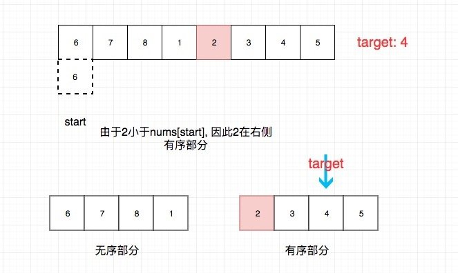

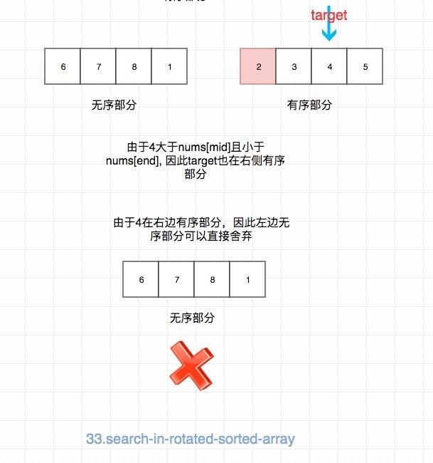

接下来，我们考虑重复元素的问题。如果存在重复数字，就可能会发生 nums[mid] == nums[start] 了，比如 30333 。这个时候可以选择舍弃 start，也就是 start 右移一位。有的同学会担心”会不会错失目标元素？“。其实这个担心是多余的，前面我们已经介绍了” 搜索区间“。由于搜索区间同时包含 start 和 mid ，因此去除一个 start ，我们还有 mid。假如 3 是我们要找的元素， 这样进行下去绝对不会错过，而是收缩”搜索区间“到一个元素 3 ，我们就可以心安理得地返回 3 了。

##### 代码（Python）

```python
class Solution:
    def search(self, nums, target):
        l, r = 0, len(nums)-1
        while l <= r:
            mid = l + (r-l)//2
            if nums[mid] == target:
                return True
            while l < mid and nums[l] == nums[mid]:  # tricky part
                l += 1
            # the first half is ordered
            if nums[l] <= nums[mid]:
                # target is in the first half
                if nums[l] <= target < nums[mid]:
                    r = mid - 1
                else:
                    l = mid + 1
            # the second half is ordered
            else:
                # target is in the second half
                if nums[mid] < target <= nums[r]:
                    l = mid + 1
                else:
                    r = mid - 1
        return False

```

**复杂度分析**

- 时间复杂度：$O(log N)$
- 空间复杂度：$O(1)$

##### 扩展

如果题目不是让你返回 true 和 false，而是返回最左/最右等于 targrt 的索引呢？这不就又和前面的知识建立联系了么？比如我让你在一个旋转数组中找最左等于 target 的索引，其实就是 [面试题 10.03. 搜索旋转数组](https://leetcode-cn.com/problems/search-rotate-array-lcci/)。

思路和前面的最左满足类似，仍然是通过压缩区间，更新备胎，最后返回备胎的方式来实现。 具体看代码吧。

Python Code:

```py
class Solution:
    def search(self, nums: List[int], target: int) -> int:
        l, r = 0, len(nums) - 1
        while l <= r:
            mid = l + (r - l) // 2
            # # the first half is ordered
            if nums[l] < nums[mid]:
                # target is in the first half
                if nums[l] <= target <= nums[mid]:
                    r = mid - 1
                else:
                    l = mid + 1
            # # the second half is ordered
            elif nums[l] > nums[mid]:
                # target is in the second half
                if nums[l] <= target or target <= nums[mid]:
                    r = mid - 1
                else:
                    l = mid + 1
            elif nums[l] == nums[mid]:
                if nums[l] != target:
                    l += 1
                else:
                    # l 是一个备胎
                    r = l - 1
        return l if l < len(nums) and nums[l] == target else -1

```

### 二维数组

二维数组的二分查找和一维没有本质区别， 我们通过两个题来进行说明。

#### 74. 搜索二维矩阵

##### 题目地址

https://leetcode-cn.com/problems/search-a-2d-matrix/

##### 题目描述

```
编写一个高效的算法来判断 m x n 矩阵中，是否存在一个目标值。该矩阵具有如下特性：

每行中的整数从左到右按升序排列。
每行的第一个整数大于前一行的最后一个整数。
示例 1:

输入:
matrix = [
  [1,   3,  5,  7],
  [10, 11, 16, 20],
  [23, 30, 34, 50]
]
target = 3
输出: true
示例 2:

输入:
matrix = [
  [1,   3,  5,  7],
  [10, 11, 16, 20],
  [23, 30, 34, 50]
]
target = 13
输出: false

```

##### 思路

简单来说就是将一个一维有序数组切成若干长度相同的段，然后将这些段拼接成一个二维数组。你的任务就是在这个拼接成的二维数组中找到 target。

需要注意的是，数组是不存在重复元素的。

> 如果有重复元素，我们该怎么办？

算法：

- 选择矩阵左下角作为起始元素 Q
- 如果 Q > target，右方和下方的元素没有必要看了（相对于一维数组的右边元素）
- 如果 Q < target，左方和上方的元素没有必要看了（相对于一维数组的左边元素）
- 如果 Q == target ，直接 返回 True
- 交回了都找不到，返回 False

##### 代码(Python)

```py


class Solution:
    def searchMatrix(self, matrix: List[List[int]], target: int) -> bool:
        m = len(matrix)
        if m == 0:
            return False
        n = len(matrix[0])

        x = m - 1
        y = 0
        while x >= 0 and y < n:
            if matrix[x][y] > target:
                x -= 1
            elif matrix[x][y] < target:
                y += 1
            else:
                return True
        return False

```

**复杂度分析**

- 时间复杂度：最坏的情况是只有一行或者只有一列，此时时间复杂度为 $O(M * N)$。更多的情况下时间复杂度为 $O(M + N)$
- 空间复杂度：$O(1)$

力扣 [240. 搜索二维矩阵 II](https://leetcode-cn.com/problems/search-a-2d-matrix-ii/) 发生了一点变化，不再是`每行的第一个整数大于前一行的最后一个整数`，而是 `每列的元素从上到下升序排列`。我们仍然可以选择左下进行二分。

### 寻找最值(改进的二分)

上面全部都是找到给定值，这次我们试图寻找最值（最小或者最大）。我们以最小为例，讲解一下这种题如何切入。

##### 153. 寻找旋转排序数组中的最小值

##### 题目地址

https://leetcode-cn.com/problems/find-minimum-in-rotated-sorted-array/

##### 题目描述

```
假设按照升序排序的数组在预先未知的某个点上进行了旋转。

( 例如，数组 [0,1,2,4,5,6,7] 可能变为 [4,5,6,7,0,1,2] )。

请找出其中最小的元素。

你可以假设数组中不存在重复元素。

示例 1:

输入: [3,4,5,1,2]
输出: 1
示例 2:

输入: [4,5,6,7,0,1,2]
输出: 0

```

##### 二分法

###### 思路

和查找指定值得思路一样。我们还是：

- 初始化首尾指针 l 和 r
- 如果 nums[mid] 大于 nums[r]，说明 mid 在左侧有序部分，由于最小的一定在右侧，因此可以收缩左区间，即 l = mid + 1
- 否则收缩右侧，即 r = mid（不可以 r = mid - 1）

> 这里多判断等号没有意义，因为题目没有让我们找指定值

- 当 l >= r 或者 nums[l] < nums[r] 的时候退出循环

> nums[l] < nums[r]，说明区间 [l, r] 已经是整体有序了，因此 nums[l] 就是我们想要找的

###### 代码（Python）

```py


class Solution:
    def findMin(self, nums: List[int]) -> int:
        l, r = 0, len(nums) - 1

        while l < r:
            # important
            if nums[l] < nums[r]:
                return nums[l]
            mid = (l + r) // 2
            # left part
            if nums[mid] > nums[r]:
                l = mid + 1
            else:
                # right part
                r = mid
        # l or r is not important
        return nums[l]

```

**复杂度分析**

- 时间复杂度：$O(log N)$
- 空间复杂度：$O(1)$

##### 另一种二分法

###### 思路

我们当然也也可以和 nums[l] 比较，而不是上面的 nums[r]，我们发现：

- 旋转点左侧元素**都大于**数组第一个元素

- 旋转点右侧元素**都小于**数组第一个元素

这样就建立了 nums[mid] 和 nums[0] 的联系。

具体算法：

1. 找到数组的中间元素 mid。

2. 如果中间元素 > 数组第一个元素，我们需要在 mid 右边搜索。

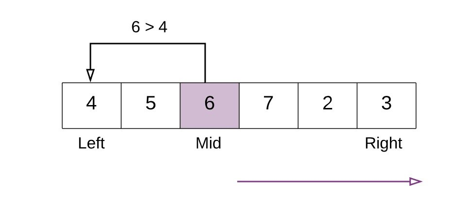

- 如果中间元素 <= 数组第一个元素，我们需要在 mid 左边搜索。

上面的例子中，中间元素 6 比第一个元素 4 大，因此在中间点右侧继续搜索。

3. 当我们找到旋转点时停止搜索，当以下条件满足任意一个即可：

- nums[mid] > nums[mid + 1]，因此 mid+1 是最小值。

- nums[mid - 1] > nums[mid]，因此 mid 是最小值。

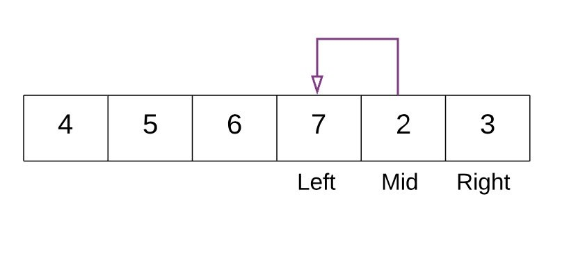

###### 代码（Python）

```py
class Solution:
    def findMin(self, nums):
        # If the list has just one element then return that element.
        if len(nums) == 1:
            return nums[0]

        # left pointer
        left = 0
        # right pointer
        right = len(nums) - 1

        # if the last element is greater than the first element then there is no rotation.
        # e.g. 1 < 2 < 3 < 4 < 5 < 7. Already sorted array.
        # Hence the smallest element is first element. A[0]
        if nums[right] > nums[0]:
            return nums[0]

        # Binary search way
        while right >= left:
            # Find the mid element
            mid = left + (right - left) / 2
            # if the mid element is greater than its next element then mid+1 element is the smallest
            # This point would be the point of change. From higher to lower value.
            if nums[mid] > nums[mid + 1]:
                return nums[mid + 1]
            # if the mid element is lesser than its previous element then mid element is the smallest
            if nums[mid - 1] > nums[mid]:
                return nums[mid]

            # if the mid elements value is greater than the 0th element this means
            # the least value is still somewhere to the right as we are still dealing with elements greater than nums[0]
            if nums[mid] > nums[0]:
                left = mid + 1
            # if nums[0] is greater than the mid value then this means the smallest value is somewhere to the left
            else:
                right = mid - 1

```

**复杂度分析**

- 时间复杂度：$O(log N)$
- 空间复杂度：$O(1)$

### 二叉树

对于一个给定的二叉树，其任意节点最多只有两个子节点。 从这个定义，我们似乎可以嗅出一点二分法的味道， 但是这并不是二分。但是，二叉树中却和二分有很多联系，我们来看一下。

最简单的，如果这个二叉树是一个二叉搜索树（BST）。 那么实际上，在一个二叉搜索树种进行搜索的过程就是二分法。

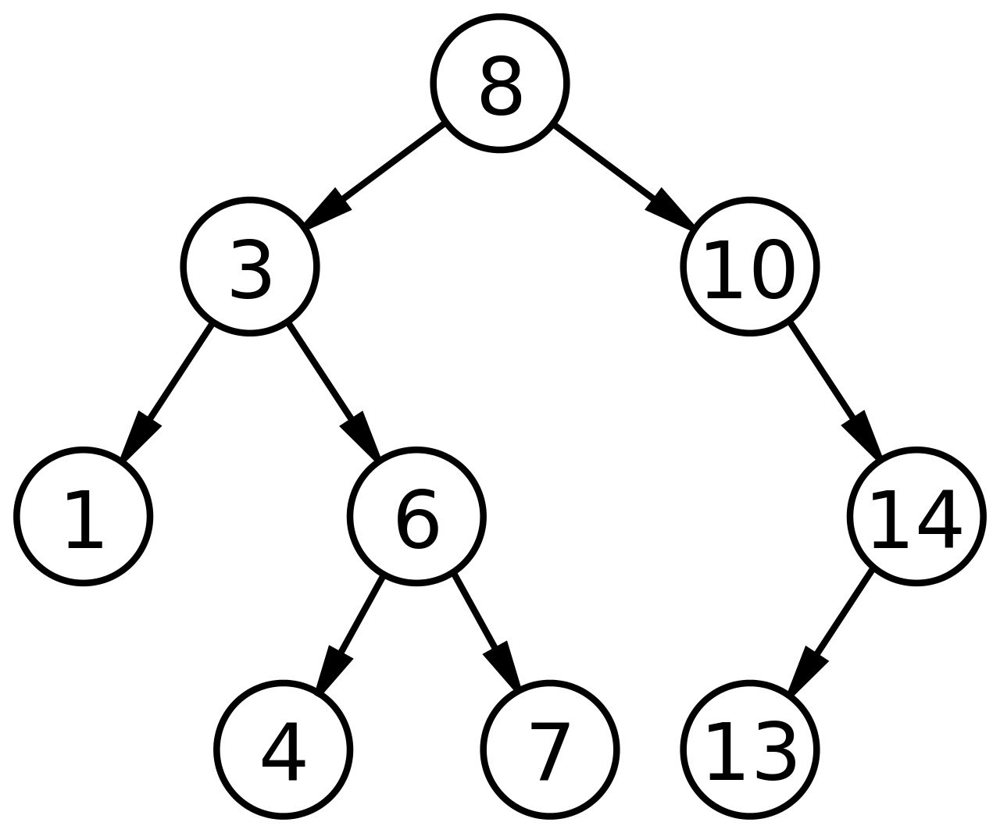

如上图，我们需要在这样一个二叉搜索树中搜索 7。那么我们的搜索路径则会是 8 -> 3 -> 6 -> 7，这也是一种二分法。只不过相比于普通的**有序序列查找给定值**二分， 其时间复杂度的下界更差，原因在于二叉搜索树并不一定是二叉平衡树。

上面讲了二叉搜索树，我们再来看一种同样特殊的树 - 完全二叉树。 如果我们给一颗完全二叉树的所有节点进行编号（二进制），依次为 01,10,11, ...。

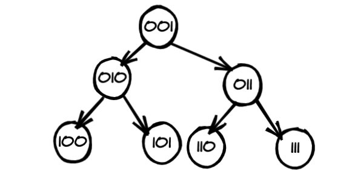

那么实际上，最后一行的编号就是从根节点到该节点的路径。 其中 0 表示向左， 1 表示向右。(第一位数字不用)。 我们以最后一行的 101 为例，我们需要执行一次左，然后一次右。

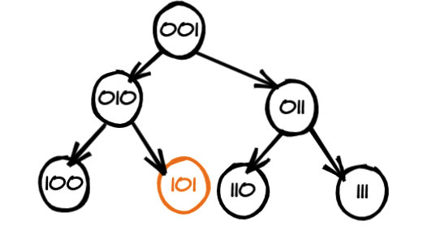

其实原理也不难，如果你用数组表示过完全二叉树，那么就很容易理解。 我们可以发现，父节点的编号都是左节点的二倍，并且都是右节点的二倍 + 1。从二进制的角度来看就是：**父节点的编号左移一位就是左节点的编号，左移一位 + 1 就是右节点的编号**。 因此反过来， 知道了子节点的最后一位，我们就能知道它是父节点的左节点还是右节点啦。

## 题目推荐

- [875. 爱吃香蕉的珂珂](https://leetcode-cn.com/problems/koko-eating-bananas/)
- [2141. Maximum Running Time of N Computers 官方题解](https://leetcode.com/problems/maximum-running-time-of-n-computers/editorial) 强烈推荐 👍

## 数学基础

为了方便新手理解，前面讲的内容使用的是自然语言，尽可能通俗。

这里我们稍微增加一点数学知识，帮你从另外一个方向理解。

前面我们提到了解空间的概念， 解空间指的是**题目所有可能的解构成的集合**。比如一个题目所有解的可能是 1,2,3,4,5，但具体在某一种情况只能是其中某一个数（即可能是 1，2，3，4，5 中的**一个数**）。那么这里的解空间就是 1,2,3,4,5 构成的集合。

如果我们将解空间作为自变量，然后选取另外一个指标作为因变量，将其画到坐标轴上，你会发现能用二分法解决的问题在这个坐标轴的图像都是一个”凸函数“，也有一些资料将其称为二段性，其实是一个意思，只不过“凸函数”更直观。

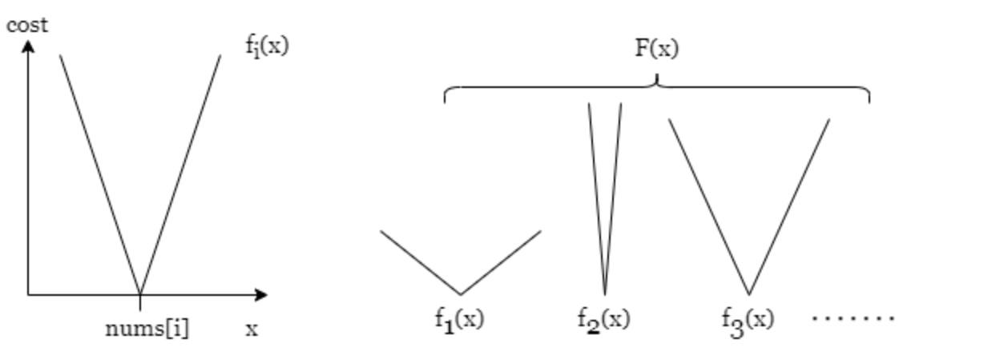

如果一个函数是凸函数，我们又想要求凸的那个极点，就可使用二分。

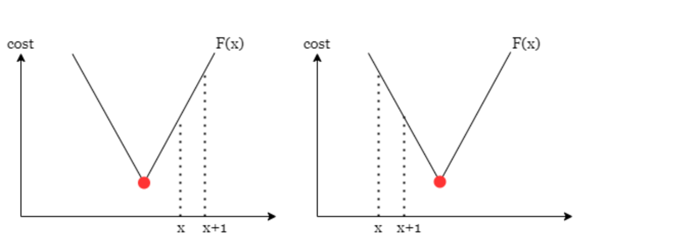

如上图，通过比较 F(x) 和 F(x+1) 就可以确定我们要找的凸点在哪一侧，进而舍弃一般的解空间。

> 这里的 F(x) 就是我上面说的“另外一个指标作为因变量”的因变量。

这里推荐力扣国际中的一篇题解，里面形象地解释了凸函数，其函数图像以及为何凸函数就可以使用二分。via: https://leetcode.com/problems/minimum-cost-to-make-array-equal/editorial/

## 四大应用

基础知识铺垫了差不多了。接下来，我们开始干货技巧。

接下来要讲的：

- 能力检测和计数二分本质差不多，都是**普通二分** 的泛化。
- 前缀和二分和插入排序二分，本质都是在**构建有序序列**。

那让我们开始吧。

### 能力检测二分

如果一道题你使用纯暴力解法感觉完全不可能通过。 比如暴力解法是枚举所有的组合，这需要指数的时间，而题目的数据范围限定到 $10**5$。这显然是无法通过的。

那么我们往往需要转变思维，将题目转化一种问法。比如直接求最小的 xxxx 比较困难，那么求**x 是否可行**会不会简单点呢？如果**x 是否可行**会简单点。我们是否可以枚举所有的 x 找到答案呢？

> 基础篇的枚举章节提示我们这种情况需要从小到大枚举，这样可以剪枝

经过这样的处理，时间复杂度很可能已经降低了很多。如果题目满足单调性，比如 x 不行，小于 x 的都不行，那么我们就可以使用本文所讲的能力检测二分进行求解了。

能力检测二分一般是：定义函数 possible， 参数是 mid，返回值是布尔值。外层根据返回值调整"解空间"。

示例代码（以最左二分为例）：

```py
def ability_test_bs(nums):
  def possible(mid):
    pass
  l, r = 0, len(A) - 1
  while l <= r:
      mid = (l + r) // 2
      # 只有这里和最左二分不一样
      if possible(mid): l = mid + 1
      else: r = mid - 1
  return l
```

和最左最右二分这两种最最基本的类型相比，能力检测二分**只是将 while 内部的 if 语句调整为了一个函数罢了**。因此能力检测二分也分最左和最右两种基本类型。

基本上大家都可以用这个模式来套。明确了解题的框架，我们最后来看下能力检测二分可以解决哪些问题。这里通过三道题目带大家感受一下，类似的题目还有很多，大家课后自行体会。

#### 875. 爱吃香蕉的珂珂（中等）

##### 题目地址

https://leetcode-cn.com/problems/koko-eating-bananas/description/

##### 题目描述

```
珂珂喜欢吃香蕉。这里有 N 堆香蕉，第 i 堆中有 piles[i] 根香蕉。警卫已经离开了，将在 H 小时后回来。

珂珂可以决定她吃香蕉的速度 K （单位：根/小时）。每个小时，她将会选择一堆香蕉，从中吃掉 K 根。如果这堆香蕉少于 K 根，她将吃掉这堆的所有香蕉，然后这一小时内不会再吃更多的香蕉。  

珂珂喜欢慢慢吃，但仍然想在警卫回来前吃掉所有的香蕉。

返回她可以在 H 小时内吃掉所有香蕉的最小速度 K（K 为整数）。

 

示例 1：

输入: piles = [3,6,7,11], H = 8
输出: 4
示例 2：

输入: piles = [30,11,23,4,20], H = 5
输出: 30
示例 3：

输入: piles = [30,11,23,4,20], H = 6
输出: 23
 

提示：

1 <= piles.length <= 10^4
piles.length <= H <= 10^9
1 <= piles[i] <= 10^9


```

##### 前置知识

- 二分查找

##### 公司

- 字节

##### 思路

题目是让我们求**H 小时内吃掉所有香蕉的最小速度**。

符合直觉的做法是枚举所有可能的速度，找出所有的可以吃完香蕉的速度，接下来选择最小的速度即可。由于需要返回最小的速度，因此选择从小到大枚举会比较好，因为可以提前退出。 这种解法的时间复杂度比较高，为 $O(N * M)$，其中 N 为 piles 长度， M 为 Piles 中最大的数（也就是解空间的最大值）。

观察到需要检测的解空间是个**有序序列**，应该想到可能能够使用二分来解决，而不是线性枚举。可以使用二分解决的关键和前面我们简化的二分问题并无二致，关键点在于**如果速度 k 吃不完所有香蕉，那么所有小于等于 k 的解都可以被排除。**

二分解决的关键在于：

- 明确解空间。 对于这道题来说， 解空间就是 [1,max(piles)]。
- 如何收缩解空间。关键点在于**如果速度 k 吃不完所有香蕉，那么所有小于等于 k 的解都可以被排除。**

综上，我们可以使用最左二分，即不断收缩右边界。

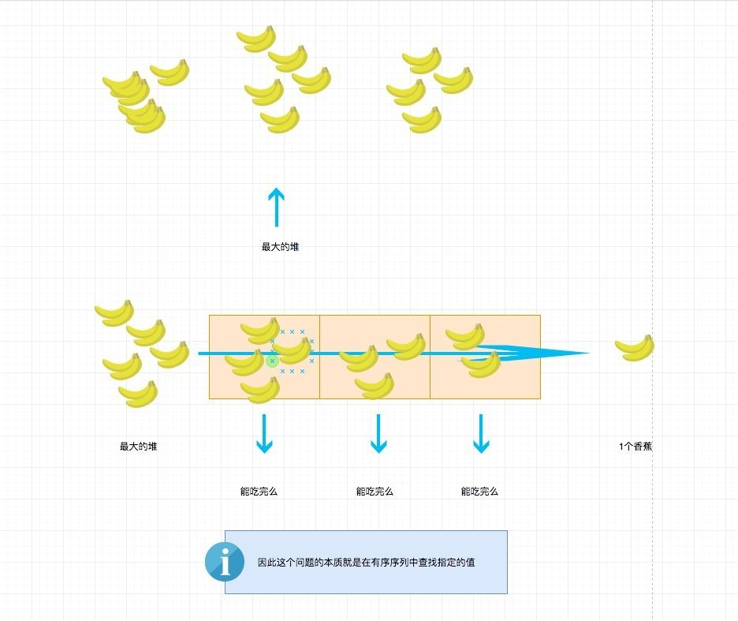

> 香蕉堆的香蕉个数上限是 10^9， 珂珂这也太能吃了吧？

##### 关键点解析

- 二分查找模板

##### 代码

代码支持：Python，JavaScript

Python Code:

```py
class Solution:
    def solve(self, piles, k):
        def possible(mid):
            t = 0
            for pile in piles:
                t += (pile + mid - 1) // mid
            return t <= k

        l, r = 1, max(piles)

        while l <= r:
            mid = (l + r) // 2
            if possible(mid):
                r = mid - 1
            else:
                l = mid + 1
        return l

```

JavaScript Code:

```js
function canEatAllBananas(piles, H, mid) {
  let h = 0;
  for (let pile of piles) {
    h += Math.ceil(pile / mid);
  }

  return h <= H;
}
/**
 * @param {number[]} piles
 * @param {number} H
 * @return {number}
 */
var minEatingSpeed = function (piles, H) {
  let lo = 1,
    hi = Math.max(...piles);
  // [l, r) ， 左闭右开的好处是如果能找到，那么返回 l 和 r 都是一样的，因为最终 l 等于 r。
  while (lo <= hi) {
    let mid = lo + ((hi - lo) >> 1);
    if (canEatAllBananas(piles, H, mid)) {
      hi = mid - 1;
    } else {
      lo = mid + 1;
    }
  }

  return lo; //  不能选择hi
};
```

**复杂度分析**

- 时间复杂度：$O(max(N, N * logM))$，其中 N 为 piles 长度， M 为 Piles 中最大的数。
- 空间复杂度：$O(1)$

#### 最小灯半径（困难）

##### 题目描述

```
You are given a list of integers nums representing coordinates of houses on a 1-dimensional line. You have 3 street lights that you can put anywhere on the coordinate line and a light at coordinate x lights up houses in [x - r, x + r], inclusive. Return the smallest r required such that we can place the 3 lights and all the houses are lit up.

Constraints

n ≤ 100,000 where n is the length of nums
Example 1
Input
nums = [3, 4, 5, 6]
Output
0.5
Explanation
If we place the lamps on 3.5, 4.5 and 5.5 then with r = 0.5 we can light up all 4 houses.
```

##### 前置知识

- 排序
- 二分法

##### 二分法

##### 思路

本题和力扣 [475. 供暖器](https://leetcode-cn.com/problems/heaters/) 类似。

这道题的意思是给你一个数组 nums，让你在 [min(nums),max(nums)] 范围内放置 3 个灯，每个灯覆盖半径都是 r，让你求最小的 r。

之所以不选择小于 min(nums) 的位置和大于 max(nums) 的位置是因为没有必要。比如选取了小于 min(nums) 的位置 pos，那么选取 pos **一定不比选择 min(nums) 位置结果更优**。

这道题的核心点还是一样的思维模型，即：

- 确定解空间。这里的解空间其实就是 r。不难看出 r 的下界是 0， 上界是 max(nums) - min(nums)。

> 没必要十分精准，只要不错过正确解即可，这个我们在前面讲过，这里再次强调一下。

- 对于上下界之间的所有可能 x 进行枚举（不妨从小到大枚举），检查半径为 x 是否可以覆盖所有，返回第一个可以覆盖所有的 x 即可。

注意到我们是在一个有序序列进行枚举，因此使用二分就应该想到。可使用二分的核心点在于：如果 x 不行，那么小于 x 的所有半径都必然不行。

接下来的问题就是给定一个半径 x，判断其是否可覆盖所有的房子。

**判断其是否可覆盖**就是所谓的能力检测，我定义的函数 possible 就是能力检测。

首先**对 nums 进行排序**，这在后面会用到。 然后从左开始模拟放置灯。先在 nums[0] + r 处放置一个灯，其可以覆盖 [0, 2 * r]。由于 nums 已经排好序了，那么这个等可以覆盖到的房间其实就是 nums 中坐标小于等于 2 \* r 所有房间，使用二分查找即可。对于 nums 右侧的所有的房间我们需要继续放置灯，采用同样的方式即可。

能力检测核心代码：

```py
def possible(diameter):
    start = nums[0]
    end = start + diameter
    for i in range(LIGHTS):
        idx = bisect_right(nums, end)
        if idx >= N:
            return True
        start = nums[idx]
        end = start + diameter
    return False
```

由于我们想要找到满足条件的最小值，因此可直接套用**最左二分模板**。

##### 代码

代码支持：Python3

Python3 Code:

```py
class Solution:
    def solve(self, nums):
        nums.sort()
        N = len(nums)
        if N <= 3:
            return 0
        LIGHTS = 3
        # 这里使用的是直径，因此最终返回需要除以 2
        def possible(diameter):
            start = nums[0]
            end = start + diameter
            for i in range(LIGHTS):
                idx = bisect_right(nums, end)
                if idx >= N:
                    return True
                start = nums[idx]
                end = start + diameter
            return False

        l, r = 0, nums[-1] - nums[0]
        while l <= r:
            mid = (l + r) // 2
            if possible(mid):
                r = mid - 1
            else:
                l = mid + 1
        return l / 2
```

**复杂度分析**

令 n 为数组长度。

- 时间复杂度：由于进行了排序， 因此时间复杂度大约是 $O(nlogn)$
- 空间复杂度：取决于排序的空间消耗

#### 778. 水位上升的泳池中游泳（困难）

##### 题目地址

https://leetcode-cn.com/problems/swim-in-rising-water

##### 题目描述

```
在一个 N x N 的坐标方格  grid 中，每一个方格的值 grid[i][j] 表示在位置 (i,j) 的平台高度。

现在开始下雨了。当时间为  t  时，此时雨水导致水池中任意位置的水位为  t 。你可以从一个平台游向四周相邻的任意一个平台，但是前提是此时水位必须同时淹没这两个平台。假定你可以瞬间移动无限距离，也就是默认在方格内部游动是不耗时的。当然，在你游泳的时候你必须待在坐标方格里面。

你从坐标方格的左上平台 (0，0) 出发。最少耗时多久你才能到达坐标方格的右下平台  (N-1, N-1)？

示例 1:

输入: [[0,2],[1,3]]
输出: 3
解释:
时间为 0 时，你位于坐标方格的位置为 (0, 0)。
此时你不能游向任意方向，因为四个相邻方向平台的高度都大于当前时间为 0 时的水位。

等时间到达 3 时，你才可以游向平台 (1, 1). 因为此时的水位是 3，坐标方格中的平台没有比水位 3 更高的，所以你可以游向坐标方格中的任意位置
示例 2:

输入: [[0,1,2,3,4],[24,23,22,21,5],[12,13,14,15,16],[11,17,18,19,20],[10,9,8,7,6]]
输出: 16
解释:
0 1 2 3 4
24 23 22 21 5
12 13 14 15 16
11 17 18 19 20
10 9 8 7 6

最终的路线用加粗进行了标记。
我们必须等到时间为 16，此时才能保证平台 (0, 0) 和 (4, 4) 是连通的

提示:

2 <= N <= 50.
grid[i][j] 位于区间 [0, ..., N*N - 1] 内。
```

##### 前置知识

- [DFS](https://github.com/azl397985856/leetcode/blob/master/thinkings/DFS.md)
- [二分](https://github.com/azl397985856/leetcode/blob/master/91/binary-search.md)

##### 思路

首先明确一下解空间。不难得出，解空间是[0, max(grid)]，其中 max(grid) 表示 grid 中的最大值。

因此一个简单的思路是一个个试。

- 试试 a 可以不
- 试试 a+1 可以不
- 。。。

**试试 x 是否可行**就是能力检测。

实际上，如果 x 不可以，那么小于 x 的所有值都是不可以的，这正是本题的突破口。基于此，我们同样可使用讲义中的**最左二分**模板解决。

伪代码:

```py
def test(x):
    pass
while l <= r:
    mid = (l + r) // 2
    if test(mid, 0, 0):
        r = mid - 1
    else:
        l = mid + 1
return l

```

这个模板会在很多二分中使用。比如典型的计数型二分，典型的就是计算小于等于 x 的有多少，然后根据答案更新解空间。

明确了这点，剩下要做的就是完成能力检测部分 （test 函数） 了。其实这个就是一个普通的二维网格 dfs，我们从 (0,0) 开始在一个二维网格中搜索，直到无法继续或达到 (N-1,N-1)，如果可以达到 (N-1,N-1)，我们返回 true，否则返回 False 即可。对二维网格的 DFS 不熟悉的同学可以看下我之前写的[小岛专题](https://github.com/azl397985856/leetcode/blob/master/thinkings/island.md)

##### 代码

```py
class Solution:
    def swimInWater(self, grid: List[List[int]]) -> int:
        l, r = 0, max([max(vec) for vec in grid])
        seen = set()

        def test(mid, x, y):
            if x > len(grid) - 1 or x < 0 or y > len(grid[0]) - 1 or y < 0:
                return False
            if grid[x][y] > mid:
                return False
            if (x, y) == (len(grid) - 1, len(grid[0]) - 1):
                return True
            if (x, y) in seen:
                return False
            seen.add((x, y))
            ans = test(mid, x + 1, y) or test(mid, x - 1,
                                              y) or test(mid, x, y + 1) or test(mid, x, y - 1)
            return ans
        while l <= r:
            mid = (l + r) // 2
            if test(mid, 0, 0):
                r = mid - 1
            else:
                l = mid + 1
            seen = set()
        return l

```

**复杂度分析**

- 时间复杂度：$O(NlogM)$，其中 M 为 grid 中的最大值， N 为 grid 的总大小。
- 空间复杂度：$O(N)$，其中 N 为 grid 的总大小。

### 计数二分

计数二分和上面的思路已经代码都基本一致。 直接看代码会清楚一点：

```py
def count_bs(nums, k):
  def count_not_greater(mid):
    pass
  l, r = 0, len(A) - 1
  while l <= r:
      mid = (l + r) // 2
      # 只有这里和最左二分不一样
      if count_not_greater(mid) > k: r = mid - 1
      else: l = mid + 1
  return l
```

可以看出只是将 `possible` 变成了 `count_not_greater`，返回值变成了数字而已。

实际上，我们可以将上面的代码稍微改造一下，使得两者更像：

```py
def count_bs(nums, k):
  def possible(mid, k):
    # xxx
    return cnt > k
  l, r = 0, len(A) - 1
  while l <= r:
      mid = (l + r) // 2
      if possible(mid, k): r = mid - 1
      else: l = mid + 1
  return l
```

是不是基本一致了？

由于和上面基本一致， 因此这里直接推荐一个题目，大家用我的思路练习一下，看看我的技巧灵不灵。

- [第 k 小的距离对](https://binarysearch.com/problems/Kth-Pair-Distance)

### 前缀和二分

前面说了：如果数组全是正的，那么其前缀和就是一个严格递增的数组，基于这个特性，我们可以在其之上做二分。类似的有单调栈/队列。这种题目类型很多，为了节省篇幅就不举例说明了。提出前缀和二分的核心的点在于让大家保持对**有序序列**的敏感度。

比如题目 [LCP 08. 剧情触发时间](https://leetcode-cn.com/problems/ju-qing-hong-fa-shi-jian/)，不难发现朴素的暴力做法时间复杂度是 $O(m*n)$， 其中 m 和 n 分别为 increase 和 requirements 的长度。进一步我们发现随着游戏进行，三种属性递增，也就是说其是一个**有序序列**，因此我们可以基于此进行二分查找，分别对 C，R 和 H 进行二分查找，三个中的瓶颈就是答案，大家不妨自己试试，体会一下**有序序列**的妙处。

再比如 [2389. 和有限的最长子序列](https://leetcode.cn/problems/longest-subsequence-with-limited-sum/) 由于数组中每一个数都是正数，因此前缀和是递增的， 这样前缀和的最后一个小于等于 x 的数就是满足题目条件的子序列的最大长度。

而即使前缀和不是有序的， 我们也可以手动维护成有序， 然后做二分。 比如：给你一个数组 nums， 让你求 nums 有多少个子数组的和大于 0。 我们可以用前缀和预处理，然后前缀和计算任意子数组的和。而这里我们需要手动维护“有序的”前缀和二分。比如当前累计和为 t，索引是 i，那么我们的目标是找到第一个为 t 的位置 x，那么左端点为 [0,x) 右端点是 i 的子数组都是满足条件的，累加即可。

题目推荐：

- [2488. 统计中位数为 K 的子数组](https://leetcode.cn/problems/count-subarrays-with-median-k/)

2488 参考代码：

```py
from sortedcontainers import SortedList
class Solution:
    def countSubarrays(self, nums: List[int], k: int) -> int:
        def f(mid: int) -> int:
            A = [1 if num >= mid else -1 for num in nums]
            ans, t, d = 0, 0, SortedList([0])
            for num in A:
                t += num
                ans += d.bisect_left(t)
                d.add(t)
            return ans
        return f(k) - f(k + 1)
```

### 插入排序二分

除了上面的前缀和之外，我们还可以自行维护有序序列。一般有三种方式：

- 直接对序列排序。

代码表示：

```py
nums.sort()
bisect.bisect_left(nums, x) # 最左二分
bisect.bisect_right(nums, x) # 最右二分
```

- 遍历过程维护一个新的有序序列，有序序列的内容为**已经遍历过的值的集合**。

比如无序数组 [3,2,10,5]，遍历到索引为 2 的项（也就是值为 10 的项）时，我们构建的有序序列为 [2,3,10]。

> 注意我描述的是有序序列，并不是指数组，链表等具体的数据结构。而实际上，这个有序序列很多情况下是平衡二叉树。后面题目会体现这一点。

代码表示：

```py
d = SortedList()
for a in A:
    d.add(a) # 将 a 添加到 d，并维持 d 中数据有序
```

上面代码的 d 就是有序序列。

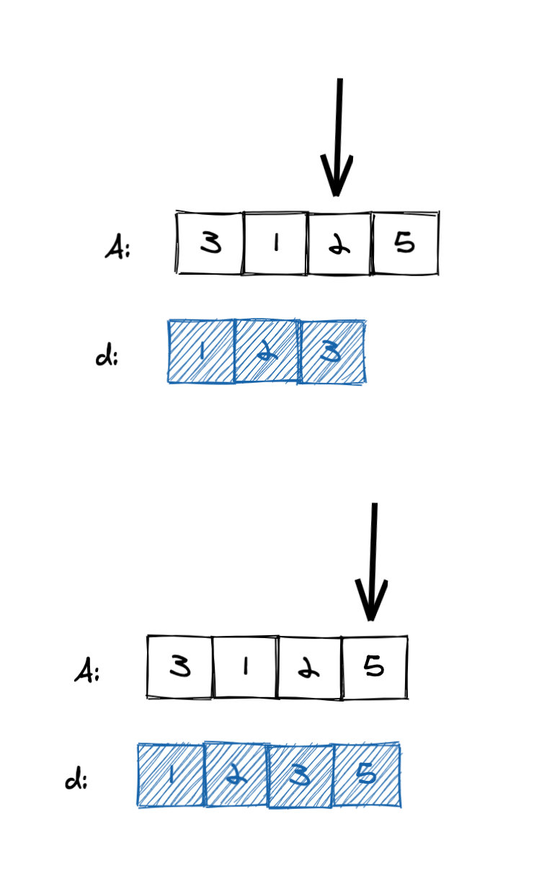

理论知识到此为止，接下来通过一个例子来说明。

- 将数组索引放到一个数组 arr 中，并维持 arr 有序。这里维持 arr 有序就简单多了，我们只需从左到右遍历原数组即可。接下来，我们可以对 arr 进行二分。推荐题目：[区间内查询数字的频率](https://leetcode-cn.com/problems/range-frequency-queries/)

#### 327. 区间和的个数(困难)

##### 题目地址

https://leetcode-cn.com/problems/count-of-range-sum

##### 题目描述

```
给定一个整数数组 nums 。区间和 S(i, j) 表示在 nums 中，位置从 i 到 j 的元素之和，包含 i 和 j (i ≤ j)。

请你以下标 i （0 <= i <= nums.length ）为起点，元素个数逐次递增，计算子数组内的元素和。

当元素和落在范围 [lower, upper] （包含 lower 和 upper）之内时，记录子数组当前最末元素下标 j ，记作 有效 区间和 S(i, j) 。

求数组中，值位于范围 [lower, upper] （包含 lower 和 upper）之内的 有效 区间和的个数。

 

注意：
最直观的算法复杂度是 O(n2) ，请在此基础上优化你的算法。

 

示例：

输入：nums = [-2,5,-1], lower = -2, upper = 2,
输出：3
解释：
下标 i = 0 时，子数组 [-2]、[-2,5]、[-2,5,-1]，对应元素和分别为 -2、3、2 ；其中 -2 和 2 落在范围 [lower = -2, upper = 2] 之间，因此记录有效区间和 S(0,0)，S(0,2) 。
下标 i = 1 时，子数组 [5]、[5,-1] ，元素和 5、4 ；没有满足题意的有效区间和。
下标 i = 2 时，子数组 [-1] ，元素和 -1 ；记录有效区间和 S(2,2) 。
故，共有 3 个有效区间和。
 

提示：

0 <= nums.length <= 10^4

```

##### 思路

题目很好理解。

由前缀和的性质知道：区间 i 到 j（包含）的和 sum(i,j) = pre[j] - pre[i-1]，其中 pre[i] 为数组前 i 项的和 0 <= i < n。

但是题目中的数字可能是负数，前缀和不一定是单调的啊？这如何是好呢？答案是手动维护前缀和的有序性。

比如 [-2,5,-1] 的前缀和 为 [-2,3,2]，但是我们可以将求手动维护为 [-2,2,3]，这样就有序了。但是这丧失了索引信息，因此这个技巧仅适用于**无需考虑索引，也就是不需要求具体的子序列，只需要知道有这么一个子序列就行了，具体是哪个，我们不关心**。

比如当前的前缀和是 cur，那么前缀和小于等于 cur - lower 有多少个，就说明以当前结尾的区间和大于等于 lower 的有多少个。类似地，前缀和小于等于 cur - upper 有多少个，就说明以当前结尾的区间和大于等于 upper 的有多少个。

基于这个想法，我们可使用二分在 $logn$ 的时间快速求出这两个数字，使用平衡二叉树代替数组可使得插入的时间复杂度降低到 $O(logn)$。Python 可使用 SortedList 来实现， Java 可用 TreeMap 代替。

##### 代码

```py
from sortedcontainers import SortedList
class Solution:
    def countRangeSum(self, A: List[int], lower: int, upper: int) -> int:
        ans, pre, cur = 0, SortedList([0]), 0
        for a in A:
            cur += a
            ans += pre.bisect_right(cur - lower) - pre.bisect_left(cur - upper)
            pre.add(cur)
        return ans

```

**复杂度分析**

令 n 为数组长度。

- 时间复杂度：$O(nlogn)$
- 空间复杂度：$O(nlogn)$

#### 493. 翻转对（困难）

##### 题目地址

https://leetcode-cn.com/problems/reverse-pairs/

##### 题目描述

```
给定一个数组 nums ，如果 i < j 且 nums[i] > 2*nums[j] 我们就将 (i, j) 称作一个重要翻转对。

你需要返回给定数组中的重要翻转对的数量。

示例 1:

输入: [1,3,2,3,1]
输出: 2


示例 2:

输入: [2,4,3,5,1]
输出: 3


注意:

给定数组的长度不会超过50000。
输入数组中的所有数字都在32位整数的表示范围内。
```

##### 前置知识

- 二分

##### 公司

- 暂无

##### 思路

我们可以一边遍历一边维护一个有序序列 d，其中 d 为**已经遍历过的值的集合**。对于每一个位置 0 <= i < n，我们统计 d 中大于 2 \* A[i] 的个数，这个个数就是题目要求的翻转对。这里的关键在于 d 中的值是比当前索引小的**全部**值。

我们当然可以线性遍历 d，求出个数。一个更好的方法是在遍历的同时维持 d 是**有序的**，这样我们就可以用二分了。和上面题目一样，使用平衡二叉树代替数组可使得插入的时间复杂度降低到 $O(logn)$。

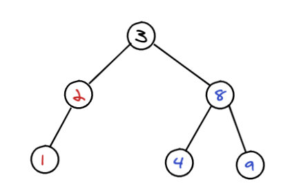

##### 关键点

- 插入排序二分

##### 代码

- 语言支持：Python3

Python3 Code:

```python
from sortedcontainers import SortedList
class Solution:
    def reversePairs(self, A: List[int]) -> int:
        d = SortedList()
        ans = 0
        for a in A:
            ans += len(d) - d.bisect_right(2*a)
            d.add(a)
        return ans

```

**复杂度分析**

令 n 为数组长度。

- 时间复杂度：$O(nlogn)$
- 空间复杂度：$O(n)$

### 小结

四个应用讲了两种构造有序序列的方式，分别是前缀和，插入排序，插入排序的部分其实也可以看下我之前写的[最长上升子序列系列](https://lucifer.ren/blog/2020/06/20/LIS/ "最长上升子序列系列")，那里面的贪心解法就是**自己构造有序序列再二分**的。 另外理论上单调栈/队列也是有序的，也可是用来做二分，但是相关题目太少了，因此大家只要保持对**有序序列**的敏感度即可。而前缀和这种有序序列的二分是比较多的，比如最近的一次周赛就用到了 [5900. 蜡烛之间的盘子](https://leetcode-cn.com/problems/plates-between-candles/)。这道题就可以对盘子进行前缀和统计，而是每次查询都在前缀和上进行二分查找，唯一需要注意的是一些 corner case 的处理。

能力检测二分很常见，不过其仅仅是将普通二分的 if 部分改造成了函数而已。而对于计数二分，其实就是能力检测二分的特例，只不过其太常见了，就将其单独提取出来了。

另外，有时候有序序列也会给你稍微变化一种形式。比如二叉搜索树，大家都知道可以在 $logn$ 的时间完成查找，这个查找过程本质也是二分。二叉查找树有**有序序列**么？有的！二叉查找树的中序遍历恰好就是一个有序序列。因此如果一个数比当前节点值小，一定在左子树（也就是有序序列的左侧），如果一个数比当前节点值大，一定在右子树（也就是有序序列的右侧）。

## 母题

1. 给你一个长度为 m 的值的范围是 [1,n]的有序序列。求数组中缺失的第一个数是多少？

比如：

- [2,3,4] 缺失的第一个数是 1
- [1,2,3,5] 缺失的第一个数是 4

我们可以将问题转化为求**最右满足 nums[i]==i+1**的数，这样可以套用我们的模型来解决。

题目 [2424. 最长上传前缀](https://leetcode.cn/problems/longest-uploaded-prefix/) 就可以使用这个技巧来完成（虽然不是最优解）

参考代码：

```py
from sortedcontainers import SortedList

class LUPrefix:

    def __init__(self, n: int):
        self.d = SortedList()
        self.n = n

    def upload(self, video: int) -> None:
        self.d.add(video)

    def longest(self) -> int:

        l, r = 0, len(self.d) - 1

        while l <= r:
            mid = (l + r) // 2
            if self.d[mid] == mid+1:
                l = mid + 1
            else:
                r = mid - 1
        return r + 1
```

2. 求解最少需要多少步。

比如发生火灾了，火势可以蔓延，问题最晚原地等多久开始跑能跑掉。我们可以将问题转化为求**最右满足 xxx**，这样可以套用我们的模型来解决。

再比如还是发生火灾了，但是消防员可以蔓延地扑火，你最早啥时候可以跑掉 。类似地，我们可以将问题转化为求**最左满足 xxx**，这样可以套用我们的模型来解决。我们上面讲解的 778. 水位上升的泳池中游泳（困难） 就可以使用这个模型。

3. 极大化极小值或者极小化极大值。

这种题目考虑使用动态规划或者二分。 动态规划可以参考后面动态规划章节的博弈 DP。

朴素的思维是线性枚举最大值，并判断最大值是否真的可以取到。二分的话就是对这一过程的折半优化。

参考题目 [2439. 最小化数组中的最大值](https://leetcode.cn/problems/minimize-maximum-of-array/)

## 总结

二分查找是一种非常重要且难以掌握的核心算法，大家一定要好好领会。有的题目直接二分就可以了，有的题目二分只是其中一个环节。不管是哪种，都需要我们对二分的思想和代码模板非常熟悉才可以。

二分查找的基本题型有：

- 查找满足条件的元素，返回对应索引
- 如果存在多个满足条件的元素，返回最左边满足条件的索引。
- 如果存在多个满足条件的元素，返回最右边满足条件的索引。
- 数组不是整体有序的。 比如先升序再降序，或者先降序再升序。
- 将一维数组变成二维数组。
- 局部有序查找最大（最小）元素
- 。。。

不管是哪一种类型，我们的思维框架都是类似的，都是：

- 先定义**搜索区间**（非常重要）
- 根据搜索区间定义循环结束条件
- 取中间元素和目标元素做对比（目标元素可能是需要找的元素或者是数组第一个，最后一个元素等）（非常重要）
- 根据比较的结果收缩区间，舍弃非法解（也就是二分）

> 如果是整体有序通常只需要 nums[mid] 和 target 比较即可。如果是局部有序，则可能需要与其周围的特定元素进行比较。

大家可以使用这个思维框架并结合本文介绍的几种题型进行练习，必要的情况可以使用我提供的解题模板，提供解题速度的同时，有效地降低出错的概率。

特别需要注意的是**有无重复元素对二分算法影响很大**，我们需要小心对待。

另外本文主要讲了两种二分类型：最左和最右，模板已经给大家了，大家只需要根据题目调整解空间和判断条件即可。关于四种应用更多的还是让大家理解二分的核心**折半**。表面上来看，二分就是对有序序列的查找。其实不然，只不过有序序列很容易做二分罢了。因此战术上大家保持对有序序列的敏感度，战略上要明确二分的本质是折半，核心在于什么时候将哪一半折半。

一个问题能否用二分解决的关键在于检测一个值的时候是否可以排除解空间中的一半元素。比如我前面反复提到的**如果 x 不行，那么解空间中所有小于等于 x 的值都不行**。

对于简单题目，通常就是给你一个有序序列，让你在上面找满足条件的位置。顶多变化一点，比如数组局部有序，一维变成二维等。对于这部分可以看下我写的[91 算法 - 二分查找讲义](https://github.com/azl397985856/leetcode/blob/master/91/binary-search.md "91算法 - 二分查找讲义")

中等题目可能需要让你自己构造有序序列。大家也可以直接使用编程语言自带的数据结构，比如 Java 的 TreeSet，CPP 的 multiset，Python sortedcontainers 等等。

困难题则可能是二分和其他专题的结合，比如上面的 778. 水位上升的泳池中游泳（困难），就是二分和搜索的结合。我们给的例子是和 DFS 进行结合，而也有的题目需要结合使用 BFS，比如 [2258. 逃离火灾](https://leetcode-cn.com/problems/escape-the-spreading-fire/) 这个留给大家当作业。

以上就是本文的全部内容了， 大家对此有何看法，欢迎给我留言，我有时间都会一一查看回答。我是 lucifer，维护西湖区最好的算法题解，Github 超 40K star 。大家也可以关注我的公众号《力扣加加》带你啃下算法这块硬骨头。

另外我整理的 1000 多页的电子书已限时免费下载，大家可以去我的公众号《力扣加加》后台回复电子书获取。
