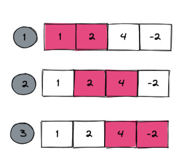
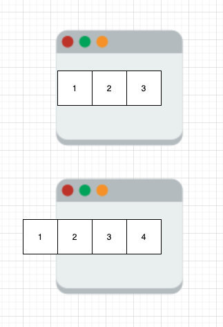
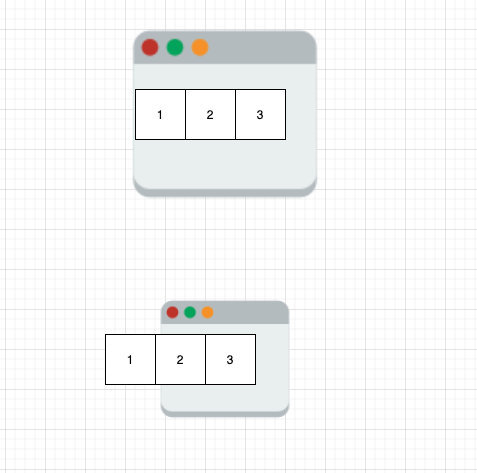

# 滑动窗口

## 简介

笔者最早接触滑动窗口是滑动窗口协议，滑动窗口协议（Sliding Window Protocol），属于 TCP 协议的一种应用，用于网络数据传输时的流量控制，以避免拥塞的发生。 发送方和接收方分别有一个窗口大小 w1 和 w2。窗口大小可能会根据网络流量的变化而有所不同，但是在更简单的实现中它们是固定的。窗口大小必须大于零才能进行任何操作。

我们算法中的滑动窗口也是类似，只不过包括的情况更加广泛。实际上上面的滑动窗口在某一个时刻就是固定窗口大小的滑动窗口，随着网络流量等因素改变窗口大小也会随着改变。接下来我们讲下算法中的滑动窗口。

算法中的滑动窗口（以下简称滑窗），也就是 Sliding Window，是利用双指针（两个指针用于界定窗口的左右边界）在某种数据结构上（大部分基本上都是 Array）虚构出了一个窗口，并且该窗口还会进行移动，窗口移动的时候**利用已有的窗口的计算信息重新出新的窗口的计算信息**，其本质是一种**空间换时间**的算法。该专题希望大家可以对该思想有一个系统的认识以及训练。

## 滑动窗口的核心

为了方便大家理解，不妨思考一下如何**求数组连续 k 个数的和的最大值**。比如数组是 [1,2,4,-2], k = 2。那么连续 k 个数的子序列有 [1,2], [2,4], [4,-2]， 其中最大的是 [2,4]，其和为 6。



首先我们使用暴力枚举的方式进行求解。即暴力枚举所有的长度为 k 的子序列并比较大小返回最大的。

暴力枚举的方法也比较容易想到，就是直接使用**双层循环**固定左右两个数组端点。最后只需要将两个端点间的数相加即可。而由于窗口长度固定为 k，

因此固定一个端点，另外一个端点也随之固定。比如我们固定了左端点 l，那么右端点就是 l + k，其中 0 <= l < n - k + 1。

```py
res = 1
# 枚举左端点
for l in range(n - k + 1):
    res = max(res, sum(nums[l:l+k]))
return res
```

不难发现时间复杂度已经达到了$O(N^{2})$。这是因为我们每移动一次都抛弃了前次的信息并重新计算，效率大打折扣。

不难发现，每向后移动一次大小为 k 的窗口，实际上**变化的只有窗口两端的元素**，具体地， **新窗口元素和 = 旧窗口元素和 - 左边移除的元素 + 右边进来的元素**。


这样就可以写出如下$O(N)$时间复杂度的代码了：

```py
window_sum = sum([elem for elem in n[:k])
res = window_sum

for i in range(k, len(n) - k + 1):
    # window_sum 很好的利用了前面的计算好的 window_sum，而不是傻傻地从头计算。
    window_sum = window_sum - n[i] + n[i + k]
    res = max(res, window_sum)

return res
```

这次就利用上了前面计算过的部分信息啦。这就是滑动窗口的核心，也就是滑动窗口主要是为了**解决没有利用前面状态计算好的信息而重新计算带来的计算复杂度增加的问题**。 很多算法都是基于这种优化思想产生的，比如前缀和。

> 如果数组不是一次性给出的，而是基于流的，那么使用滑动窗口是必须的。而流在工程中经常出现，比如我要计算一段时间内股票 k 线图，因此滑动窗口算法实际上有着非常广泛的意义。

## 常见套路

滑动窗口主要用来处理连续问题。比如题目求解“连续子串 xxxx”，“连续子数组 xxxx”，就应该可以想到滑动窗口。能不能解决另说，但是这种敏感性还是要有的。

> 另外子数组求和要想到前缀和优化

从类型上说主要有：

- 固定窗口大小
- 窗口大小不固定，求解最大的满足条件的窗口
- 窗口大小不固定，求解最小的满足条件的窗口（上面的 209 题就属于这种）

后面两种我们统称为`可变窗口`。当然不管是哪种类型基本的思路都是一样的，不一样的仅仅是代码细节。

### 固定窗口大小

对于固定窗口，我们只需要固定初始化左右指针 l 和 r，分别表示的窗口的左右顶点，并且保证：

1. l 初始化为 0
2. 初始化 r，使得 r - l + 1 等于窗口大小
3. 同时移动 l 和 r
4. 判断窗口内的连续元素是否满足题目限定的条件
   - 4.1 如果满足，再判断是否需要更新最优解，如果需要则更新最优解
   - 4.2 如果不满足，则继续。



关于固定窗口大小的代码大家可以参考前面**滑动窗口的核心** 小节的代码。

<!-- 和非固定窗口大小不同，固定窗口大小的第一个窗口的右端点一定是大于等于 k - 1， 其中 k 为窗口大小。而非固定右端点可能更小。

为了代码简单，我们可以先处理第一个窗口， 然后让左端点从 1 右端点从 k 开始，这样逻辑更统一，下面我们举个例子来说明。

假设我们要求窗口大小为 k 情况下的窗口元素和最大为多少。

代码中 k 为窗口大小，nums 为原数组。

```py
class Solution:
    def solve(self, nums: List[int], k: int) -> int:
        t = ans = l = 0
        # 第一步， 计算初始窗口的信息，即维护窗口的元素和
        for i in range(k):
            t += nums[i]
        # 先假设初始化窗口为最优解（兜底）
        # 此时 l == 0 r == k - 1
        ans = t
        # 右指针不断移动
        for r in range(k, len(nums)):
            t += nums[r]-nums[l] # 更新窗口内信息
            ans = max(ans, t)
            l += 1
        return ans
``` -->

给大家留一个作业：在求数组连续 k 个数的和的最大值的基础上，再增加一个条件：窗口内不能有重复元素。

<!--
```py
class Solution:
    def solve(self, nums: List[int], k: int) -> int:
        t = ans = l = 0
        # 第一步， 计算初始窗口的信息。 比如这里我们计算的是窗口内的元素出现次数， 并维护窗口的元素和
        counter = collections.Counter()
        for i in range(k):
            counter[nums[i]] += 1
            t += nums[i]
        # 先假设初始化窗口为最优解（兜底）
        # 此时 l == 0 r == k - 1
        if len(counter) == k:
            ans = max(ans, t)
        # 右指针不断移动
        for r in range(k, len(nums)):
            t += nums[r]-nums[l] # 更新窗口内信息 1
            counter[nums[l]] -= 1 # 更新窗口内信息 2
            if counter[nums[l]] == 0: del counter[nums[l]] # # 更新窗口内信息 3
            counter[nums[r]] += 1 # # 更新窗口内信息 4
            if len(counter) == k: # 如何没有重复元素则更新答案
                ans = max(ans, t)
            l += 1

        return ans
``` -->

### 可变窗口大小

对于可变窗口，我们同样固定初始化左右指针 l 和 r，分别表示的窗口的左右顶点。后面有所不同，我们需要保证：

1. l 和 r 都初始化为 0
2. r 指针移动一步
3. 判断窗口内的连续元素是否满足题目限定的条件
   - 3.1 如果满足，再判断是否需要更新最优解，如果需要则更新最优解。并尝试通过移动 l 指针缩小窗口大小。循环执行 3.1
   - 3.2 如果不满足，则继续。

形象地来看的话，就是 r 指针不停向右移动，l 指针仅仅在窗口满足条件之后才会移动，起到窗口收缩的效果。



## 解题步骤

上面的常见套路都提到了**是否满足条件**。而这个条件其实就是题目的条件，不同的题目条件不同，没有一个普适的标准，大家做题的时候如果不会可以回头再看下讲义，**反思一下题目的条件**。

另外我们主要介绍了窗口求和。其实除此之外也可以求其他的统计信息，比如求异或。比如我出一个题目**求数组连续 k 个数的异或的最大值**。你怎么求？当然是一样的了。这里只需要知道**异或的自反性即可**。

> 比如加的反运算是减，而异或的自反性指的是异或的反运算还是本身。

然而不管是可变窗口还是不可变窗口，我们都可以将算法流程大致抽象出以下三个步骤：

1. 向窗口添加元素：需要判断当前情况我们是否需要移动右侧边界来进行添加。
2. 从窗口删除元素：需要判断当前情况我们是否需要移动左侧边界来进行删除。
3. 更新信息：只要窗口的边界情况发生了改变，我们就需要动态的更新窗口中我们所需的信息。

上面三步可不是线性执行顺序，添加和删除在一些情况可能是连续进行的，也就是第一步或第二部可能有连续执行的情况，只要有第一步或第二步执行过，那么我们就要执行一次第三步。

因此滑动窗口的难点其实需要我们明确在什么情况下移动左/右边界。这里不做过多展开解释，我会选出比较经典的题来给大家练习讲解。

下面给出伪代码：

```py
初始化窗口window

while 右边界 < 合法条件：
    更新状态信息
    # 左边界收缩
    while left < right and 符合收缩条件：
        window左边界+1
        更新状态信息
    # 右边界扩张
    window右边界+1
```

下面给一个真实可运行代码。这段是 209 题的代码，使用 Python 编写，大家意会即可。

```python
class Solution:
    def minSubArrayLen(self, s: int, nums: List[int]) -> int:
        l = total = 0
        ans = len(nums) + 1
        # 右指针 r，左指针 l
        for r in range(len(nums)):
            # 统计窗口信息（求和）
            total += nums[r]
            # 判断是否需要收缩
            while total >= s:
                ans = min(ans, r - l + 1)
                total -= nums[l]
                # 收缩
                l += 1
        return  0 if ans == len(nums) + 1 else ans
```

## 什么时候可以用滑动窗口

1. 求解的是连续区间的某个指标，关键词是连续
2. 如果考虑一个子区间，我们在其前或者后添加一个元素，会对指标的计算产生什么样的影响？换言之，我们是否可以在小区间前或者后添加一个元素后，利用已经计算好的小区间的指标去更新大区间的指标？
3. 如果某一个区间不合法，那么小于（或大于）其区间的也都不合法。这样我们就可以利用滑动创建左指针不回退的特点将时间复杂度降低。

其中第一个条件是可以使用滑动窗口的前提。第二个和第三个是滑动窗口相比与暴力枚举的能够提高性能的关键。

比如 [6098. 统计得分小于 K 的子数组数目](https://leetcode.cn/problems/count-subarrays-with-score-less-than-k/) 。对于子数组 nums[i:j] 如果不满足条件，那么 nums[k:j+1] 肯定也不满足，其中 k 为小于 i 的正整数。这样我们用 i 记录左边界，并利用不回退的特性结合前缀和技巧就可以解决这个问题。

主框架代码:

```py
i = ans = 0
for j in range(len(nums)):
    # 指针不回退
    while i <= j and 分数 >= k:
            i += 1
    ans += j - i + 1
return ans
```

参考代码:

```py
class Solution:
    def countSubarrays(self, nums: List[int], k: int) -> int:
        i = ans = 0
        pre = [0] + list(accumulate(nums))
        for j in range(len(nums)):
            while i <= j and (pre[j+1] - pre[i]) * (j - i + 1) >= k:
                 i += 1
            ans += j - i + 1
        return ans
```

### 和哈希表联动

如果我们想要统计一些信息，比如：

- 窗口内最大值多少？
- 窗口内最小值多少？
- 窗口内一共有多少个不同的数？

这些都可以维护一个哈希表来**计数** 来解决。至于如何解决，这个不难，留给大家做思考题好了。

因此哈希表在很多题目都会和哈希表一起使用。

## 推荐题目

以下题目有的信息比较直接，有的题目信息比较隐蔽，需要自己发掘。

以下题目分别来自力扣和 BinarySearch 平台。

<!-- ### 力扣 -->

- [76. 最小覆盖子串](https://leetcode-cn.com/problems/minimum-window-substring/solution/python-hua-dong-chuang-kou-76-zui-xiao-fu-gai-zi-c/)
- [209. 长度最小的子数组](https://leetcode-cn.com/problems/minimum-size-subarray-sum/solution/209-chang-du-zui-xiao-de-zi-shu-zu-hua-dong-chua-2/)
- [【Python】滑动窗口（438. 找到字符串中所有字母异位词）](https://leetcode-cn.com/problems/find-all-anagrams-in-a-string/solution/python-hua-dong-chuang-kou-438-zhao-dao-zi-fu-chua/)
- [【904. 水果成篮】（Python3）](https://leetcode-cn.com/problems/fruit-into-baskets/solution/904-shui-guo-cheng-lan-python3-by-fe-lucifer/)
- [【930. 和相同的二元子数组】（Java，Python）](https://leetcode-cn.com/problems/binary-subarrays-with-sum/solution/930-he-xiang-tong-de-er-yuan-zi-shu-zu-javapython-/)
- [【992. K 个不同整数的子数组】滑动窗口（Python）](https://leetcode-cn.com/problems/subarrays-with-k-different-integers/solution/992-k-ge-bu-tong-zheng-shu-de-zi-shu-zu-hua-dong-c/)
- [978. 最长湍流子数组](../problems/978.longest-turbulent-subarray.md)
- [【1004. 最大连续 1 的个数 III】滑动窗口（Python3）](https://leetcode-cn.com/problems/max-consecutive-ones-iii/solution/1004-zui-da-lian-xu-1de-ge-shu-iii-hua-dong-chuang/)
- [【1234. 替换子串得到平衡字符串】[Java/C++/Python] Sliding Window](https://leetcode.com/problems/replace-the-substring-for-balanced-string/discuss/408978/javacpython-sliding-window/367697)
- [【1248. 统计「优美子数组」】滑动窗口（Python）](https://leetcode-cn.com/problems/count-number-of-nice-subarrays/solution/1248-tong-ji-you-mei-zi-shu-zu-hua-dong-chuang-kou/)
- [1658. 将 x 减到 0 的最小操作数](https://github.com/azl397985856/leetcode/blob/master/problems/1658.minimum-operations-to-reduce-x-to-zero.md)
- [6293. 统计好子数组的数目](https://leetcode.cn/problems/count-the-number-of-good-subarrays/) 👍

6293. 统计好子数组的数目 参考代码：

```py
class Solution:
    def countGood(self, nums: List[int], k: int) -> int:
        # 4 + 3 + 2 + 1
        d = Counter()
        i = ans = cnt = 0
        def cal(v):
            v -= 1
            if v < 0:
                return 0
            return (1 + v) * v // 2
        for j in range(len(nums)):
            d[nums[j]] += 1
            cnt += cal(d[nums[j]]) - cal(d[nums[j]] - 1)
            while cnt >= k:
                d[nums[i]] -= 1
                cnt += cal(d[nums[i]]) - cal(d[nums[i]] + 1)
                i += 1
            ans += i # 唯一一处和普通滑动窗口不一样的地方。 这道题比较特殊的点是如果左端点 i 可以，那么小于等于 i 的都可以，因此累加 i 即可
        return ans
```

<!-- ### Binary Search


- [Most Occurring Number After K Increments](https://binarysearch.com/problems/Most-Occurring-Number-After-K-Increments) 贪心 + 双指针
- [Longest Equivalent Sublist After K Increments](https://binarysearch.com/problems/Longest-Equivalent-Sublist-After-K-Increments) 和上面的题目非常类似，推荐一起做

提示： 上面的题目求的是连续的子数组，关于两者的差异大家可通过这个例子来对比。

nums = [1, 0] k = 2 -->

## 总结

滑动窗口核心就是解决没有利用前置状态计算好的信息而带来的计算复杂度增加的问题，因为**每次移动窗口变化的其实只是窗口两端的部分，中间的内容是不会变的。**

从窗口大小是否可变，我们可将滑动窗口分为**可变滑动窗口**和**固定滑动窗口**，相对来说前者更为复杂。

关于滑动窗口我们需要判断何时更新指针。关于如何更新指针，很难用几句话归纳，因此通过做题来总结是一种好的方式。希望大家在做题的过程多多回顾讲义内容，结合题目攻克滑动窗口难关。

需要注意的是，一旦涉及到非定长窗口大小的问题，一般都较难界定何种情况来移动对应指针，所以在 lc 上直观表现就是个 hard 题，但实际上，如果一旦做了出来或者看题解，也很容易发现题目并不难，只是我们没有想清楚而已。

## 扩展阅读

- [LeetCode Sliding Window Series Discussion](https://leetcode.com/problems/binary-subarrays-with-sum/discuss/186683/)
- [6309. 分割数组使乘积互质](https://leetcode.cn/problems/split-the-array-to-make-coprime-products/) 这道题有点难度，没那么容易想到是滑动窗口，而且即使告诉你是滑动窗口也不好写，大家可以作为提升题目来做。
