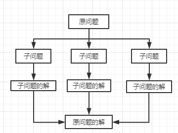
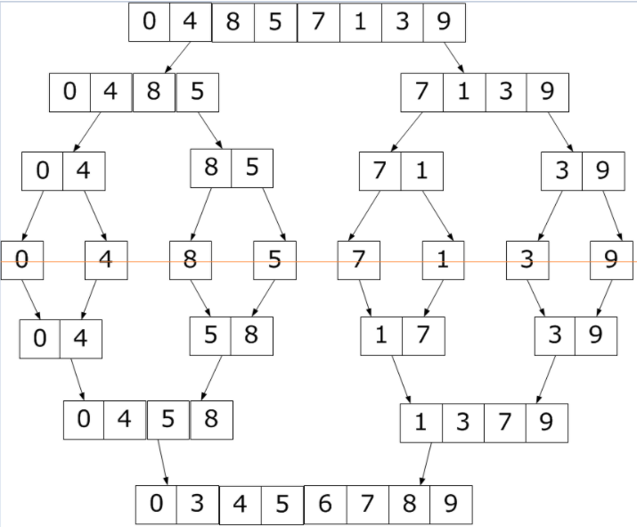
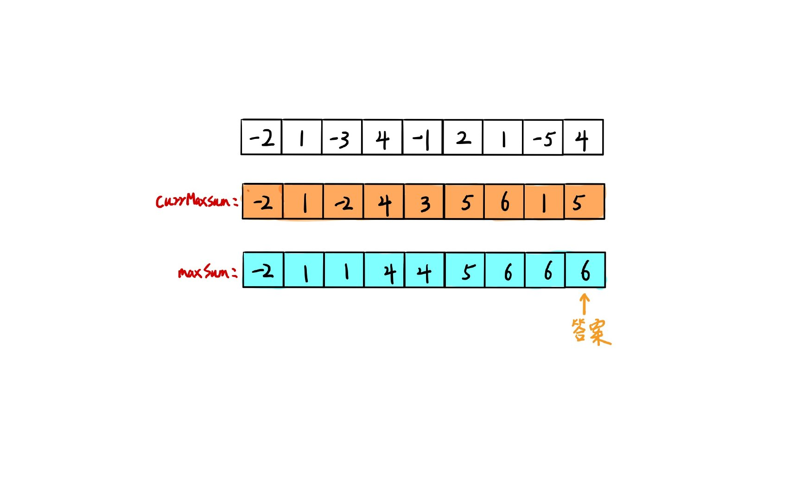
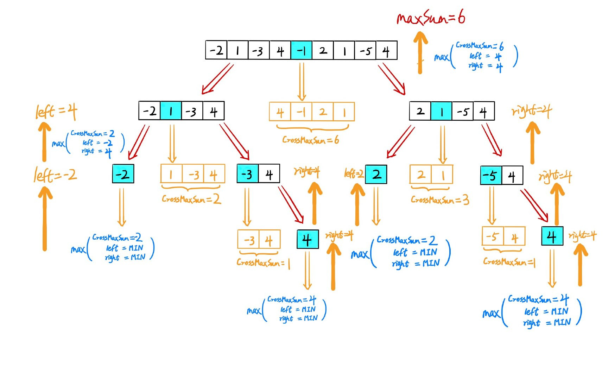
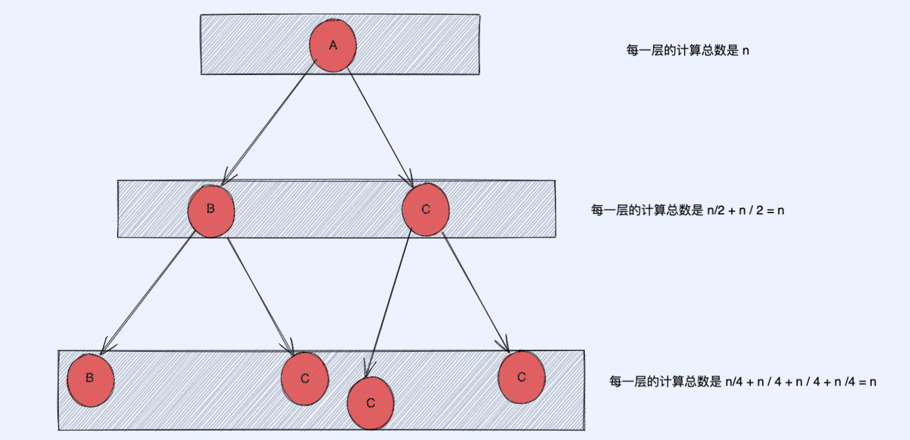

# 分治

分治即**分而治之**，我们可以将分治拆分一下进行解读。一个是分，另外一个是治。

- 分。 将一个规模为 N 的问题分解为若干个规模较小的子问题
- 治。 解决子问题并根据子问题的解求原问题。

从上面的描述，我们可以理出几个关键点。

- 一定是先分再治。
- 治一定是利用分的结果进行的，也就是说治依赖分。

## 适用场景

那么什么问题适合分治解决呢？

一般来说，如果我们可以：

```
将一个规模为 N 的问题分解为 K 个（K < N）规模较小的子问题，并根据子问题的解求原问题。这些子问题相互独立且与原问题性质相同，求出子问题的解，就可得到原问题的解。
```

那么就可以尝试使用分治法。这样说起来还比较抽象，我们进一步提炼一下关键点。

一般题目具有以下 3 个特征，就可以考虑使用分治算法

1. 如果问题可以被分解为若干个规模较小的相同问题。（动态规划也是？那有什么区别？）比如原问题可以抽象为 f(m,n) 而子问题比如 f(m-x, n-y) 可以和 f(m,n) 建立某种联系。而这种联系通常指的是我们可以根据 f(m-x, n-y)求解出 f(m,n) ，通常 x 和 y 为正整数。通常我们不是由单一的子问题推导原问题，因此如果是单一子问题，我们一般称为**递推**，这我们在基础篇讲过了。更多情况，我们需要根据多个子问题的解求解原问题。

2. 这些被分解的问题的结果可以进行合并。（分治的核心标志，动态规划也是？）

3. 这些被分解的问题是相互独立的，不包含重叠的子问题（动态规划也是？那有什么区别？）

可以看出，分治和动态规划有很深的联系。另外分治和其他思想，比如二分也颇有原因，因为本质上**二分就是一种只有分没有治的分治**。本质上，二分法是分治法的特殊情况，我们称为**减治**，类似的例子有**快速选择排序**。如果你同时熟悉快速排序和快速选择就明白减治和分治的微妙区别。 到这里，有没有学习算法殊途同归的感觉呢？

上面总结了适合用分治的三点，说起来很简单，但事实并非如此。分治是一种难度很大的思想，并且 LC 上题目并不多见。因此我的建议是大家透过几道经典的分治问题，好好研究，最后结合我们给出的每日一题题目进行练习，集中地针对性练习 10 道左右，这样应付大多数面试是不成问题的。

## 解题步骤

那么分治问题的距离解决问题的步骤是什么呢？这里我总结了三个步骤。



1. 将原问题分解至达到求解边界的**结构相同互相独立的子问题**。（这是重点，也是难点。实际操作并不容易想到，这其实和动态规划的难点一样）
2. 对所有的子问题进行求解。这一步就是根据题目描述解决子问题，难度相对不大。
3. 将所有子问题的解进行合并，从而得到原问题。第一种是边界条件的处理，这相对容易。另外一种是普通情况求解。普通情况求解需要我们**假设子问题**已经求解完成，你如何将子问题进行合并进而求解。

相比于 2 和 3，1 既是重点也是难点。很多题目其实很难看出来可以使用分治来解决的。也无法通过几句话就讲清楚的，我认为分治是比**动态规划更难**的思想。因为分治动态规划只需要关注局部即可，而分治则需要关注全体，因为你需要对全体进行**分和治的操作**。

上面是分治做题的指导**思想**，对你做**具体题目实际上并没有什么帮助**。接下来我们来一点实操技巧。

## 实操技巧

这里给出几个解决分治问题的几个分治技巧给大家。

1. 使用函数来定义问题，并思考子问题的求解边界(问题缩小至什么规模时可以求解)。（和动态规划类似）
2. 思考如果将子问题的解进行合并。（假设子问题已经计算好了，我们如何合并？）
3. 思考编码套路（一般利用递归）

### 归并排序

我们以经典的归并排序算法为例，讲解一下如下使用这几个技巧。



如果，我们需要对一个数组进行排序。这个问题可以进行分解成独立子问题么？

1. 显然如果规模缩小到只有一个元素时，问题就变得很容易解了。（实操技巧 1）

接下来，我们思考：如果两个子数组（子问题）已经有序，我们如何将其合并？

2. 然后我们发现将子问题的解两两之间进行合并其实就是合并两个有序数组（使用[双指针](https://github.com/leetcode-pp/91alg-1/blob/master/basic-05.md)轻松解决）（实操技巧 2）

3. 于是，我们可以定义问题函数为 f(l, r) 为对数组 [l,r] 区间进行排序。接下来逐步分解到对单个数（分）进行求解（单个数天然有序），之后使用合并两个有序数组的技巧（治）来完成，这样逐步**治** 即可得到答案。

我们先来看下伪代码：

```cpp

void mergeSort(一个数组) {
  if (数据规模小到可以直接处理) return;
  mergeSort(左半个数组);
  mergeSort(右半个数组);
  merge(左半个数组, 右半个数组);
}


//L,R分别用来存左右两个序列
void merge(int a[],int n,int left,int mid,int right)
{
    int n1=mid-left,n2=right-mid;
    for(int i=0;i<n1;i++)
        L[i]=a[left+i];
    for(int i=0;i<n2;i++)
        R[i]=a[mid+i];
    L[n1]=R[n2]=INF;
    int i=0,j=0;
    //  leetcode 简单题，合并两个有序数组
    for(int k=left;k<right;k++)
    {
        if(L[i]<=R[j])
            a[k]=L[i++];
        else
            a[k]=R[j++];
    }
}
```

基本思路一句话概括就是：先左右分解，再处理合并。由于我们依赖子问题解求解，因此本质上这是一种**后序遍历**，不了解的建议复习一下前面的递归专题以及树专题。

CPP Code：

```cpp
#include<bits/stdc++>
using namespace std;
const int size=0x3f3f3f3f,INF=0x3f3f3f3f;
int L[size],R[size];
void merge(int a[],int n,int left,int mid,int right)
{
    int n1=mid-left,n2=right-mid;
    for(int i=0;i<n1;i++)
        L[i]=a[left+i];
    for(int i=0;i<n2;i++)
        R[i]=a[mid+i];
    L[n1]=R[n2]=INF;
    int i=0,j=0;
    for(int k=left;k<right;k++)
    {
        if(L[i]<=R[j])
            a[k]=L[i++];
        else
            a[k]=R[j++];
    }
}
void mergeSort(int a[],int n,int left,int right)
{
    if(left+1<right)
    {
        int mid=(left+right)/2;
        mergeSort(a,n,left,mid);
        mergeSort(a,n,mid,right);
        mergeSort(a,n,left,mid,right);
    }
}
```

时间复杂度为 $O(nlogn)$，空间复杂度是 $O(n)$ （可通过原地交换优化到 $O(1)$）

再举一个例子。

### 53. 最大子序和

题目描述：

求取数组中最大连续子序列和，例如给定数组为 A = [1， 3， -2， 4， -5]， 则最大连续子序列和为 6，即 1 + 3 +（-2）+ 4 = 6。

首先明确一下题意。

- 题目说的子数组是连续的
- 题目只需要求和，不需要返回子数组的具体位置。
- 数组中的元素是整数，但是可能是正数，负数和 0。
- 子序列的最小长度为 1。

比如：

- 对于数组 [1, -2, 3, 5, -3, 2], 应该返回 3 + 5 = 8
- 对于数组 [0, -2, 3, 5, -1, 2], 应该返回 3 + 5 + -1 + 2 = 9
- 对于数组 [-9, -2, -3, -5, -3], 应该返回 -2

首先我们考虑使用动态规划来求解。

我们重新思考一下这个问题，观察能否将其拆解为规模更小的问题，并找出递推关系解决问题呢？

不妨假设问题 Q(list, i) 表示 list 中以索引 i 结尾的情况下的最大子序列和，那么原问题就转化为 Q(list, i) 中的最大值，其中 i = 0,1,2...n-1。

继续来看下 Q(list, i) 和 Q(list, i - 1) 的关系，即如何根据 Q(list, i - 1) 推导出 Q(list, i)。如果已知 Q(list, i - 1)， 那么可以将问题分为两种情况，即以索引为 i 的元素终止，或者只有一个索引为 i 的元素。

- 如果以索引为 i 的元素终止， 那么就是 Q(list, i - 1) + list[i] 我们继续来看下递推关系，即如何根据 Q(list, i - 1) 推导出 Q(list, i)。假设已知 Q(list, i - 1)， 我们可以将 Q(list, i) 分为两种情况：

- 如果 $Q(list, i-1) > 0$，则表示以索引 i-1 结尾的最大子序列和大于 0，因此 Q(list, i) 可以包含 Q(list, i-1) 的部分，即 $Q(list, i)  = Q(list, i - 1) + list[i]$
- 如果 $Q(list, i-1) \leq 0$，则表示 Q(list, i-1) 对于 Q(list, i) 没有贡献， 因此 $Q(list, i) = 0 + list[i]$

分析到这里，递推关系就很明朗了，即`Q(list, i) = max(0, Q(list, i - 1)) + list[i]`。



Python Code：

```python
class Solution:
    def maxSubArray(self, nums: List[int]) -> int:
        n = len(nums)
        max_sum_ending_curr_index = max_sum = nums[0]
        for i in range(1, n):
            max_sum_ending_curr_index = max(max_sum_ending_curr_index + nums[i], nums[i])
            max_sum = max(max_sum_ending_curr_index, max_sum)

        return max_sum
```

**复杂度分析**

- 时间复杂度：$O(N)$，其中 N 为数组长度。
- 空间复杂度：$O(1)$。

接下来，我们使用本文讲的分治来解决，大家感受一下动态规划和分治的异同点。

如果你一时间想不到更好的解决方式的话，有两种方式可以帮助你理清思路：

- 举几个简单的例子。这种方法通常适用于很复杂的问题，以致于一时间无法发现其中的规律。树，以及链表等题目使用这种方式比较好。搭配画图来将问题进行一个可视化的展现效果会更好。
- 将大问题拆解为若干子问题，通过解决子问题以及探寻子问题和大问题的关系来解决。

这里我们采用第二种方式。

假如先把数组平均分成左右两部分，那么此时有三种情况：

- 最大子序列全部在数组左部分，不妨用 `left` 表示。
- 最大子序列全部在数组右部分，不妨用 `rigt` 表示。
- 最大子序列横跨左右数组，不妨用 `crossMaxSum` 表示。

对于前两种情况，相当于将原问题转化为了规模更小的同样问题。对于第三种情况，由于已知循环的起点（即中点），只需要向左向右分别找出左边和右边的最大子序列，那么当前最大子序列就是`向左能够达到的最大子序列 + nums[mid] + 向右能够达到的最大子序列`。所以一个思路就是每次都将数组分成左右两部分，然后分别计算上面三种情况的最大子序列和，最后返回最大值即可。



#### 代码

```python
class Solution:
    def maxSubArray(self, nums: List[int]) -> int:
        return self.helper(nums, 0, len(nums) - 1)
    def helper(self, nums: List[int], l:int, r:int):
        if l > r:
            return float('-inf')
        mid = (l + r) // 2
        left = self.helper(nums, l, mid - 1)
        right = self.helper(nums, mid + 1, r)
        left_suffix_max_sum = right_prefix_max_sum = 0
        total = 0
        for i in reversed(range(l, mid)):
            total += nums[i]
            left_suffix_max_sum = max(left_suffix_max_sum, total)
        total = 0
        for i in range(mid + 1, r + 1):
            total += nums[i]
            right_prefix_max_sum = max(right_prefix_max_sum, total)
        cross_max_sum = left_suffix_max_sum + right_prefix_max_sum + nums[mid]
        return max(cross_max_sum, left, right)
```

（代码 2.6.2）

**复杂度分析**

- 时间复杂度：$O(NlogN)$，其中 $N$ 为数组长度。
- 空间复杂度：空间复杂度取决于函数调用栈的深度，故空间复杂度为 $O(logN)$，其中 $N$ 为数组长度，这也可以从上图直观地感受到。

## 分治法的时间复杂度

如果我们可以将一个规模为 n 的问题分解为 m 个同样大小的子问题。

假设合并子问题的复杂度为 O(m)， 那么分治法的时间复杂度可以用如下公式得出：

$$
T(n) = \frac{n}{m}*T(m) + O(m)
$$

即 T(问题规模) = 子问题数 X T(子问题规模) + 合并操作数。

以前面的归并排序为例：

之前西法在先导篇给大家说过：**如果有递归那就是：递归树的节点数 \* 递归函数内部的基础操作数**。而这句话的前提是所有递归函数内部的基本操作数是一样的，这样才能直接乘。而这里递归函数的基本操作数不一样。

不过我们发现递归树内部每一层的基本操作数都是固定的， 为啥固定已经在图上给大家算出来了。因此总的空间复杂度其实可以通过**递归深度 \* 每一层基础操作数**计算得出，也就是 $nlogn$。



另外大家也直接可以通过公式推导得出。对于这道题来说，设基本操作数 T(n)，那么就有 T(n) = T(n/2) \* 2 + n/2，推导出来 T(n) 大概是 nlogn。这应该高中的知识。具体推导过程如下：

$$

T(n) = T(n/2) * 2 + n/2 =
\frac{n}{2} + 2 * (\frac{n}{2}) ^ 2 + 2 ^ 2 _ (\frac{n}{2}) ^ 3 + ...
= logn * \frac{n}{2}


$$

类似地，如果递推公式为 T(n) = T(n/2) \* 2 + 1 ，那么 T(n) 大概就是 logn。

## 分治和二分的异同

分治和二分其实还是有点像的。只不过二分只对问题进行**分**，分完直接舍弃。而分治不仅需要对问题进行分解，而且需要对问题的多个问题进行**治**。

分治和动态规划都涉及到问题的问题，并且都需要保证子问题不重不漏。那么两者有啥不同呢？我觉得真的挺像的，只不过有一点两者有很大的不同。那就是**动态规划解决的问题往往伴随重叠子问题**（因为不重叠没必要动态规划）。而分治则不是，分治是没有重叠子问题的。

## 作业

最后给大家留一个作业。这个作业是我面试腾讯的时候的二面的一个算法题目，这同时也是力扣上的原题 [4. 寻找两个正序数组的中位数](https://leetcode-cn.com/problems/median-of-two-sorted-arrays/)

## 总结

如果一个问题可以被分解为若干个**不重叠**的独立子问题，并且子问题可以推导出原问题。我们就可以对问题进行定义，并使用分治来解决。具体地，我们先对问题进行分解（可以借助递归完成），接下来对问题的解进行合并（通常结合其他基础算法知识）即可。

分治是一种很难掌握且考察相对比较少的问思想。另外它和二分，动态规划等其他专题渊源颇深（分治可以看成是没有重叠子问题的动态规划，二分可以看成是没有只有分没有治的分治，其实也就是减治），大家可以结合起来进行理解。和动态规划类似，实际代码中，我推荐大家**使用递归来完成分治法**。

通过我们给出的两道经典例题，大家可以感受一下分治和**二分以及动态规划**的异同，这可以很好地帮助你学习分治算法。

最后推荐几道题帮助大家理解和运用分治思维。

- 手写堆
- 手写线段树
- 手写归并排序
- 题目：[面试题 08.06. 汉诺塔问题](https://leetcode-cn.com/problems/hanota-lcci/)
- 题目：[96. 不同的二叉搜索树](https://leetcode-cn.com/problems/unique-binary-search-trees/)
