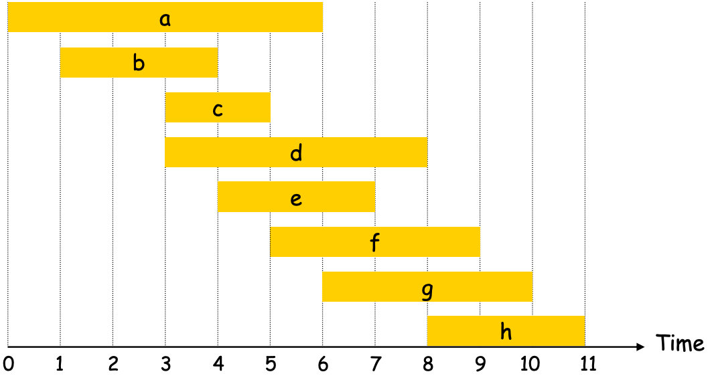
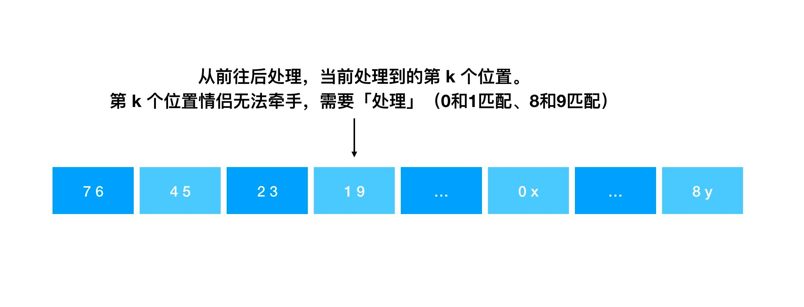

# 贪心

## 简介

贪心算法（又称贪婪算法）是指在对问题求解时，总是做出在当前看来是最好的选择。也就是说，不从整体最优上加以考虑，这样算法得到的是在某种意义上的局部最优解。

贪心算法不能保证每次都能找到最优解，有时候只能找到接近最优解的方案。所以求解时，要确定问题具有贪心选择性质：每一次选择的局部最优**可以导致**问题的整体最优。比如硬币找零问题（后面证明部分会讲）使用贪心解法则可能会得到错误的答案。

另外即使题目可以通过贪心解决，那么如何选择贪心策略也是关键，因此可能存在一种错误的贪心策略。

总的来说，贪心算法是仅考虑局部最优的算法，难点在于如何识别出是贪心问题以及贪心的策略选择。更严谨地，我们则需要证明贪心的正确性，这通常比想到并用贪心做出来更难。

贪心算法的运用非常广泛，比如哈夫曼树，Dijkstra 算法等。

## 使用场景

1. 贪心选择的局部最优解能得到整体的最优解。 而正向思考比较困难，我们一般从反向进行思考。如果能举出反例局部最优解不能得到全局最优解那么一定不能使用贪心。
2. 贪心策略无后效性，即当前贪心选择不会影响以后的状态，只与当前状态有关。这一点其实和动态规划是一样的。我们可以将贪心算法看成是**不需要回溯**的动态规划。因为动态规划很多时候需要**回溯以及计算好的局部最优解**，通过它们得到当前的最优解。这也就是为什么动态规划需要记忆化， 记住我们之前运算的结果，而贪心则不需要的原因。也正是如此，贪心往往比动态规划等算法要快。

## 常见技巧

### 如果xxxx，则一定不比yyy差

看了上面的介绍，你可能还不知道什么时候使用贪心。 那么对于新手我给你介绍一个有用的小技巧。 那就是如果碰到一道题，你可以这样描述算法：`如果xxxx，则一定不比yyy差`，那么这个时候你就可以采用  xxxx， 而不采用 yyyy， 这就是贪心。

### 排序

先排序，再按照价值从高到低或者从低到高选取
### 堆

使用堆的事后诸葛亮技巧

具体见我写的[堆专题](https://lucifer.ren/blog/2021/01/19/heap-2/)。

## 解题步骤

1. 将问题分解为子问题
2. 求出当前子问题的局部最优解
3. 通过这个局部最优解推导出全局最优解

## 证明

贪心适合求解的问题是极值的问题，并且贪心策略通常也是显而易见的那种。

> 正如前面所说，虽然贪心策略显而易见，但是却不一定是正确的。

比如给你一堆硬币，面值分别为 [1,3,5]，你需要找零 9 元，如果才能是的找的硬币数目最少？贪心的策略是优先取最大的，这样可以更快地缩小问题的规模。因此我们先选 5，为了凑够剩下的 4，我们需要选择 4 枚 面值为 1 的硬币。不过这显然不是最优的，我们其实可以直接选 3 枚 面值为 3 的硬币。

上面是一个错误使用贪心策略的例子。而证明贪心是错误的只需要像上面一样**举个反例**就行了。但是想证明贪心算法是对的就很难了。也就是说贪心算法的难点在于**如何知道贪心的策略是正确的**。那如何证明贪心算法的正确性呢？常见的两种方法是：反证法和数学归纳法。

- 反证法：如果交换方案中任意两个元素，答案不会变得更好，那么可以推定目前的解已经是最优解了。（有点像我前面提到的技巧吧？）
- 数学归纳法：先算得出边界情况的最优解，比如 F(1) ，然后再证明**F(n) 都可以由 F(n-1)推导出来**

> 当然也可能是 F(n-2) 等，只要是可以推导出且规模更小就行了。

## 常见题型

- 区间调度。 给你很多的区间 [s, e]，让你满足没有相交区间的情况下最多可以选择多少个区间。这种可以根据开始或者结束时间排序，然后遍历一次区间同时维护**截止到目前的最早结束时间（贪心策略）**。题目推荐: [2406. 将区间分为最少组数](https://leetcode.cn/problems/divide-intervals-into-minimum-number-of-groups/)



详细证明参考：[Greedy.pdf](https://courses.cs.washington.edu/courses/cse421/08au/Greedy.pdf)

- 覆盖问题。 还是给你一堆区间，让你选最少的区间去覆盖某一个大的区间（允许重叠）。这种题目，我在我的[刷题秘籍](https://github.com/azl397985856/leetcode/blob/master/thinkings/greedy.md)中进行了详细描述，大家可以参考 。
- Dijkstra。前面的图专题讲过了，不再赘述。


## 例题讲解

### 881. 救生艇

#### 题目地址

https://leetcode-cn.com/problems/boats-to-save-people/

#### 题目描述

```
第 i 个人的体重为 people[i]，每艘船可以承载的最大重量为 limit。

每艘船最多可同时载两人，但条件是这些人的重量之和最多为 limit。

返回载到每一个人所需的最小船数。(保证每个人都能被船载)。

 

示例 1：

输入：people = [1,2], limit = 3
输出：1
解释：1 艘船载 (1, 2)
示例 2：

输入：people = [3,2,2,1], limit = 3
输出：3
解释：3 艘船分别载 (1, 2), (2) 和 (3)
示例 3：

输入：people = [3,5,3,4], limit = 5
输出：4
解释：4 艘船分别载 (3), (3), (4), (5)
提示：

1 <= people.length <= 50000
1 <= people[i] <= limit <= 30000


```

#### 思路

1. 题目要求船数最少，即每个船都尽可能多装一些重量（分解为子问题）

2. 每个船在容量固定情况下，尽可能多装一些重量（类似背包问题）。由于题目限制船最多装两个人，所以每次装人的时候先将最大重量的装上，然后再从轻到重遍历剩下的人，看剩余容量能否再装下一人（制定贪心策略）。

这种贪心策略可行的原因我们可以使用上面提到的反证法证明。由于每个人都必须被装进去，所以每个人都必须思考如何载运。现在我们不妨仅思考**如何安排最重的那个人**，由于船最多载两个人，因此他可以选择和另外一个人同时乘船，为了使船更少，显然我们需要尽量让他和其他人同一艘船，那选谁呢？

如果最轻的人 a 和最重的人 b 重量和超过了 limit，那么其他人不用看了，肯定都不行。那如果最轻的人 a 可以和最重的人 b 同时载运，此时会存在另外一种方案（其选择非最轻的人 c 和最重的人 b 配对）比其更优么？答案是不能，因此假设存在这样的更优方案，那么我们必然可以通过**交换 a 和 c**得到**不比其差的答案**。 因此最重的人和最轻的人配对是最合适的，换句话说没有比这种方法更优的解。

> 显然，最优解可能有多重。这种方案选择的只是其中一种罢了。

3. 将已经被装上船的人踢出列表，继续按 2 的策略装直到所有人都上船（局部最优解推导出全局最优解）

#### 代码

JS Code：

```js
var numRescueBoats = function (people, limit) {
  // 用到了排序。这个是我们总结的贪心两种题型中的一种
  people.sort((a, b) => a - b);
  let ans = 0,
    start = 0,
    end = people.length - 1;
  while (start <= end) {
    if (people[end] + people[start] <= limit) {
      start++;
      end--;
    } else {
      end--;
    }
    ans++;
  }
  return ans;
};
```

令 n 为数组长度。

**复杂度分析**

- 时间复杂度：$O(nlogn)$

- 空间复杂度：$O(1)$

### 765. 情侣牵手

#### 题目地址

https://leetcode-cn.com/problems/couples-holding-hands/

#### 题目描述

```
N 对情侣坐在连续排列的 2N 个座位上，想要牵到对方的手。 计算最少交换座位的次数，以便每对情侣可以并肩坐在一起。 一次交换可选择任意两人，让他们站起来交换座位。

人和座位用  0  到  2N-1  的整数表示，情侣们按顺序编号，第一对是  (0, 1)，第二对是  (2, 3)，以此类推，最后一对是  (2N-2, 2N-1)。

这些情侣的初始座位   row[i]  是由最初始坐在第 i 个座位上的人决定的。

示例 1:

输入: row = [0, 2, 1, 3]
输出: 1
解释: 我们只需要交换 row[1]和 row[2]的位置即可。
示例 2:

输入: row = [3, 2, 0, 1]
输出: 0
解释: 无需交换座位，所有的情侣都已经可以手牵手了。
说明:

len(row) 是偶数且数值在  [4, 60]范围内。
可以保证 row 是序列  0...len(row)-1  的一个全排列。

```

#### 思路

我们需要将所有的情侣按（0，1）（2，3） 安排座位，那么：

- 如果某一个人最终编号是奇数，那么他对应的情侣应该在他的左边。
- 如果某一个人最终编号是偶数，那么他对应的情侣应该在他的右边。

因此我们可以进行一次遍历，采用两两一对的遍历方式（步长为 2）。如果遍历的时候，相邻的不是情侣，则进行一次交换。那么和谁交换呢？显然交换依据应该是上面提到的关键点（通过其编号判断其情侣在 ta 的左边还是右边）。这提示我们先将每一个人的最终编号和当前编号进行一次哈希映射。

具体算法：

1. 我们先做个一个哈希表进行映射，key 是数组值，value 是其下标。

2. 依次遍历所有人，如果他的情侣坐在他旁边就继续下一轮循环，如果不在他旁边就通过哈希表找到情侣当前在哪儿，然后把伴侣跟身边的基佬换个位置这样就又凑成一对（制定贪心策略）

> 交换位置后别忘了更新哈希表

3. 循环执行第 2 步直到所有人都凑到一起了（局部最优解推导出全局最优解）

这种算法的时间和空间复杂度都是 $O(n)$，其中 n 为数组长度。

接下来我们证明一下贪心策略的正确性。

我发现宫水三叶写的这个证明蛮不错的，因此就不写了。地址：https://leetcode-cn.com/problems/couples-holding-hands/solution/liang-chong-100-de-jie-fa-bing-cha-ji-ta-26a6/

为了防止内容被删除，我摘要主要内容如下：

---

我们这样的做法本质是什么？

其实相当于，当我处理到第 k 个位置的时候，前面的 k - 1 个位置的情侣已经牵手成功了。我接下来怎么处理，能够使得总花销最低。

分两种情况讨论：

- a. 现在处理第 k 个位置，使其牵手成功：

那么我要使得第 k 个位置的情侣也牵手成功，那么必然是保留第 k 个位置的情侣中其中一位，再进行修改，这样的成本是最小的（因为只需要交换一次）。

而且由于前面的情侣已经牵手成功了，因此交换的情侣必然在 k 位置的后面。

然后我们再考虑交换左边或者右边对最终结果的影响。

分两种情况来讨论：

1. 与第 k 个位置的匹配的两个情侣不在同一个位置上：这时候无论交换左边还是右边，后面需要调整的「情侣对数量」都是一样。假设处理第 k 个位置前需要调整的数量为 n 的话，处理完第 k 个位置（交换左边或是右边），需要调整的「情侣对数量」都为 n - 1 。



2. 与第 k 个位置的匹配的两个情侣在同一个位置上：这时候无论交换左边还是右边，后面需要调整的「情侣对数量」都是一样。假设处理第 k 个位置前需要调整的数量为 n 的话，处理完第 k 个位置（交换左边或是右边），需要调整的「情侣对数量」都为 n - 2 。


因此对于第 k 个位置而言，交换左边还是右边，并不会影响后续需要调整的「情侣对数量」。

b. 现在先不处理第 k 个位置，等到后面的情侣处理的时候「顺便」处理第 k 位置：

由于我们最终都是要所有位置的情侣牵手，而且每一个数值对应的情侣数值是唯一确定的。

因此我们这个等“后面”的位置处理，其实就是等与第 k 个位置互为情侣的位置处理（对应上图的就是我们是在等 【0 x】和【8 y】或者【0 8】这些位置被处理）。

由于被处理都是同一批的联通位置，因此和「a. 现在处理第 k 个位置」的分析结果是一样的。

不失一般性的，我们可以将这个分析推广到第一个位置，其实就已经是符合「当我处理到第 k 个位置的时候，前面的 k - 1 个位置的情侣已经牵手成功了」的定义了。

综上所述，我们只需要确保从前往后处理，并且每次处理都保留第 k 个位置的其中一位，无论保留的左边还是右边都能得到最优解。

---

#### 代码

代码支持：Java，JS

Java Code：

```java
class Solution {
    public int minSwapsCouples(int[] row) {
        int n = row.length;
        int ans = 0;
        int[] map = new int[n];
        for (int i = 0; i < n; i++) map[row[i]] = i;
        for (int i = 0; i < n - 1; i += 2) {
            int a = row[i], b = a ^ 1;
            if (row[i + 1] != b) {
                int src = i + 1, tar = map[b];
                map[row[tar]] = src;
                map[row[src]] = tar;
                swap(row, src, tar);
                ans++;
            }
        }
        return ans;
    }
    void swap(int[] nums, int a, int b) {
        int c = nums[a];
        nums[a] = nums[b];
        nums[b] = c;
    }
}

```

JS Code:

```js
var minSwapsCouples = function (row) {
  if (row.length <= 2) return 0;
  var len = row.length;
  var map = new Array(len);
  for (var index in row) map[row[index]] = index;
  var next = (count = 0);
  for (var i = 0; i <= len - 2; i += 2) {
    next = row[i] + (row[i] % 2 === 0 ? 1 : -1);
    if (row[i + 1] != next) {
      var temp = row[i + 1];
      row[i + 1] = row[map[next]];
      row[map[next]] = temp;
      temp = map[row[map[next]]];
      map[row[map[next]]] = map[row[i + 1]];
      map[row[i + 1]] = temp;
      count++;
    }
  }
  return count;
};
```

令 n 为数组长度。

**复杂度分析**

- 时间复杂度：$O(n)$

- 空间复杂度：$O(n)$

本题也有很多其他优秀的方法，大家可以参考下力扣的相关题解。

## 总结

实际做题的过程，更关注的是如何使用贪心策略，而不是如何证明。常见的策略有：

- 排序
- 堆：事后诸葛亮技巧

既然重点是做出来，那么大家不妨直接根据直觉入手，写出来代码。如果代码通过，则说明可能是没问题的。如果不通过，则说明可能是不可行的（相当于 OJ 平台给你了一个反例）。

而如果你执意要证明， 那么可以考虑我们提到的两种方法：数学归纳法和反证法。两种方法都不容易，并且没有什么通常的思考技巧。因此建议大家从几个经典例题入手思考如何证明。最后附上经典题目推荐：

- [贪心专题（初版）](https://github.com/azl397985856/leetcode/blob/master/thinkings/greedy.md)
- [870. 优势洗牌](https://leetcode-cn.com/problems/advantage-shuffle/) 这道题本质就是田忌赛马问题

870 题附上参考代码：

```py
class Solution:
    def advantageCount(self, A: List[int], B: List[int]) -> List[int]:
        dqa = collections.deque(sorted(A))
        dqb = collections.deque(sorted(B))
        # 由于可能存在重复数字，因此使用数组维护
        assigned = {b:[] for b in B}
        for a in dqa:
            if a > dqb[0]:
                assigned[dqb.popleft()].append(a)
            else:
                assigned[dqb.pop()].append(a)
        return [assigned[b].pop() for b in B]
```

## 作业

- [621. 任务调度器](https://leetcode-cn.com/problems/task-scheduler/)
