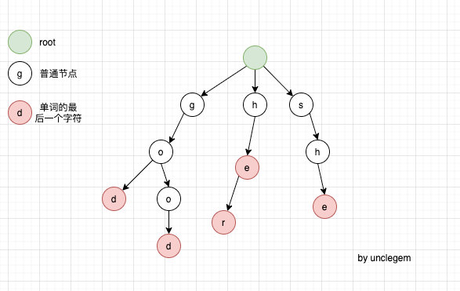

# Trie

我们想一下用百度搜索时候，打个“一语”，搜索栏中会给出“一语道破”，“一语成谶(四声的 chen)”等推荐文本，这种叫模糊匹配，也就是给出一个模糊的 query，希望给出一个相关推荐列表，很明显，hashmap 并不容易做到模糊匹配，而 Trie 可以实现基于前缀的模糊搜索。

> 注意这里的模糊搜索也仅仅是基于前缀的。比如还是上面的例子，搜索“道破”就不会匹配到“一语道破”，而只能匹配“道破 xx”

字典树也叫前缀树，英文 Trie（读 tree 或者 try 都是 ok 的）。

它本身就是一个树型结构，具体来说是一颗多叉树，学过树的朋友应该非常容易理解。

trie 的核心操作只有两个，一个是插入，另一个查找，删除很少使用，因此这个讲义不包含删除操作。

> 其实查找可以细分为前缀查找和完整查找，后面我们会讲。

截止目前（2020-02-04） [前缀树（字典树）](https://leetcode-cn.com/tag/trie/) 在 LeetCode 一共有 17 道题目。其中 2 道简单，8 个中等，7 个困难。这其实只是官方的 tag，实际上有的题目可以用 trie 优化，但是官方并没有给出 trie 的标签，大家做个简单参考即可。

## 基本概念

假想一个场景：给你若干单词 words 和一系列关键字 keywords，让你判断 keywords 是否在 words 中存在，或者判断 keywords 中的单词是否有 words 中的单词的前缀。比如单词 pre 就是单词 pres 的前缀**之一**。

朴素的想法是：遍历 keywords，对于 keywords 中的每一项都遍历 words 列表并判断二者是否相等（或者是否是其前缀）。显然这种算法的时间复杂度是 $O(m * n)$，其中 m 为 words 的平均长度，n 为 keywords 的平均长度。

那么是否有可能对其进行优化呢？如果可以，那么如何优化呢？答案就是本文要讲的前缀树。

我们可以将 words 存储到一个树上，这棵树叫做前缀树。 一个前缀树大概是这个样子：


如图每一个节点存储一个字符，然后外加一个控制信息（上图就是 isWord 字段）表示是否是单词结尾，实际使用过程可能会有细微差别，不过变化不大。

为了搞明白前缀树是如何优化暴力算法的。我们需要了解一下前缀树的基本概念和操作。

### 节点

- 根结点无实际意义
- 每个其他节点**数据域**存储一个字符
- 每个其他节点中的**控制域**可以自定义，如 isWord(是否是单词)，count(该前缀出现的次数)等，需实际问题实际分析需要什么。

一个可能的前缀树节点结构：

```java
  private class TrieNode {

        int count; //表示以该处节点构成的串的个数
        int preCount; //表示以该处节点构成的前缀的字串的个数
        TrieNode[] children;

        TrieNode() {

            children = new TrieNode[26];
            count = 0;
            preCount = 0;
        }
    }

```

可以看出 TriNode 是一个递归的数据结构，**其结构类似多叉树，只是多了几个属性记录额外信息罢了。** 比如 count 可以用来判断以当前节点结束的单词个数， preCount 可以用来判断以当前节点结束的前缀个数。举个例子：比如前缀树中存了两个单词 lu 和 lucifer，那么单词 lu 有一个，lu 前缀有两个。

前缀树大概如下图：

```
                        l(count = 0, preCount=2)
                    u(count = 1, preCount=2)
                c(count = 0, preCount=1)
            i(count = 0, preCount=1)
        f(count = 0, preCount=1)
    e(count = 0, preCount=1)
f(count = 1, preCount=1)
```

### Trie 的插入

构建 Trie 的核心就是插入。而插入指的就是将单词（words）全部依次插入到前缀树中。假定给出几个单词 words [she,he,her,good,god]构造出一个 Trie 如下图：


也就是说从根结点出发到某一粉色节点所经过的字符组成的单词，在单词列表中出现过，当然我们也可以给树的每个节点加个 count 属性，代表根结点到该节点所构成的字符串前缀出现的次数



可以看出树的构造非常简单：**插入新单词的时候就从根结点出发一个字符一个字符插入，有对应的字符节点就更新对应的属性，没有就创建一个！**

### Trie 的查询

查询更简单了，给定一个 Trie 和一个单词，和插入的过程类似，一个字符一个字符找

- 若中途有个字符没有对应节点 →Trie 不含该单词
- 若字符串遍历完了，都有对应节点，但最后一个字符对应的节点并不是粉色的，也就不是一个单词 →Trie 不含该单词

## Trie 模版

了解了 Trie 的使用场景以及基本的 API， 那么最后就是用代码来实现了。这里我提供了 Python ， Java 和 JS 三种语言的代码。

Java Code:

```java
class Trie {

    TrieNode root;

    public Trie() {

        root = new TrieNode();
    }

    public void insert(String word) {

        TrieNode node = root;

        for (int i = 0; i < word.length(); i++) {

            if (node.children[word.charAt(i) - 'a'] == null)
                node.children[word.charAt(i) - 'a'] = new TrieNode();

            node = node.children[word.charAt(i) - 'a'];
            node.preCount++;
        }

        node.count++;
    }

    public boolean search(String word) {

        TrieNode node = root;

        for (int i = 0; i < word.length(); i++) {

            if (node.children[word.charAt(i) - 'a'] == null)
                return false;

            node = node.children[word.charAt(i) - 'a'];
        }

        return node.count > 0;
    }

    public boolean startsWith(String prefix) {

        TrieNode node = root;

        for (int i = 0; i < prefix.length(); i++) {

            if (node.children[prefix.charAt(i) - 'a'] == null)
                return false;
            node = node.children[prefix.charAt(i) - 'a'];
        }

        return node.preCount > 0;
    }

    private class TrieNode {

        int count; //表示以该处节点构成的串的个数
        int preCount; //表示以该处节点构成的前缀的字串的个数
        TrieNode[] children;

        TrieNode() {

            children = new TrieNode[26];
            count = 0;
            preCount = 0;
        }
    }
}
```

Python Code:

```python
class TrieNode:
    def __init__(self):
        self.count = 0 # 表示以该处节点构成的串的个数
        self.preCount = 0 # 表示以该处节点构成的前缀的字串的个数
        self.children = {}

class Trie:

    def __init__(self):
        self.root = TrieNode()

    def insert(self, word):
        node = self.root
        for ch in word:
            if ch not in node.children:
                node.children[ch] = TrieNode()
            node = node.children[ch]
            node.preCount += 1
        node.count += 1

    def search(self, word):
        node = self.root
        for ch in word:
            if ch not in node.children:
                return False
            node = node.children[ch]
        return node.count > 0

    def startsWith(self, prefix):
        node = self.root
        for ch in prefix:
            if ch not in node.children:
                return False
            node = node.children[ch]
        return node.preCount > 0
```

JavaScript Code

```JavaScript
var Trie = function() {
  this.children = {};
  this.count = 0 //表示以该处节点构成的串的个数
  this.preCount = 0 // 表示以该处节点构成的前缀的字串的个数
};

Trie.prototype.insert = function(word) {
  let node = this.children;
  for(let char of word){
    if(!node[char]) node[char] = {}
    node = node[char]
    node.preCount += 1
  }
  node.count += 1
};

Trie.prototype.search = function(word) {
  let node = this.children;
  for(let char of word){
    if(!node[char]) return false
    node = node[char]
  }
  return node.count > 0
};

Trie.prototype.startsWith = function(prefix) {
  let node = this.children;
  for(let char of prefix){
    if(!node[char]) return false
    node = node[char]
  }
  return node.preCount > 0
};
```

**复杂度分析**

- 插入和查询的时间复杂度自然是$O(len(key))$，key 是待插入(查找)的字串。

- 最坏的情况是存储的字符串没有任何前缀，此时建树的最坏空间复杂度是$O(m*n)$, m 是字符集大小（如果是小写英文字母，那么字符集大小就是 26），n 是字符串长度。

## 前缀树的特点

简单来说， 前缀树就是一个树。前缀树一般是将一系列的单词记录到树上， 如果这些单词没有公共前缀，则和直接用数组存没有任何区别。而如果有公共前缀， 则公共前缀仅会被存储一次。可以想象，如果一系列单词的公共前缀很多， 则会有效减少空间消耗。

而前缀树的意义实际上是空间换时间，这和哈希表，动态规划等的初衷是一样的。

其原理也很简单，正如我前面所言，其公共前缀仅会被存储一次，因此如果我想在一堆单词中找某个单词或者某个前缀是否出现，我无需进行完整遍历，而是遍历前缀树即可。本质上，使用前缀树和不使用前缀树减少的时间就是公共前缀的数目。也就是说，一堆单词没有公共前缀，使用前缀树没有任何意义。

知道了前缀树的特点，接下来我们自己实现一个前缀树。关于实现可以参考 [0208.implement-trie-prefix-tree](https://github.com/azl397985856/leetcode/blob/b8e8fa5f0554926efa9039495b25ed7fc158372a/problems/208.implement-trie-prefix-tree.md)

## 回答开头的问题

前面我们抛出了一个问题：给你若干单词 words 和一系列关键字 keywords，让你判断 keywords 是否在 words 中存在，或者判断 keywords 中的单词是否有 words 中的单词的前缀。比 pre 就是 pres 的前缀**之一**。

如果使用 Trie 来解，会怎么样呢？首先我们需要建立 Trie，这部分的时间复杂度是 $O(t)$，其中 t 为 words 的总字符乘以字符集大小（如果是小写英文字母，那么字符集大小就是 26）。**预处理**完毕之后就是查询了。对于查询，由于树的高度是 $O(m)$，其中 m 为 words 的平均长度，因此查询基本操作的次数不会大于 $m$。当然查询的基本操作次数也不会大于 $k$，其中 k 为被查询单词 keyword 的长度，因此对于查询来说，时间复杂度为 $O(min(m, k))$。时间上优化的代价是空间上的消耗，对于空间来说则是预处理的消耗，空间复杂度为 $O(t)$。

## 应用场景及分析

正如上面所说，前缀树的核心思想是用空间换时间，利用字符串的公共前缀来降低查询的时间开销。

比如给你一个字符串 query，问你这个**字符串**是否在**字符串集合**中出现过，这样我们就可以将字符串集合建树，建好之后来匹配 query 是否出现，那有的朋友肯定会问，之前讲过的 hashmap 岂不是更好？

因此，这里我的理解是：上述精确查找只是模糊查找一个特例，模糊查找 hashmap 显然做不到，并且如果在精确查找问题中，hashmap 出现过多冲突，效率还不一定比 Trie 高，有兴趣的朋友可以做一下测试，看看哪个快。

再比如给你一个长句和一堆敏感词，找出长句中所有敏感词出现的所有位置（想下，有时候我们口吐芬芳，结果发送出去却变成了\*\*\*\*，懂了吧）

> 小提示：实际上 AC 自动机就利用了 trie 的性质来实现敏感词的匹配，性能非常好。以至于很多编辑器都是用的 AC 自动机的算法。

还有些其他场景，这里不过多讨论，有兴趣的可以 google 一下。

有时候构建前缀树的思想也可以应用到其他题目中。比如这道题让你设计一个文件系统 [File System](https://binarysearch.com/problems/File-System) 就可以利用前缀树的建树方式来做，只不过我们不需要查前缀了。参考代码：

```py
class Node:
    def __init__(self, content=''):
        self.content = content
        self.children = {}

class FileSystem:
    def __init__(self):
        self.d = Node()

    def get(self, path):
        cur = self.d
        parts = path.split('/')
        for folder in parts[1:]:
            if folder not in cur.children: return -1
            cur = cur.children[folder]
        return cur.content


    def create(self, path, content):
        parts = path.split('/')
        cur = self.d.children[parts[0]] if parts[0] else self.d
        for folder in parts[1:-1]:
            if folder not in cur.children: return False
            cur = cur.children[folder]
        if parts[-1] in cur.children: return False
        cur.children[parts[-1]] = Node(content)
        return True
```

create 是不是和前缀树的建树过程类似？ get 是否和前缀和查询过程类似？这就是学习算法的触类旁通。

## 题目推荐

以下是本专题的六道题目的题解，内容会持续更新，感谢你的关注～

- [0208.实现 Trie (前缀树)](https://github.com/azl397985856/leetcode/blob/b8e8fa5f0554926efa9039495b25ed7fc158372a/problems/208.implement-trie-prefix-tree.md)
- [0211.添加与搜索单词 - 数据结构设计](https://github.com/azl397985856/leetcode/blob/b0b69f8f11dace3a9040b54532105d42e88e6599/problems/211.add-and-search-word-data-structure-design.md)
- [0212.单词搜索 II](https://github.com/azl397985856/leetcode/blob/b0b69f8f11dace3a9040b54532105d42e88e6599/problems/212.word-search-ii.md)
- [0472.连接词](https://github.com/azl397985856/leetcode/blob/master/problems/472.concatenated-words.md)
- [648. 单词替换](https://leetcode-cn.com/problems/replace-words/)
- [0820.单词的压缩编码](https://github.com/azl397985856/leetcode/blob/master/problems/820.short-encoding-of-words.md)
- [1032.字符流](https://github.com/azl397985856/leetcode/blob/master/problems/1032.stream-of-characters.md)

## 作业

本节的作业是第 311 场周赛的 T4 [6183. 字符串的前缀分数和](https://leetcode.cn/problems/sum-of-prefix-scores-of-strings/)，官方难度为困难。 如果你熟悉前缀树，能想到这道题用前缀树的话就简单了。

## 总结

前缀树的核心思想是用空间换时间，利用字符串的公共前缀来降低查询的时间开销。因此如果题目中公共前缀比较多，就可以考虑使用前缀树来优化。

前缀树的基本操作就是插入和查询，其中查询可以完整查询，也可以前缀查询，其中基于前缀查询才是前缀树的灵魂，也是其名字的来源。

最后给大家提供了两种语言的前缀树模板，大家如果需要用，直接将其封装成标准 API 调用即可。

基于前缀树的题目变化通常不大， 使用模板就可以解决。如何知道该使用前缀树优化是一个难点，不过大家只要牢牢记一点即可，那就是**算法的复杂度瓶颈在字符串查找，并且字符串有很多公共前缀，就可以用前缀树优化**。
