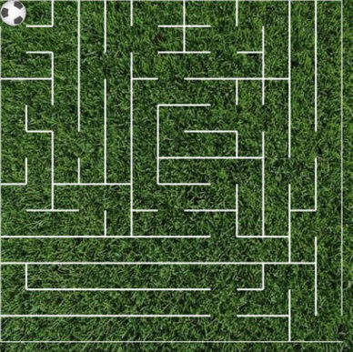
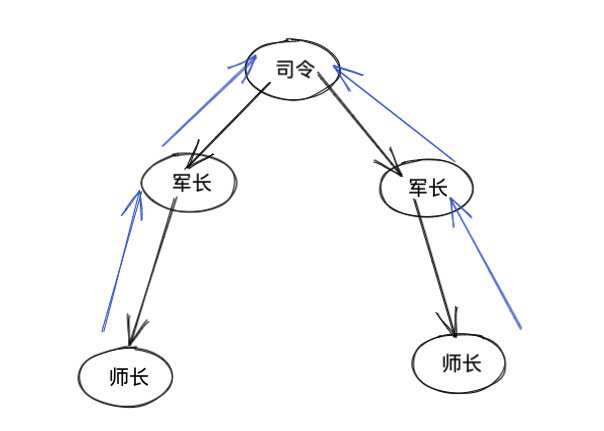
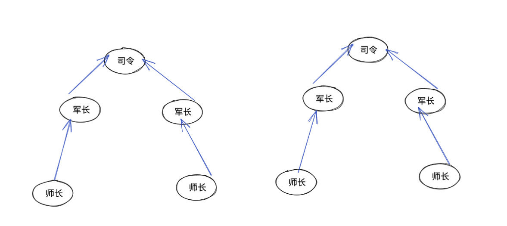
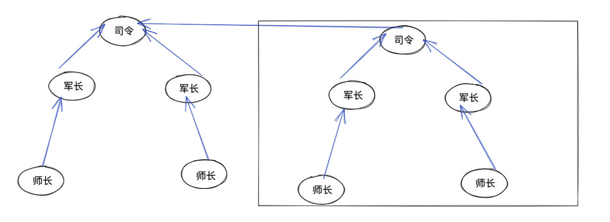
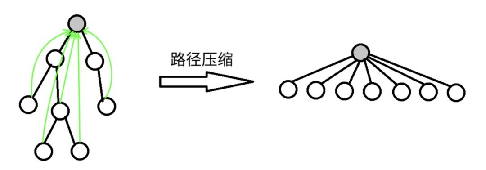

# 并查集

## 背景

相信大家都玩过下面的迷宫游戏。你的目标是从地图的某一个角落移动到地图的出口。规则很简单，仅仅你不能穿过墙。



实际上，这道题并不能够使用并查集来解决。 不过如果我将规则变成，“是否存在一条从入口到出口的路径”，那么这就是一个简单的联通问题，这样就可以借助本节要讲的并查集来完成。

另外如果地图不变，而**不断改变入口和出口的位置**，并依次让你判断起点和终点是否联通，并查集的效果高的超出你的想象。

另外并查集还可以在人工智能中用作图像人脸识别。比如将同一个人的不同角度，不同表情的面部数据进行联通。这样就可以很容易地回答**两张图片是否是同一个人**，无论拍摄角度和面部表情如何。

## 概述

并查集使用的是一种**树型**的数据结构，用于处理一些不交集（Disjoint Sets）的合并及查询问题。

比如让你求两个人是否间接认识，两个地点之间是否有至少一条路径。上面的例子其实都可以抽象为联通性问题。即如果两个点联通，那么这两个点就有至少一条路径能够将其连接起来。值得注意的是，并查集只能回答“联通与否”，而不能回答诸如“具体的联通路径是什么 ”。如果要回答“具体的联通路径是什么”这个问题，则需要借助其他算法，比如广度优先遍历。

并查集的核心是：

1. 动态
2. 集合的合并与查询

熟悉我的朋友会知道，我讲堆的时候就讲了堆的两个核心：

1. 动态
2. 求极值

并查集也是类似的。首先数据是动态变化的，不是一开始就确定好的，这点和堆是一样的。只不过并查集回答的是**集合的合并与查询问题**。那什么是集合的合并与查询呢？我们不妨从一个例子入手来看。

## 形象解释

比如有两个司令。 司令下有若干军长，军长下有若干师长。。。

### 判断两个节点是否联通

我们如何判断某两个师长是否归同一个司令管呢（连通性）？



很简单，我们顺着师长，往上找，找到司令。 如果两个师长找到的是同一个司令，那么两个人就归同一个司令管。（假设这两人级别比司令低）

如果我让你判断两个士兵是否归同一个师长管，也可以向上搜索到师长，如果搜索到的两个师长是同一个，那就说明这两个士兵归同一师长管。（假设这两人级别比师长低）

代码上我们可以用 parent[x] = y 表示 x 的 parent 是 y，通过不断沿着搜索 parent 搜索找到 root，然后比较 root 是否相同即可得出结论。 这里的 root 实际上就是 **集合代表**，下文会进行解释。

> 之所以使用 parent 存储每个节点的父节点，而不是使用 children 存储每个节点的子节点是因为“我们需要找到某个元素的代表（也就是根）”

这个不断往上找的操作，我们一般称为 find，使用 ta 我们可以很容易地求出两个节点是否连通。

### 合并两个联通区域

如图有两个司令。其中一个司令被撸下来了，其所有下属被另外一个司令接管了。

这本质是集合的合并。



我们将其合并为一个联通域，最简单的方式就是直接将其中一个司令指向另外一个即可：



以上就是三个核心 API `find`，`connnected` 和 `union`， 的形象化解释，下面我们来看下代码实现。

## 核心 API

为了更加精确的定义这些方法，需要定义如何表示集合。一种常用的策略是为每个集合选定一个固定的元素，称为代表，以表示整个集合。如上面例子中的司令就是代表。

接着定义函数 find，find(x) 返回 x 所属集合的代表，而函数 union 则使用两个集合的代表作为参数进行合并。初始时，每个人的代表都是自己本身。

并查集（Union-find Algorithm）定义了两个用于此数据结构的操作：

- Find(x)：找到 x 的代表。也就是确定元素属于哪一个子集，它可以被用来确定两个元素是否属于同一子集。

- Union(x, y)：将 x 的代表和 y 的代表进行合并， 也就是将两个子集合并成同一个集合。

以上两个方法是并查集的核心，也是并查集向外暴露的两个主要 API。其他的 api 都是基于这两个产生的，比如 connected api（用于判断两个集合是否是同一集合）

首先我们初始化每一个点都是一个连通域，类似下图：


并查集元素一般用树来表示，树中的每个节点代表一个成员，每棵树表表示一个集合，多棵树构成一个并查集森林。每个集合中，树根即其代表。

```ts
interface Node {
  parent: Node;
}
```

比如我们的 parent 可以长这个样子：

```py
{
 "0": "1",
 "1": "3",
 "2": "3",
 "4": "3",
 "3": "3"
}
```

我们可以使用数组或者字典来维护 parent。

### find

假如我让你在上面的 parent 中找 0 的代表如何找？

首先，`树的根`在 parent 中满足“parent[x] == x”。因此我们可以先找到 0 的父亲 parent[0] 也就是 1，接下来我们看 1 的父亲 parent[1] 发现是 3，因此它不是根，我们继续找 3 的父亲，发现是 3 本身。也就是说 3 就是我们要找的代表，我们返回 3 即可。

上面的过程具有明显的递归性，我们可以根据自己的喜好使用递归或者迭代来实现。

迭代代码：

```python
def find(self, x):
    while x != self.parent[x]:
        x = self.parent[x]
    return x
```

也可使用递归来实现。

递归代码：

```py
def find(self, x):
    if x != self.parent[x]:
        self.parent[x] = self.find(self.parent[x])
        return self.parent[x]
    return x
```

这里我在递归实现的 find 过程进行了路径的压缩，每次往上查找之后都会将树的高度降低到 2。

路径压缩是什么？其实就是我们现在职场中的**扁平化管理**

比如我一开始要找两个小兵，那么一层层向上找代表太慢了，如果司令下面直接是小兵是不是就快了？ 这就是路径压缩。

接下来我们从复杂度角度分析一下。

我们知道每次 find 都会从当前节点往上不断搜索，直到到达根节点，因此 find 的时间复杂度大致相等于节点的深度，树的高度如果不加控制则可能为节点数，因此 find 的时间复杂度可能会退化到 $O(n)$。而如果进行路径压缩，那么树的平均高度不会超过 $logn$，

> 如果使用了路径压缩和下面要讲的**按秩合并**那么时间复杂度可以**趋近** $O(1)$，具体证明略。不过给大家画了一个图来辅助大家理解。

> 注意是趋近 O(1)，准确来说是阿克曼函数的某个反函数。


极限情况下，每一个路径都会被压缩，这种情况下**继续**查找的时间复杂度就是 $O(1)$。



### connected

直接利用上面实现好的 find 方法即可。如果两个节点的祖先相同，那么其就联通。

```python
def connected(self, p, q):
    return self.find(p) == self.find(q)
```

### union

将其中一个节点挂到另外一个节点的祖先上，这样两者祖先就一样了。也就是说，两个节点联通了。

比如我们需要将 a 和 b 所在的集合进行合并。 一个简单的方法是：

1. 遍历所有节点，然后判断当前节点和 a 是否联通
2. 如果联通，则将当前节点的父亲节点指向 b 的父亲节点
3. 否则不做任何操作

不过这种需要遍历所有节点来完成 union 操作，时间复杂度为 O(n)，其中 n 为节点数。这其实就是上面的那种退化的树，树高就是节点数。

有没有更好的方法呢？答案是有的。比如用 childen 字典维护每一个代表的孩子，这样遍历所有节点就可以变为遍历 children[a]。似乎更好了，但是还是不够好，最坏情况还是 O(n) 的时间复杂度。

接下来，我们来看一种更好的做法 - **按秩合并**。

对于如下的一个图：


如果我们将 0 和 7 进行一次合并。即 `union(0, 7)` ，则会发生如下过程。

- 找到 0 的根节点 3
- 找到 7 的根节点 6
- 将 6 指向 3。

为了使得合并之后的树尽可能平衡，一般选择将小树挂载到大树上面，下面的代码模板会体现这一点。3 的秩比 6 的秩大，这样更利于树的平衡，避免出现极端的情况。


如果相反，即大树挂到小树上会怎么样呢? 一个容易得出的结论是不会优于小树挂到大树的结果。这在极限情况下（即合并操作的两个树差异很大）很有用。不过在面试或者一些 OJ（比如力扣）来说不是很重要，以至于你不写按秩合并也可以通过。

上面讲的小树挂大树就是所谓的**按秩合并**。

代码：

```python
def union(self, p, q):
    if self.connected(p, q): return
    self.parent[self.find(p)] = self.find(q)
```

这里我并没有判断秩的大小关系，目的是方便大家理清主脉络。完整代码见下面代码区。

## 不带权并查集

平时做题过程，遇到的更多的是不带权的并查集。相比于带权并查集， 其实现过程也更加简单。

### 代码模板

```python
class UF:
    def __init__(self, M):
        self.parent = {}
        self.size = {}
        self.cnt = 0
        # 初始化 parent，size 和 cnt
        # size 是一个哈希表，记录每一个联通域的大小，其中 key 是联通域的根，value 是联通域的大小
        # cnt 是整数，表示一共有多少个联通域
        for i in range(M):
            self.parent[i] = i
            self.cnt += 1
            self.size[i] = 1

    def find(self, x):
        if x != self.parent[x]:
            self.parent[x] = self.find(self.parent[x])
            return self.parent[x]
        return x
    def union(self, p, q):
        if self.connected(p, q): return
        # 小的树挂到大的树上， 使树尽量平衡
        leader_p = self.find(p)
        leader_q = self.find(q)
        if self.size[leader_p] < self.size[leader_q]:
            self.parent[leader_p] = leader_q
            self.size[leader_q] += self.size[leader_p]
        else:
            self.parent[leader_q] = leader_p
            self.size[leader_p] += self.size[leader_q]
        self.cnt -= 1
    def connected(self, p, q):
        return self.find(p) == self.find(q)
```

## 带权并查集

上面讲到的其实都是有向无权图，因此仅仅使用 parent 表示节点关系就可以了。而如果使用的是有向带权图呢？实际上除了维护 parent 这样的节点指向关系，我们还需要维护节点的权重，一个简单的想法是使用另外一个哈希表 weight 存储节点的权重关系。比如 `weight[a] = 1 表示 a 到其父节点的权重是 1`。

如果是带权的并查集，其查询过程的路径压缩以及合并过程会略有不同，因为我们不仅关心节点指向的变更，也关心权重如何更新。比如：

```
a    b
^    ^
|    |
|    |
x    y
```

如上表示的是 x 的父节点是 a，y 的父节点是 b，现在我需要将 x 和 y 进行合并。

```
a    b
^    ^
|    |
|    |
x -> y
```

假设 x 到 a 的权重是 w(xa)，y 到 b 的权重为 w(yb)，x 到 y 的权重是 w(xy)。合并之后会变成如图的样子：

```
a -> b
^    ^
|    |
|    |
x    y
```

那么 a 到 b 的权重应该被更新为什么呢？我们知道 w(xa) + w(ab) = w(xy) + w(yb)，也就是说 a 到 b 的权重 w(ab) = w(xy) + w(yb) - w(xa)。

当然上面关系式是加法，减法，取模还是乘法，除法等完全由题目决定，我这里只是举了一个例子。不管怎么样，这种运算一定需要满足**可传导性**。

### 代码模板

这里以加法型带权并查集为例，讲述一下代码应该如何书写。

```py
class UF:
    def __init__(self, M):
        # 初始化 parent，weight
        self.parent = {}
        self.weight = {}
        for i in range(M):
            self.parent[i] = i
            self.weight[i] = 0

   def find(self, x):
        if self.parent[x] != x:
            ancestor, w = self.find(self.parent[x])
            self.parent[x] = ancestor
            self.weight[x] += w
        return self.parent[x], self.weight[x]
    def union(self, p, q, dist):
        if self.connected(p, q): return
        leader_p, w_p = self.find(p)
        leader_q, w_q = self.find(q)
        self.parent[leader_p] = leader_q
        self.weight[leader_p] = dist + w_q - w_p
    def connected(self, p, q):
        return self.find(p)[0] == self.find(q)[0]
```

典型题目：

- [399. 除法求值](https://leetcode-cn.com/problems/evaluate-division/)

## 复杂度分析

令 n 为图中点的个数。

首先分析空间复杂度。空间上，由于我们需要存储 parent （带权并查集还有 weight） ，因此空间复杂度取决于于图中的点的个数， 空间复杂度不难得出为 $O(n)$。

并查集的时间消耗主要是 union 和 find 操作，路径压缩和按秩合并优化后的时间复杂度接近于 O(1)。更加严谨的表达是 O(log(m×Alpha(n)))，n 为合并的次数， m 为查找的次数，这里 Alpha 是 Ackerman 函数的某个反函数。但如果只有路径压缩或者只有按秩合并，两者时间复杂度为 O(logx)和 O(logy)，x 和 y 分别为合并与查找的次数。

## 应用

- 检测图是否有环

思路： 只需要将边进行合并，并在合并之前判断是否已经联通即可，如果合并之前已经联通说明存在环。

代码：

```py
uf = UF()
for a, b in edges:
    if uf.connected(a, b): return False
    uf.union(a, b)
return True
```

题目推荐：

- [684. 冗余连接](https://leetcode-cn.com/problems/redundant-connection/solution/bing-cha-ji-mo-ban-ben-zhi-jiu-shi-jian-0wz2m/)
- [1559. 二维网格图中探测环](https://leetcode.cn/problems/detect-cycles-in-2d-grid/)
- [Forest Detection](https://binarysearch.com/problems/Forest-Detection)
- 最小生成树经典算法 Kruskal

- 离线查询

离线算法( off line algorithms)，是指基于在执行算法前输入数据已知的基本假设，也就是说，对于一个离线算法，在开始时就需要知道问题的所有输入数据，而且在解决一个问题后就要立即输出结果。

更容易理解一点来说就是所有的查询都是一次性给你的。

比如如下的 query 就是一次性给你的，这是离线算法：

```py
def solve(g, queries):
    pass
```

eg: solve([[1,2,3],[2,3,3]], [[1,2,1], [2,3,2]])

比如如下的 query 就是一次一次给你的。

这是在线算法：

```py
class Solution:
    def __init__(g):
        pass
    def solve(query):
        pass
```

eg:

d = Solution([[1,2,3],[2,3,3]])

d.solve([1,2,1]) d.solve([2,3,2])

比如给你一个带权图，然后给你一个 query 数组，其中 query[i] 为 (i,j,w)表示 i 和 j 之间是否存在一个路径，这条路径上的权值都小于 w， 即你需要返回 query[i] 是 true 还是 false， 含义为 i 和 j 是否存在一条路径，这条路径没有大于等于 w 的边。

思路是：

- 对 query 和图都进行按照权值排序。
- 遍历每一个 query， 将所有小于 query 的边进行合并操作。合并后使用判断 i 和 j 是否联通，如果联通说明该 query 对应的答案就是 true，否则是 false。

虽然这种离线查询不是用来查询是否有环的，但其实非常类似。 我们也是不断地将边进行联通，并检查 i 和 j 是否联通。

题目推荐：

- [1697. 检查边长度限制的路径是否存在](https://leetcode.cn/problems/checking-existence-of-edge-length-limited-paths/)
- [6260. 矩阵查询可获得的最大分数](https://leetcode.cn/problems/maximum-number-of-points-from-grid-queries/)

- 传染问题

如果题目中有传染现象，考虑使用并查集。 比如 A 得了新冠， 他有一些密接， 并会直接传染给它的密接。 给你若干个阳性的，以及密接关系。最简单的就是求最终有多少感染，稍微复杂一点会有一些操作， 比如你可以治愈最多 x 个人， 求最多能减少多少人被感染等等。

然而传染问题还有很多。 比如多度朋友关系，即朋友的朋友也是朋友，这本质也是一种传染问题。

推荐题目：

- [924. 尽量减少恶意软件的传播](https://leetcode.cn/problems/minimize-malware-spread/) 这道题目数据量比较小，也可以暴力枚举 + 搜索解决。不过建议大家使用并查集来优化。

## 技巧

### ”状态压缩“

这里的状态压缩和我们前面讲的用位运算进行状态压缩不同。这里的状态压缩是对并查集中的元进行压缩。

让我们回顾一下并查集的 API：

- Find(x)：找到 x 的代表。也就是确定元素属于哪一个子集，它可以被用来确定两个元素是否属于同一子集。

- Union(x, y)：将 x 的代表和 y 的代表进行合并， 也就是将两个子集合并成同一个集合。

这里 x 和 y 都是元素，元素可能是单一值，也可能是集合，那么 x 和 y 是一个二维或者更高维度的数组怎么办？我们可以使用元组来表示。

比如： x 是 (i, j)， 其中 i 和 j 是矩阵的横纵坐标。

我们也可以将 (i, j) 压缩成一个单一值，比如 `i * n + j` ，其中 n 为矩阵的列数。

题目推荐：

- [1559. 二维网格图中探测环](https://leetcode.cn/problems/detect-cycles-in-2d-grid/)

## 练习

关于并查集的题目不少，官方给的数据是 30 道（截止 2020-02-20），但是有一些题目虽然官方没有贴`并查集`标签，但是使用并查集来说确非常简单。这类题目如果掌握模板，那么刷这种题会非常快，并且犯错的概率会大大降低，这就是模板的好处。

我这里总结了几道并查集的题目：

- [547. 朋友圈](../problems/547.friend-circles.md)
- [721. 账户合并](https://leetcode-cn.com/problems/accounts-merge/solution/mo-ban-ti-bing-cha-ji-python3-by-fe-lucifer-3/)
- [990. 等式方程的可满足性](https://github.com/azl397985856/leetcode/issues/304)
- [1202. 交换字符串中的元素](https://leetcode-cn.com/problems/smallest-string-with-swaps/)
- [1697. 检查边长度限制的路径是否存在](https://leetcode-cn.com/problems/checking-existence-of-edge-length-limited-paths/)

上面的题目前面四道都是无权图的连通性问题，第五道题是带权图的连通性问题。两种类型大家都要会，上面的题目关键字都是**连通性**，代码都是套模板。看完这里的内容，建议拿上面的题目练下手，检测一下学习成果。

只要是联通性问题都可以考虑一下是否可以使用并查集解决，而**并查集掌握了我的模板，困难题目也不在话下**。比如 267 场力扣周赛出了一道题 [处理含限制条件的好友请求](https://leetcode-cn.com/problems/process-restricted-friend-requests/)

套我的模板轻松解决，你可以自己去试试。 这里附上我的 Python 代码作为参考：

```py
class Solution:
    def friendRequests(self, n: int, restrictions: List[List[int]], requests: List[List[int]]) -> List[bool]:
        # 这里的 UF 就是咱们的并查集模板类
        uf = UF(n)
        ans = [True]*len(requests)
        for i, (fr, to) in enumerate(requests):
            for rfr, rto in restrictions:
                if (uf.connected(fr, rfr) and uf.connected(to, rto)) or (uf.connected(fr, rto) and uf.connected(to, rfr)):
                    ans[i] = False
                    break
            if ans[i]: uf.union(fr, to)
        return ans
```

## 总结

和其他进阶篇内容一样，并查集在实际题目中使用的并不算多，不属于是核心考点，大家可以根据自己的情况复习。

如果题目有连通，等价的关系，那么你就可以考虑并查集，另外使用并查集的时候要注意路径压缩，否则随着树的高度增加复杂度会逐渐增大。

值得注意的是**如果图是有向图，往往不能使用并查集**，比如 [Connected Cities](https://binarysearch.com/problems/Connected-Cities) 中就是有向图，就不能使用并查集来解决。如果题目是无向图，那么很容易，只需要建图并判断连通区域个数是否为 1 即可。

对于带权并查集实现起来比较复杂，主要是路径压缩和合并这块不一样，不过我们只要注意节点关系，画出如下的图：

```
a -> b
^    ^
|    |
|    |
x    y
```

就不难看出应该如何更新拉。

本文提供的题目模板是西法我用的比较多的，用了它不仅出错概率大大降低，而且速度也快了很多，整个人都更自信了呢 ^\_^

并查集的核心就是两点：动态，集合的合并与查询。

能够使用并查集解决的问题通常都可以用搜索算法来解决，只不过使用并查集会更简单或者某些情况性能更好。就好像能够使用堆解决的通常我们也可以使用排序，二分等其他方式解决。如果你看过我之前的专题，应该能够理解我的意思。

## 参考

1. 算法导论
2. [维基百科](https://zh.wikipedia.org/wiki/%E5%B9%B6%E6%9F%A5%E9%9B%86)
3. [并查集详解 ——图文解说,简单易懂(转)](https://blog.csdn.net/liujian20150808/article/details/50848646)
4. [并查集专题](https://github.com/azl397985856/leetcode/blob/master/thinkings/union-find.md)
